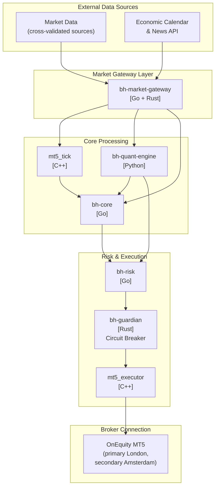
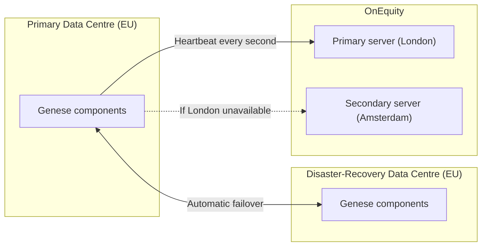

# Genese Capital (formerly BlackHole Capital) - Trading Infrastructure

> **Documentation status:** last reviewed September 2026.
>
> - **Performance:** this repository does not report performance. The live track record is published on Myfxbook: [myfxbook.com/members/blackholeai/blackhole-fund/11784758](https://www.myfxbook.com/members/blackholeai/blackhole-fund/11784758). The Myfxbook record still uses the BlackHole name.
> - **Due diligence:** the current *Genese Capital - Due Diligence Reference* is available on request.
> - Component names (`bh-core`, `bh-risk`, `bh-guardian`, etc.) and this repository keep their original BlackHole naming.

## Overview

Genese Capital (formerly BlackHole Capital) runs a systematic, intraday strategy trading **gold only (XAUUSD)**. Client capital is managed through **PAMM (Percentage Allocation Management Module)** accounts at OnEquity Ltd, which acts as broker, execution venue and custodian. Genese owns the strategy, manages the PAMM accounts, controls risk and operates the infrastructure; it does not hold client funds at any time.

The proprietary infrastructure is deployed across **two European data centres** (primary and disaster recovery) with automatic failover.

## System Architecture

## Dual-Site Deployment

## Core Repositories

| Repository | Language | Description |
|------------|----------|-------------|
| [mt5_executor](docs/repositories/mt5_executor.md) | C++ | Order execution |
| [mt5_tick](docs/repositories/mt5_tick.md) | C++ | Tick processing |
| [bh-risk](docs/repositories/bh-risk.md) | Go | Risk and position sizing |
| [bh-guardian](docs/repositories/bh-guardian.md) | Rust | Circuit breaker and protection |
| [bh-quant-engine](docs/repositories/bh-quant-engine.md) | Python | Quantitative analysis and signals |
| [bh-core](docs/repositories/bh-core.md) | Go | Orchestration |
| [bh-market-gateway](docs/repositories/bh-market-gateway.md) | Go/Rust | Market data |

## Quantitative Decision Engine

Trading decisions come from a **multi-factor scoring system with ensemble methods and regime-adaptive weighting**. Factor composition, weights and refresh frequencies are proprietary and are not disclosed.

Position size is set by a **GARCH volatility model**: higher volatility reduces lot size, lower volatility allows larger size within limits. See [Quantitative Models](docs/quantitative/models.md).

## Key Features

### Strategy
- Gold only (XAUUSD), intraday, direction-neutral and regime-adaptive
- Each position is exited by opening an offsetting position (trailing-stop profit target or fixed stop); the two legs are then netted via Close By
- Execution concentrated in the New York session; no trading at weekends or when the market is closed
- Economic-calendar/news filter and continuous spread monitoring

### Risk Management
- **Per-position stop:** a 25.00 move in the gold price (2,500 per lot)
- **Daily loss limit: 1% of NAV** (in place since October 2025) - stops order generation and closes open positions; resumes automatically next session
- **Cumulative drawdown limit: 5% of NAV** - closes all positions; trading resumes only after partner review and approval
- **Size per order:** approx. 7.5 lots on approx. 4.2m NAV, scaling in lots per million of NAV
- **Margin:** internal limit of 10% of NAV
- **Broker:** margin call at 10%, independent of Genese infrastructure
- Daily and cumulative limits are enforced server-side by `bh-guardian` and cannot be manually overridden

### Infrastructure
- **Two European data centres** (primary and disaster recovery) with automatic failover
- Broker heartbeat every second, with failover to a secondary OnEquity server (Amsterdam) if the primary (London) is unavailable
- Automatic cross-validation of market data between sources
- Hourly reconciliation with the PAMM platform
- Partners alerted through an internal app and dashboard; a dedicated trader monitors execution in real time and has an emergency stop

## Documentation

### Investor Documents
- [Executive Summary](docs/EXECUTIVE_SUMMARY.md) - Overview for prospective investors
- [Capacity Analysis](docs/CAPACITY_ANALYSIS.md) - Capacity and execution
- [Operational Due Diligence](docs/OPERATIONAL_DUE_DILIGENCE.md) - ODD information
- [Disclaimers & Risk Factors](docs/DISCLAIMERS.md) - Important disclosures
- [Production Change History](docs/PRODUCTION_CHANGE_HISTORY.md) - Configuration changes by date

### Technical Documentation
- [Architecture Overview](docs/architecture/overview.md)
- [Communication Protocols](docs/architecture/communication.md)
- [Quantitative Models](docs/quantitative/models.md)
- [Risk Framework](docs/risk-management/framework.md)
- [Market Connectors](docs/connectors/overview.md)

## Security

- Passkey authentication with 2FA on all access
- Servers on an internal network reachable only via VPN
- Credentials rotated quarterly
- Institutional account monitoring via API rather than investor passwords

**Note:** Genese Capital currently operates as a PAMM account manager through BlackHole Capital Ltd. and WEAP Global Limited (both Hong Kong), not as a regulated investment fund. A Genese Capital fund in the Cayman Islands is in the process of being established; registration details will be provided once completed. See [Disclaimers](docs/DISCLAIMERS.md).

---

*Genese Capital (formerly BlackHole Capital)*
