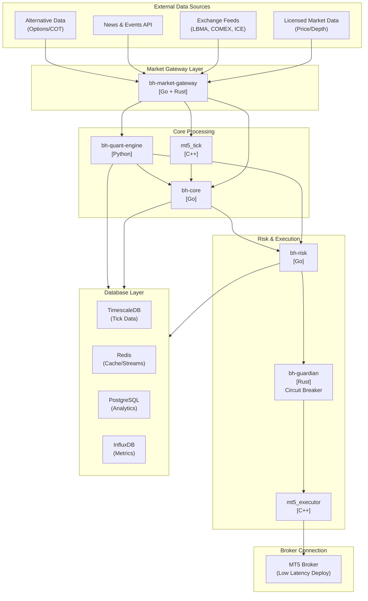
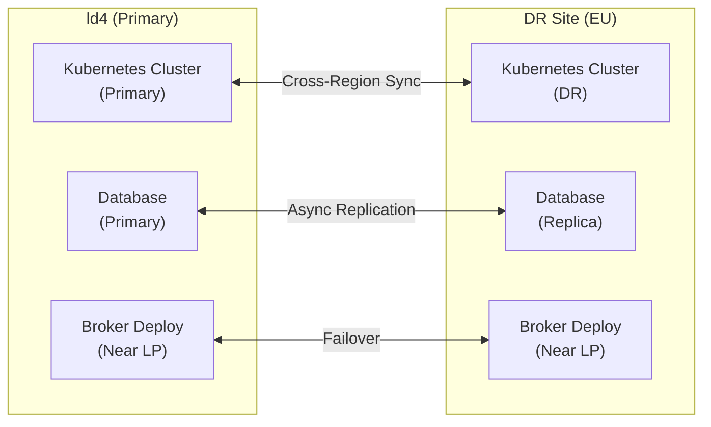
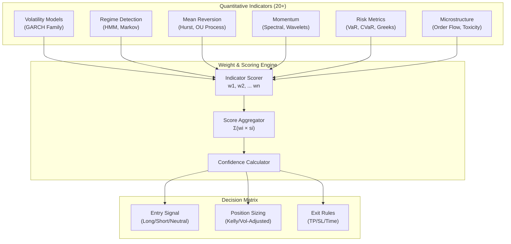
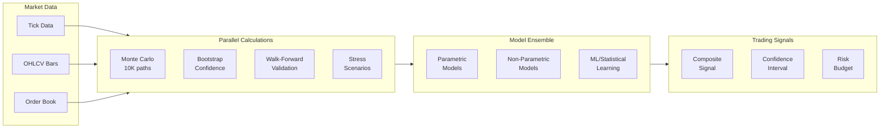

# BlackHole Fund - Trading Infrastructure

## Overview

BlackHole Fund is a quantitative trading operation specializing in **Gold (XAU/USD)** within the forex market. We manage capital through **PAMM (Percentage Allocation Management Module)** accounts, allowing investors to participate proportionally in our systematic trading strategies.

Our trading systems operate across **two data centers** (Primary EU, DR EU) to support high availability, disaster recovery, and proximity to major liquidity providers.

## System Architecture

## Multi-Region Deployment

## Core Repositories

| Repository | Language | Description |
|------------|----------|-------------|
| [mt5_executor](docs/repositories/mt5_executor.md) | C++ | High-performance order execution engine |
| [mt5_tick](docs/repositories/mt5_tick.md) | C++ | Real-time tick data processor |
| [bh-risk](docs/repositories/bh-risk.md) | Go | Risk management and position sizing engine |
| [bh-guardian](docs/repositories/bh-guardian.md) | Rust | Daily circuit breaker and system protection |
| [bh-quant-engine](docs/repositories/bh-quant-engine.md) | Python | Quantitative analysis and signal generation |
| [bh-core](docs/repositories/bh-core.md) | Go | Central orchestration and service coordination |
| [bh-market-gateway](docs/repositories/bh-market-gateway.md) | Go/Rust | Market data connectors and feed handlers |

## Quantitative Decision Engine

Our trading decisions are driven by a sophisticated **multi-indicator weighted scoring system**. Each quantitative indicator contributes to the final trading decision with configurable weights and thresholds.

### Indicator Categories & Weights

| Category | Indicators | Weight Range | Update Frequency |
|----------|------------|--------------|------------------|
| **Volatility** | GARCH, EGARCH, FIGARCH, Realized Vol, Range Vol | 15-25% | 1min - 1hr |
| **Regime** | HMM States, RS-GARCH, Structural Breaks | 10-20% | 1hr - 4hr |
| **Mean Reversion** | Hurst Exponent, OU Process, Half-Life, Z-Score | 10-15% | 5min - 1hr |
| **Momentum** | Spectral Analysis, Wavelet Decomposition, Trend Strength | 10-15% | 1min - 15min |
| **Risk** | VaR, CVaR, Drawdown, Correlation, Beta | 15-20% | Real-time |
| **Microstructure** | Order Flow Imbalance, VPIN, Kyle's Lambda | 5-15% | Tick-level |
| **Sentiment** | News Sentiment, COT Positioning, Options Flow | 5-10% | 15min - Daily |

### Simulation & Calculation Pipeline

## Key Features

### Quantitative Analysis
- **20+ Statistical Indicators** with individual weights and confidence scores
- **Ensemble Methods**: Combining multiple models for robust signal generation
- **Adaptive Weights**: Dynamic weight adjustment based on regime and performance
- **Multi-Timeframe Analysis**: From tick-level to daily aggregations

### Simulation Capabilities
- **Monte Carlo Simulations**: 10,000+ paths for VaR/CVaR estimation
- **Bootstrap Methods**: Non-parametric confidence intervals
- **Stress Testing**: Historical and hypothetical scenarios
- **Walk-Forward Optimization**: Out-of-sample validation

### Risk Management
- Real-time position monitoring and exposure limits
- Dynamic position sizing based on volatility regime
- **1% Daily Stop Loss** circuit breaker (hard limit)
- Multi-level risk controls (order, account, portfolio)

### Infrastructure
- **Dual-site deployment** for high availability
- **Low-latency execution targets** (deployed near liquidity providers; actual latency depends on broker/venue)
- Automated failover and disaster recovery
- Comprehensive monitoring and alerting

## Documentation

### Investor Documents
- [Executive Summary](docs/EXECUTIVE_SUMMARY.md) - Fund overview for prospective investors
- [Capacity Analysis](docs/CAPACITY_ANALYSIS.md) - AUM limits and market impact
- [Operational Due Diligence](docs/OPERATIONAL_DUE_DILIGENCE.md) - ODD information
- [Disclaimers & Risk Factors](docs/DISCLAIMERS.md) - Important disclosures

### Technical Documentation
- [Architecture Overview](docs/architecture/overview.md)
- [Communication Protocols](docs/architecture/communication.md)
- [Quantitative Models](docs/quantitative/models.md)
- [Risk Framework](docs/risk-management/framework.md)
- [Market Connectors](docs/connectors/overview.md)

## Technology Stack

| Layer | Technologies |
|-------|-------------|
| **Execution** | C++ 20, MetaTrader 5 API |
| **Risk & Orchestration** | Go 1.22+, gRPC, Protocol Buffers |
| **Circuit Breaker** | Rust 1.75+, Tokio |
| **Quantitative** | Python 3.11+, NumPy, SciPy, Arch, Statsmodels, Scikit-learn |
| **Messaging** | ZeroMQ, Redis Streams, Apache Kafka |
| **Databases** | TimescaleDB, PostgreSQL, Redis, InfluxDB |
| **Infrastructure** | Kubernetes, Terraform, Prometheus, Grafana |

## Security

Our systems implement comprehensive security measures:
- End-to-end encryption for all inter-service communication
- Secure key management
- Comprehensive audit logging
- Role-based access control (RBAC)

**Note:** BlackHole Fund operates as a PAMM account manager, not a regulated investment fund. See [Disclaimers](docs/DISCLAIMERS.md) for important information.

---

*BlackHole Fund - Precision Trading Through Quantitative Excellence*
