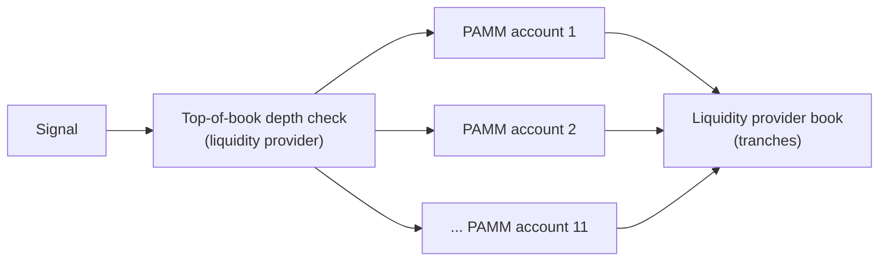

# Capacity and Execution

*Genese Capital (formerly BlackHole Capital). Last reviewed September 2026.*

## Overview

This document describes how the strategy's execution is distributed and what constrains capacity as assets grow. Earlier versions of this document cited capacity figures of 60 million (indicative / soft) and 100 million (maximum / hard). **Those figures relate to the previous configuration and have been withdrawn.**

## Staggered Execution

- Execution is distributed across **11 PAMM accounts** with staggered entries, approximately one minute apart and about 90% non-overlapping, so aggregate size reaches the book in tranches.
- Size is checked against **liquidity-provider top-of-book depth** before entry.
- Execution is concentrated in the New York session.

## Size Relative to NAV

Position limits scale in **lots per million of NAV** rather than in absolute lots.

Since the June 2026 sizing optimisation, median gross exposure per million of NAV fell from **6.00 to 3.27 lots**.

## Liquidity Provider Capacity

Capacity is agreed directly with the liquidity provider. Genese provides a weekly and monthly forecast of the volume it will trade, and on that basis the liquidity provider commits to support up to an agreed number of lots. These terms are covered by a confidentiality agreement with the liquidity provider. No separate capacity stress test has been run.

## Binding Constraint: Execution Quality

At scale the binding constraint is execution quality, not market depth alone. The net result per lot is small relative to typical execution costs, so small additional costs per lot consume a meaningful share of the result:

| Additional cost per lot | Effect on historical net result |
|-------------------------|---------------------------------|
| +1.00 | -6% |
| +2.00 | -13% |
| +5.00 | -32% |
| +10.00 | -63% |

(One lot equals 100 ounces; a 1.00 move in the gold price equals 100 per lot.)

## Future Structure

Under the Cayman fund structure (in the process of being established), execution will **connect directly to the liquidity provider**, removing the retail broker layer from the cost chain.

---

*Capacity statements reflect the current configuration and may change. Past performance is not indicative of future results.*
