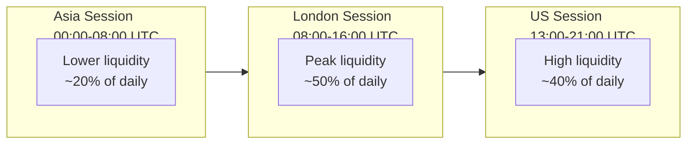
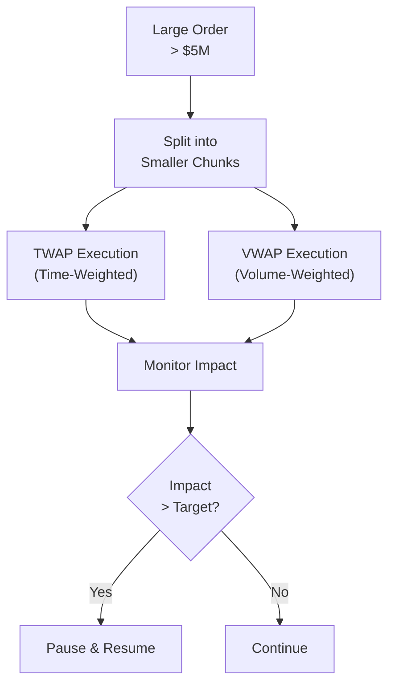
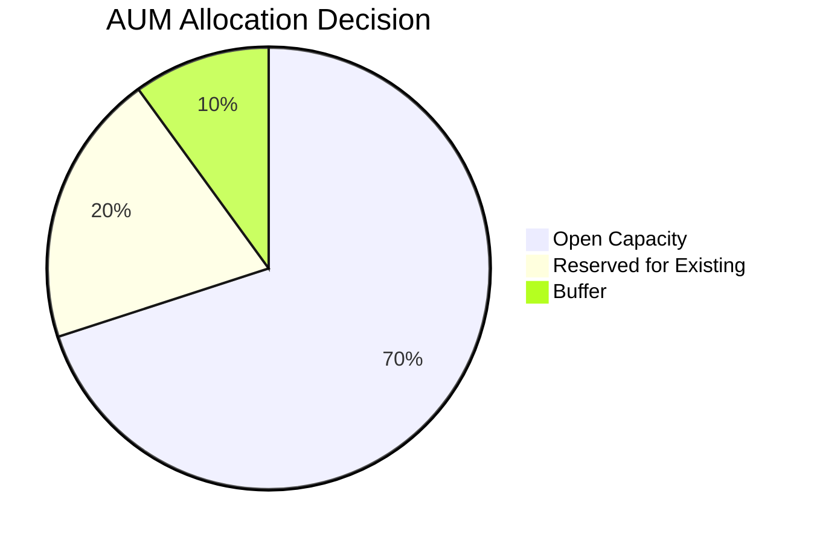

# Capacity Analysis

## Overview

This document outlines BlackHole Fund's capacity constraints, market impact considerations, and AUM limits. Understanding capacity is critical for both the fund's performance and investor expectations.

## Gold Market Liquidity Profile

### XAU/USD Daily Volume

| Metric | Estimate |
|--------|----------|
| **Daily Spot Volume** | $150-200 billion |
| **LBMA Clearing** | ~$30 billion/day |
| **COMEX Futures** | ~$50 billion/day |
| **Retail Forex (XAU/USD)** | ~$20-40 billion/day |

### Liquidity by Time of Day



**Key Observations:**
- London session overlap with US provides best liquidity
- Avoid large orders during Asia-only hours
- LBMA fixes (10:30, 15:00 London) create temporary volatility

## Market Impact Model

### Theoretical Framework

We use a square-root market impact model:

```
Market Impact = σ × √(Q/V) × λ

Where:
  σ = Daily volatility
  Q = Order size (USD)
  V = Daily volume (USD)
  λ = Asset-specific constant (~0.5 for gold)
```

### Impact Estimates

| Order Size | % of Daily Vol | Est. Impact | Acceptable? |
|------------|----------------|-------------|-------------|
| $1M | 0.003% | < 0.1 pip | Yes |
| $5M | 0.015% | ~0.3 pips | Yes |
| $10M | 0.03% | ~0.5 pips | Yes |
| $25M | 0.075% | ~1.2 pips | Marginal |
| $50M | 0.15% | ~2.5 pips | Too high |

**Our Target:** Keep individual orders < 0.05% of hourly volume

### Execution Strategy



**Execution Principles:**
1. Break large orders into smaller clips ($1-2M each)
2. Execute over 15-30 minute windows
3. Avoid concentration in single time period
4. Monitor real-time slippage vs. expected

## Capacity Constraints

### Theoretical Maximum AUM

Based on our trading frequency and market impact tolerance:

| Scenario | Max AUM | Rationale |
|----------|---------|-----------|
| Conservative | $50M | < 0.5 pip impact per trade |
| Moderate | $100M | < 1.0 pip impact per trade |
| Aggressive | $200M | < 2.0 pip impact, alpha decay |

### Current Capacity Decision



| Status | Amount |
|--------|--------|
| **Target AUM** | $75M |
| **Hard Cap** | $100M |
| **Soft Close Trigger** | $60M |

**Rationale:**
- At $75M, we maintain < 0.8 pip average market impact
- Preserves strategy alpha without significant decay
- Allows comfortable position sizing within risk limits

### Impact of AUM on Performance

| AUM Level | Expected Sharpe | Impact Cost | Net Alpha |
|-----------|-----------------|-------------|-----------|
| $25M | 1.8 | 0.1% | Full |
| $50M | 1.6 | 0.3% | ~90% |
| $75M | 1.4 | 0.5% | ~80% |
| $100M | 1.2 | 0.8% | ~70% |
| $150M | 0.9 | 1.5% | ~50% |

**Conclusion:** Performance degrades meaningfully above $100M

## Position Size Constraints

### Maximum Position by AUM

| AUM | Max Position (25% NAV) | % Daily Volume | Feasibility |
|-----|------------------------|----------------|-------------|
| $25M | $6.25M | 0.02% | Easy |
| $50M | $12.5M | 0.04% | Easy |
| $75M | $18.75M | 0.06% | Manageable |
| $100M | $25M | 0.08% | Requires care |

### Entry/Exit Time Estimates

Time required to establish/exit maximum position with minimal impact:

| AUM | Max Position | Entry Time | Exit Time (Normal) | Exit Time (Stress) |
|-----|--------------|------------|--------------------|--------------------|
| $50M | $12.5M | 15-30 min | 15-30 min | 1-2 hours |
| $75M | $18.75M | 30-45 min | 30-45 min | 2-3 hours |
| $100M | $25M | 45-60 min | 45-60 min | 3-4 hours |

## Capacity Management Policy

### Soft Close Procedure

When AUM reaches 80% of target ($60M):

1. **Notification**: Existing investors informed
2. **Waitlist**: New investors placed on queue
3. **Reduced Allocations**: New investments may be scaled
4. **Review**: Quarterly capacity reassessment

### Hard Close Procedure

When AUM reaches hard cap ($100M):

1. **Closed to New Investors**: No new subscriptions
2. **Existing Only**: Only current investors may add
3. **Redemption Priority**: Redeemed capital not replaced
4. **Re-Open Criteria**: Defined triggers for reopening

### Reopening Criteria

Fund may reopen when:
- AUM falls below 70% of soft close ($42M)
- Liquidity conditions improve significantly
- Strategy modifications reduce capacity constraints

## Investor Implications

### Benefits of Capacity Discipline

1. **Performance Protection**: Alpha not diluted by size
2. **Execution Quality**: Better fills, less slippage
3. **Risk Management**: Faster exit capability
4. **Strategy Integrity**: Maintains trading edge

### Allocation Priority

In case of oversubscription:

| Priority | Criteria |
|----------|----------|
| 1 | Existing investors (pro-rata) |
| 2 | Strategic partners |
| 3 | Early commitments |
| 4 | Waitlist (FIFO) |

## Capacity Monitoring

### Metrics Tracked

```
# Capacity utilization
capacity_utilization_pct = current_aum / hard_cap × 100

# Execution quality
avg_slippage_pips = (executed_price - signal_price) / pip_value
market_impact_cost_pct = total_slippage / trade_value × 100

# Liquidity metrics
avg_spread_pips = ask - bid
volume_participation_pct = our_volume / market_volume × 100
```

### Review Schedule

| Review | Frequency | Focus |
|--------|-----------|-------|
| Execution Quality | Daily | Slippage analysis |
| Market Impact | Weekly | Impact vs. model |
| Capacity Status | Monthly | AUM vs. limits |
| Strategy Capacity | Quarterly | Full reassessment |

---

*This analysis is based on current market conditions and historical data. Capacity estimates may change based on market liquidity evolution.*
