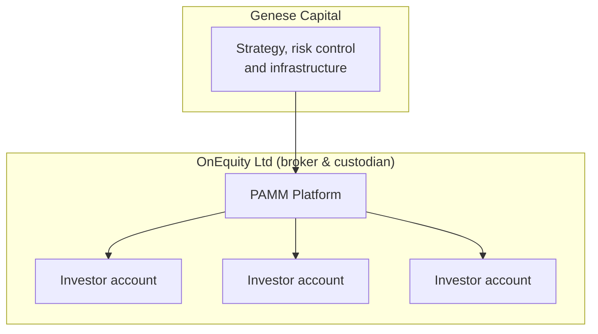

# Genese Capital - Executive Summary

*Genese Capital (formerly BlackHole Capital). Last reviewed September 2026.*

This summary is not an investment proposal, solicitation or offer to invest. Performance is not reported here; see the public [Myfxbook record](https://www.myfxbook.com/members/blackholeai/blackhole-fund/11784758). The full *Due Diligence Reference* is available on request.

## Overview

Genese Capital runs a systematic, intraday strategy trading **gold only (XAUUSD)**. Capital is managed through **PAMM (Percentage Allocation Management Module)** accounts at OnEquity Ltd, which acts as broker, execution venue and custodian.

| Attribute | Details |
|-----------|---------|
| **Instrument** | Gold only (XAUUSD, traded as GOLD# at OnEquity) |
| **Style** | Intraday, multi-factor, regime-adaptive, direction-neutral |
| **Structure** | PAMM account management (Cayman fund in the process of being established) |
| **Broker / custodian** | OnEquity Ltd - Seychelles FSA, Securities Dealer licence no. SD154 |
| **Per-position stop** | 25.00 move in the gold price (2,500 per lot) |
| **Daily loss limit** | 1% of NAV (automated, in place since October 2025) |
| **Cumulative drawdown limit** | 5% of NAV (automated) |
| **Track record** | [Myfxbook](https://www.myfxbook.com/members/blackholeai/blackhole-fund/11784758) |

## Corporate Structure

| Item | Detail |
|------|--------|
| Brand | Genese Capital (formerly BlackHole Capital) |
| Current operating entities | BlackHole Capital Ltd. (Hong Kong) and WEAP Global Limited (Hong Kong), both owned by the founding partners |
| Future structure | Genese Capital fund in the Cayman Islands, in the process of being established. Registration details will be provided once completed |
| Broker, execution venue and custodian | OnEquity Ltd, licensed by the Seychelles Financial Services Authority as a Securities Dealer (licence no. SD154) |
| Client custody | All client capital is held by OnEquity. Genese does not hold client funds at any time |

Until the Cayman fund is launched, BlackHole Capital Ltd. and WEAP Global Limited remain the contracting entities.

## Team

| Name | Role |
|------|------|
| Pedro | Co-founder, Director & CEO |
| Wellington | Co-founder, Director & CTO |
| Maurício Mendes Dutra | Director |

| Function | Headcount |
|----------|-----------|
| Directors | 3 |
| Quantitative team | 3 |
| Developers (remote) | 4 |
| Introducing brokers (global distribution) | 20+ |

All strategy development is internal; no core logic is outsourced.

## How PAMM Works

- Each client has a dedicated PAMM account at OnEquity with Genese as manager
- Results are allocated proportionally by the PAMM platform
- Custody remains with OnEquity in all cases
- Each PAMM account runs this single strategy only

## Strategy

- **Decision engine:** multi-factor scoring system with ensemble methods and regime-adaptive weighting. Factor composition, weights and refresh frequencies are proprietary.
- **Approach:** intraday and direction-neutral. Neither a pure mean-reversion nor a trend-following system. No carry or arbitrage component.
- **Entry and exit:** each position is exited by opening an offsetting position, triggered by a trailing-stop profit target or a fixed stop. Once the offsetting leg is open the pair is market-neutral and the two legs are netted via Close By.
- **Position sizing:** GARCH volatility model. Limits scale in lots per million of NAV (currently a maximum of approximately 7.5 lots per order on a NAV of approximately 4.2 million).
- **Trading window:** execution concentrated in the New York session. No trading at weekends or when the market is closed.
- **Filters:** economic calendar and news via API, blocking entries around high-impact events; continuous spread measurement with no new entries above a defined threshold.

## Risk Management

| Control | Limit | Action |
|---------|-------|--------|
| Loss per position | 25.00 move in the gold price (2,500 per lot) | Position closed; subject to spread widening |
| Daily loss | 1% of NAV (since October 2025) | Stops order generation and closes open positions; resumes automatically next session |
| Cumulative drawdown | 5% of NAV | Closes all positions; resumes only after partner review and approval |
| Margin | 10% of NAV | Internal limit |
| Size per order | Approx. 7.5 lots on 4.2m NAV | Scales with NAV |
| Broker | Margin call at 10% | Independent of Genese infrastructure |

Daily and cumulative limits are enforced server-side by `bh-guardian` and cannot be manually overridden. The 5% limit has never been reached. See the [Risk Framework](risk-management/framework.md).

## Execution Infrastructure

- Proprietary multi-component architecture across **two European data centres** (primary and disaster recovery) with automatic failover
- Broker heartbeat every second; secondary OnEquity server (Amsterdam) if the primary (London) is unavailable
- Hourly reconciliation with the PAMM platform, with automatic pause and alert on divergence

## Fee Structure

| Fee Type | Rate |
|----------|------|
| Management Fee | None |
| Performance Fee | 20%, with a per-investor high-water mark |
| Minimum allocation | USD 10,000 |

Terms can be customised for institutional allocations. Cayman fund terms will be set out in its offering documents.

## Getting Started

1. **Open an account** at OnEquity (details provided during onboarding)
2. **Fund the account** according to OnEquity's terms
3. **Connect to the PAMM** with Genese as manager
4. **Monitor** through the broker platform and the public Myfxbook record

OnEquity does not onboard residents of the United States, Canada and sanctioned or restricted territories. Other jurisdictions follow OnEquity's onboarding policies and, once launched, the Cayman fund's offering documents.

## Important Notes

- Genese Capital currently operates as a PAMM account manager through BlackHole Capital Ltd. and WEAP Global Limited, **not as a regulated investment fund**
- Genese does not provide investment advice and does not hold client funds
- Past performance is not indicative of future results
- You can lose your entire investment

---

*Trading gold and foreign exchange on margin carries a high level of risk. Only invest what you can afford to lose.*
