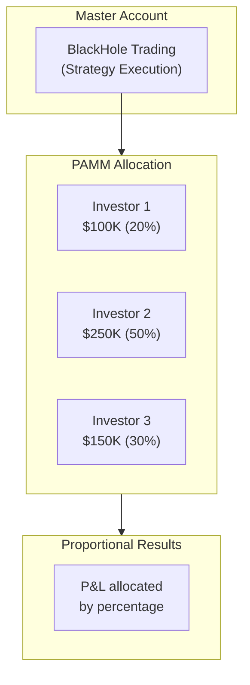
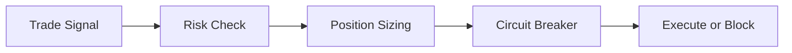

# BlackHole Fund - Executive Summary

## Overview

**BlackHole Fund** is a systematic quantitative trading operation specializing in gold (XAU/USD) within the forex market. We manage capital through **PAMM (Percentage Allocation Management Module)** accounts, allowing investors to allocate funds that are traded proportionally alongside the master account.

| Attribute | Details |
|-----------|---------|
| **Strategy** | Systematic Quantitative - Gold Focus |
| **Asset Class** | Forex (XAU/USD) |
| **Structure** | PAMM Account Management |
| **Trading Style** | Medium-frequency (minutes to days) |
| **Target Volatility** | 8-12% annualized |
| **Max Drawdown Limit** | 15% peak-to-trough |
| **Daily Stop Loss** | 1% hard limit (automated) |

## How PAMM Works

**Key Features:**
- Each investor maintains their own account at the broker
- Trades are copied proportionally to each PAMM account
- Investors can deposit/withdraw according to broker terms
- Full transparency: investors see all trades in real-time
- Segregated funds: your money stays in YOUR account

## Investment Philosophy

### Core Beliefs

1. **Gold as a Macro Asset** - Gold exhibits predictable behavior relative to rates, dollar strength, and risk sentiment
2. **Regime Matters** - Different market regimes require different approaches
3. **Risk First** - Superior returns come from avoiding large losses
4. **Systematic Execution** - Rule-based trading removes behavioral biases

## Performance Targets

| Metric | Target | Notes |
|--------|--------|-------|
| **Annual Return** | 12-18% | Target range, not a guarantee |
| **Sharpe Ratio** | 1.2 - 1.8 | Risk-adjusted focus |
| **Max Drawdown** | < 15% | Hard limit enforced |
| **Win Rate** | 45-55% | Not dependent on high hit rate |
| **Monthly Volatility** | 3-5% | Moderate risk profile |

## Risk Management

### Automated Protection

| Control | Threshold | Action |
|---------|-----------|--------|
| Daily Loss | 0.5% | Reduce position sizes |
| Daily Loss | 0.75% | Close-only mode |
| Daily Loss | 1.0% | **Automatic halt** |
| Max Position | 25% equity | Order rejected |

## Execution Infrastructure

### Brokers & Execution

| Provider | Role |
|----------|------|
| **Tier-1 regulated broker** | PAMM platform & execution (name provided on request/NDA) |
| **Liquidity venues** | Broker-aggregated gold liquidity |

### Technology

- **Dual-region deployment** (London + Ireland)
- **Low-latency execution targets** (single-digit ms under normal conditions)
- **99.9% uptime target** (measured monthly)
- **Automated failover**

## Fee Structure

| Fee Type | Rate |
|----------|------|
| Management Fee | None |
| Performance Fee | 20-30% of profits (high-water mark) |

*Fees are automatically calculated and deducted by the PAMM system*

## Getting Started

### Minimum Investment

| Tier | Minimum | Performance Fee |
|------|---------|-----------------|
| Standard | $10,000 | 30% |
| Premium | $50,000 | 25% |
| VIP | $100,000+ | 20% |

### How to Invest

1. **Open account** at the PAMM broker partner (details provided during onboarding)
2. **Fund your account** via bank transfer or other methods
3. **Connect to PAMM** using our master account ID
4. **Monitor performance** through broker platform

### Withdrawals

- Process through your broker account directly
- Typically T+1 to T+3 settlement
- No lock-up period from our side
- Broker terms apply

## Important Notes

**This is NOT a regulated investment fund.**

- We are traders managing PAMM accounts, not a licensed fund
- Your funds remain in your own broker account
- No investor protection schemes apply
- Past performance does not guarantee future results
- You can lose your entire investment

## Contact

For more information about joining the PAMM, contact details are provided during onboarding or through the broker's referral process.

---

*Trading forex/CFDs carries high risk. Only invest what you can afford to lose.*
