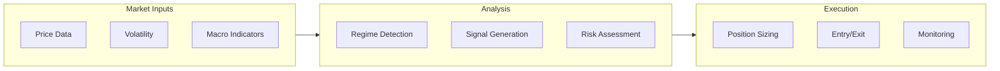
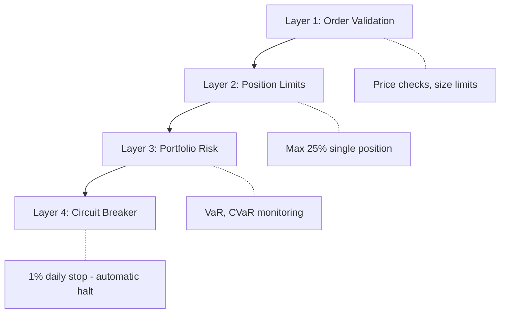

# BlackHole Fund - Executive Summary

## Fund Overview

**BlackHole Fund** is a systematic quantitative fund specializing in gold (XAU/USD) trading within the forex market. The fund employs a multi-factor, regime-adaptive strategy designed to capture opportunities across varying market conditions while maintaining strict risk controls.

| Attribute | Details |
|-----------|---------|
| **Strategy** | Systematic Quantitative - Gold Focus |
| **Asset Class** | Forex (XAU/USD) |
| **Trading Style** | Medium-frequency (minutes to days) |
| **Target Volatility** | 8-12% annualized |
| **Max Drawdown Limit** | 15% peak-to-trough |
| **Daily Stop Loss** | 1% hard limit (automated) |

## Investment Philosophy

### Core Beliefs

1. **Gold as a Macro Asset** - Gold exhibits predictable behavior relative to rates, dollar strength, and risk sentiment
2. **Regime Matters** - Different market regimes require different approaches; one-size-fits-all fails
3. **Risk First** - Superior risk-adjusted returns come from avoiding large losses, not chasing large gains
4. **Systematic Execution** - Emotion-free, rule-based trading removes behavioral biases

### Strategy Components

## Performance Characteristics

### Target Profile

| Metric | Target | Rationale |
|--------|--------|-----------|
| **Annual Return** | 12-18% | Achievable with moderate leverage |
| **Sharpe Ratio** | 1.2 - 1.8 | Risk-adjusted performance focus |
| **Sortino Ratio** | > 1.5 | Downside risk emphasis |
| **Max Drawdown** | < 15% | Capital preservation |
| **Win Rate** | 45-55% | Not dependent on high hit rate |
| **Profit Factor** | > 1.5 | Winners larger than losers |

### Expected Behavior by Market Regime

| Regime | Expected Performance | Notes |
|--------|---------------------|-------|
| Low Volatility | Moderate positive | Trend following works |
| Normal | Target returns | Optimal conditions |
| High Volatility | Reduced exposure | Capital preservation mode |
| Crisis | Near-flat or small positive | Hedging / minimal activity |

## Risk Management

### Multi-Layer Protection

### Key Risk Controls

| Control | Threshold | Action |
|---------|-----------|--------|
| Daily Loss | 0.5% | Reduce position sizes 25% |
| Daily Loss | 0.75% | Close-only mode |
| Daily Loss | 1.0% | **Automatic halt + closeout** |
| Weekly Loss | 3.0% | No new positions |
| Max Position | 25% NAV | Order rejected |
| VaR (95%) | 1.5% daily | Position adjustment |

## Technology Infrastructure

### Architecture Highlights

- **Dual-Region Deployment**: London + Manchester (AWS) for redundancy
- **Execution Latency**: ~5-10ms to liquidity providers
- **Uptime Target**: 99.99% (< 1 hour downtime/year)
- **Automated Failover**: < 30 seconds recovery

### Data Sources

| Source | Purpose | Redundancy |
|--------|---------|------------|
| Bloomberg | Primary market data | Reuters backup |
| LBMA | Gold price reference | Direct feeds |
| News feeds | Event detection | Multiple sources |

## Operational Structure

### Service Providers

| Function | Provider Type |
|----------|--------------|
| Prime Broker | Tier-1 institution |
| Custodian | Independent third-party |
| Administrator | Independent NAV calculation |
| Auditor | Big-4 accounting firm |
| Legal | Specialized fund counsel |

### Key Personnel

| Role | Responsibility |
|------|----------------|
| Portfolio Manager | Strategy oversight, risk decisions |
| Chief Risk Officer | Independent risk monitoring |
| Head of Technology | Infrastructure, execution systems |
| Chief Compliance | Regulatory adherence |

## Fee Structure

| Fee Type | Rate |
|----------|------|
| Management Fee | 1.5% annually |
| Performance Fee | 20% (high-water mark) |
| Hurdle Rate | Risk-free rate |

## Investment Terms

| Term | Details |
|------|---------|
| Minimum Investment | $500,000 |
| Lock-up Period | 12 months |
| Redemption Notice | 30 days |
| Redemption Frequency | Monthly |
| NAV Calculation | Weekly |

## Contact

For more information, please contact the investor relations team.

---

*This document is for informational purposes only and does not constitute an offer to sell or solicitation of an offer to buy any securities. Past performance is not indicative of future results.*
