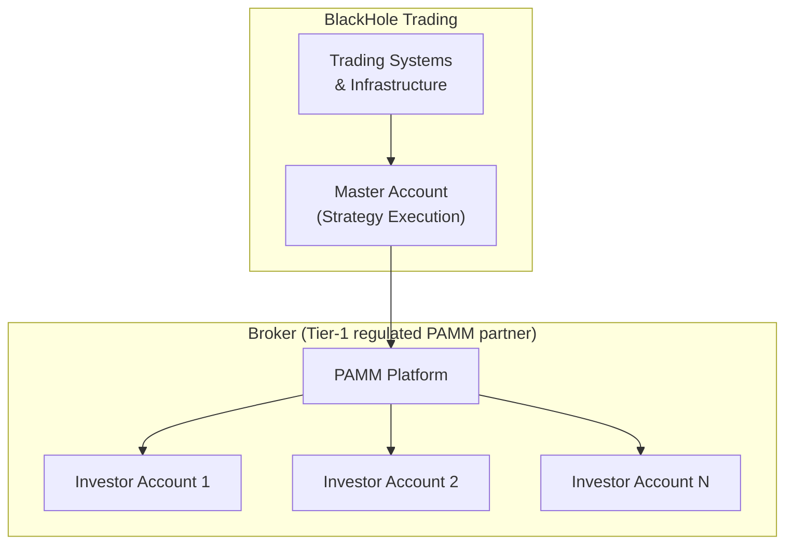
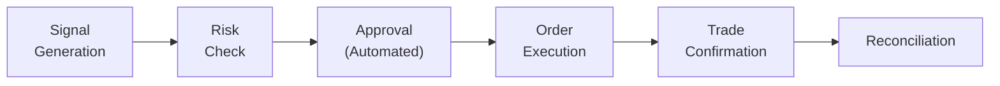
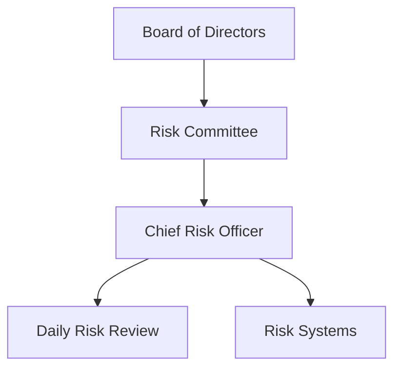

# Operational Due Diligence

## Overview

This document provides information to assist prospective investors in conducting due diligence on BlackHole Fund's PAMM (Percentage Allocation Management Module) trading operation. It addresses common questions across key operational areas.

**Important:** BlackHole Fund operates as a PAMM account manager, NOT a regulated investment fund. Your capital remains in your own broker account at all times.

## Operational Structure

### PAMM Model

| Component | Description |
|-----------|-------------|
| Master Account | BlackHole's trading account where strategies execute |
| PAMM Platform | Broker system that copies trades proportionally |
| Investor Accounts | Individual accounts owned by each investor |

### Key Personnel

| Role | Responsibility |
|------|----------------|
| Lead Trader | Strategy development and execution |
| Risk Manager | Position monitoring and risk controls |
| Systems Engineer | Trading infrastructure and automation |

### Operational Continuity

- Fully documented trading systems and processes
- Automated execution reduces key-person dependency
- Cross-training on critical functions
- Systems designed for autonomous operation

## Service Providers

### Broker & Execution

| Provider | Role |
|----------|------|
| **Tier 1 Liquidity** | Primary execution venue for gold |
| **Tier-1 regulated broker** | PAMM platform and execution (name provided on request/NDA) |

### Broker Features

| Feature | Details |
|---------|---------|
| Account Segregation | Client funds segregated per regulations |
| PAMM Platform | Automated trade copying and allocation |
| Reporting | Real-time position and P&L visibility |
| Withdrawals | Direct through broker platform |

### Infrastructure Providers

| Service | Provider |
|---------|----------|
| Cloud Infrastructure | Colocation (ld4 + ld5) |
| Market Data | Licensed providers + exchange feeds |
| Monitoring | Prometheus, Grafana |

## Technology & Infrastructure

### System Architecture

| Component | Technology | Redundancy |
|-----------|------------|------------|
| Trading Systems | Proprietary | Dual-region |
| Risk Management | Proprietary | Dual-region |
| Data Infrastructure | Multi-site | Dual-site redundancy |
| Connectivity | Multiple ISPs | Failover |

### Disaster Recovery

| Metric | Target | Tested |
|--------|--------|--------|
| RTO (Recovery Time) | < 1 hour | Quarterly |
| RPO (Recovery Point) | < 1 minute | Quarterly |
| DR Site | ld5 (EU) | Active-active (dual-region) |

### Cybersecurity

| Control | Implementation |
|---------|----------------|
| Access Control | Multi-factor authentication |
| Encryption | TLS 1.3, AES-256 at rest |
| Network Security | Firewalls, IDS/IPS, VPN |
| Monitoring | Centralized logging with alerting |
| Testing | Annual penetration testing |
| Training | Quarterly security awareness |

### Business Continuity

| Scenario | Plan |
|----------|------|
| Office unavailable | Remote work capability |
| Key system failure | Automated failover |
| Data loss | Real-time replication |
| Personnel unavailable | Cross-training, documentation |

### Change Management & SDLC

| Control | Practice |
|---------|----------|
| Code Changes | Peer review and mandatory approvals |
| Deployments | CI/CD with staged rollouts and rollback plans |
| Configuration | Versioned, audited changes with change tickets |
| Release Notes | Documented per release for strategy + infra updates |

### Incident Response

| Stage | Practice |
|-------|----------|
| Detection | Automated alerts and on-call escalation |
| Triage | Severity classification within defined SLAs |
| Remediation | Documented runbooks and post-incident review |
| Communication | Investor updates for material incidents |

### Data Governance

| Area | Practice |
|------|----------|
| Data Lineage | Source attribution for market and alternative data |
| Retention | Tiered retention with archival policies |
| Access | Role-based permissions with audit logging |

## Trading Operations

### Order Management

| Step | Automation | Oversight |
|------|------------|-----------|
| Signal Generation | Fully automated | Algorithm monitoring |
| Risk Check | Fully automated | Parameter review |
| Execution | Fully automated | Execution quality review |
| Confirmation | Automated matching | Exception handling |
| Reconciliation | Daily automated | Breaks investigated |

### Trade Reconciliation

| Type | Frequency | Process |
|------|-----------|---------|
| Position | Daily | System vs. broker |
| Cash | Daily | System vs. bank |
| P&L | Daily | System vs. admin |
| NAV | Weekly | Internal vs. admin |

### Error Handling

| Error Type | Detection | Resolution |
|------------|-----------|------------|
| Trade break | Automated alert | Same-day investigation |
| System failure | Automated monitoring | Immediate failover |
| Data issue | Validation checks | Source correction |

## Risk Management

### Risk Governance

### Risk Limits

| Limit | Value | Monitoring |
|-------|-------|------------|
| Daily Loss | 1% NAV | Real-time |
| Weekly Loss | 3% NAV | Daily |
| Position Size | 25% NAV | Pre-trade |
| Gross Exposure | 200% NAV | Real-time |
| VaR (95%) | 1.5% NAV | Daily |

### Independent Risk Oversight

- CRO reports to Board, not PM
- Daily risk reports to management
- Monthly risk reports to Board
- Quarterly risk committee meetings

## Regulatory Status

### Important Disclosure

**BlackHole Fund is NOT a regulated investment fund.**

| Aspect | Status |
|--------|--------|
| Fund Registration | None - PAMM account management only |
| Manager Registration | Not registered as investment adviser |
| Investor Protection | None beyond broker's own protections |

### Broker Regulation

Your funds are held at the broker you select (PAMM partner), which maintains its own regulatory status. Please verify:

- Broker's regulatory registration
- Client fund segregation policies
- Deposit protection schemes (if any)

### Investor Responsibility

| Requirement | Responsibility |
|-------------|----------------|
| KYC/AML | Handled by broker during account opening |
| Tax Reporting | Investor's responsibility |
| Regulatory Compliance | Investor must comply with local laws |

## Account Valuation

### Real-Time Transparency

PAMM accounts provide complete transparency through the broker platform:

| Information | Access |
|-------------|--------|
| Open Positions | Real-time via broker |
| Account Balance | Real-time via broker |
| Trade History | Full history in platform |
| P&L | Real-time floating and realized |

### Pricing

| Asset | Source |
|-------|--------|
| XAU/USD Spot | Broker feed (aggregated liquidity) |
| Account Equity | Broker calculation |
| Performance | PAMM platform metrics |

## Reporting & Transparency

### What You Can See

| Information | How to Access |
|-------------|---------------|
| All Trades | Broker platform (real-time) |
| Position Sizes | Broker platform (real-time) |
| Floating P&L | Broker platform (real-time) |
| Performance Stats | PAMM leaderboard |
| Historical Returns | Broker reports |

### What We Provide

| Report | Frequency | Content |
|--------|-----------|---------|
| Performance Summary | Monthly | Returns, drawdown, key metrics |
| Strategy Commentary | Monthly | Market outlook, positioning |
| Risk Report | On request | VaR, exposure analysis |

**Note:** All official account data comes from your broker. Our reports supplement but do not replace broker statements.

## Protection & Insurance

### Broker-Level Protection

Your funds are protected by your broker's measures:

| Protection | Details |
|------------|---------|
| Segregated Accounts | Client funds separate from broker |
| Broker Regulation | Check broker's regulatory status |
| Deposit Insurance | Varies by broker and jurisdiction |

### Our Operational Protections

| Measure | Implementation |
|---------|----------------|
| System Redundancy | Dual-region deployment |
| Risk Controls | Automated circuit breakers |
| Access Security | MFA, encrypted communications |

**Important:** We do not hold your funds. Protection depends on your broker.

## Due Diligence Information

### Information Available

| Information | Available |
|-------------|-----------|
| Track Record | Yes (via PAMM platform) |
| Trading Strategy Overview | Yes |
| Risk Management Description | Yes |
| Infrastructure Overview | Yes |
| Fee Structure | Yes |

### Questions to Ask Your Broker

Before joining any PAMM, verify with your broker:

1. How are client funds segregated?
2. What regulatory oversight applies?
3. What deposit protection exists?
4. How are PAMM fees calculated and deducted?
5. What are withdrawal terms and timing?

### Contact

For questions about joining the PAMM, contact details are provided during onboarding or through the broker's referral process.

---

**Disclaimer:** BlackHole Fund is a PAMM trading operation, not a regulated investment fund. This document is for informational purposes only. Your broker is the custodian of your funds - conduct due diligence on your broker's regulatory status and protections.
