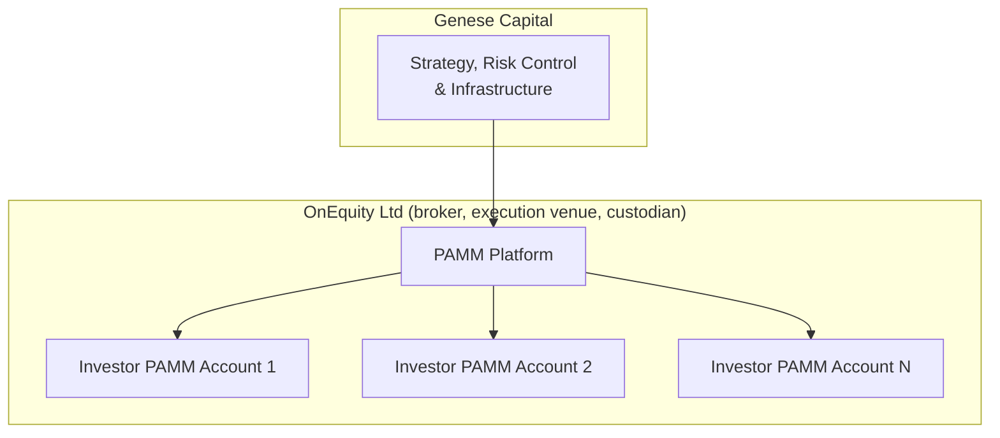
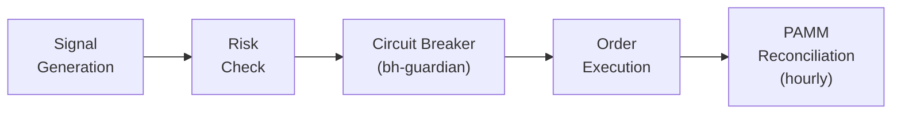

# Operational Due Diligence

*Genese Capital (formerly BlackHole Capital). Last reviewed September 2026.*

## Overview

This document provides information to assist prospective investors in conducting operational due diligence on Genese Capital's PAMM trading operation. The full *Due Diligence Reference* is available on request. Performance is published on [Myfxbook](https://www.myfxbook.com/members/blackholeai/blackhole-fund/11784758) and is not repeated here.

**Important:** Genese Capital currently operates as a PAMM account manager, NOT as a regulated investment fund. All client capital is held by OnEquity as broker and custodian.

## Corporate and Legal Structure

| Item | Detail |
|------|--------|
| Brand | Genese Capital (formerly BlackHole Capital) |
| Current operating entities | BlackHole Capital Ltd. (Hong Kong) and WEAP Global Limited (Hong Kong), both owned by the founding partners |
| Future structure | Genese Capital fund in the Cayman Islands, in the process of being established. Registration details will be provided once completed |
| Broker, execution venue and custodian | OnEquity Ltd, licensed by the Seychelles Financial Services Authority as a Securities Dealer (licence no. SD154) |
| Client custody | All client capital is held by OnEquity. Genese does not hold client funds at any time |
| Track record | [Myfxbook](https://www.myfxbook.com/members/blackholeai/blackhole-fund/11784758) |

Genese owns the strategy, manages the PAMM accounts, controls risk and operates the infrastructure. OnEquity acts solely as broker, execution venue and custodian. Until the Cayman fund is launched, BlackHole Capital Ltd. and WEAP Global Limited remain the contracting entities. Under the Cayman fund structure, execution will connect directly to the liquidity provider rather than through a retail broker.

## Operational Structure

### PAMM Model

| Component | Description |
|-----------|-------------|
| PAMM accounts | Dedicated PAMM account at OnEquity with Genese as manager |
| PAMM platform | Broker system that allocates results proportionally |
| Custody | OnEquity in all cases |

Each PAMM account runs this single strategy only; there is no blending of strategies within an account. The client may contract with OnEquity (broker and custodian), with Genese (manager), or both.

### Team

| Name | Role |
|------|------|
| Pedro | Co-founder, Director & CEO |
| Wellington | Co-founder, Director & CTO |
| Maurício Mendes Dutra | Director |

| Function | Headcount |
|----------|-----------|
| Directors | 3 |
| Quantitative team | 3 |
| Developers (remote) | 4 |
| Introducing brokers (global distribution) | 20+ |

All strategy development is internal; no core logic is outsourced.

### Human Oversight

- Execution is fully automated
- A dedicated trader monitors execution in real time and has an emergency stop
- Both partners have full-stop authority and direct account access

## Governance and Process

- Monthly research and recalibration cycle: performance analysis, volatility-regime assessment, parameter evaluation
- Staged deployment - demo, proprietary capital, production. No parameter change goes directly to production
- Weekly governance meeting between the partners
- Lot and risk adjustments are system-generated and require management approval

Genese's commitments are formalised through agreements that may include an Investment Management Agreement, Risk Disclosure Statement, Operational SLA and Governance & Risk Policy.

## Technology & Infrastructure

### System Architecture

Proprietary multi-component architecture deployed across **two European data centres** (primary and disaster recovery) with automatic failover.

| Component | Technology | Function |
|-----------|------------|----------|
| mt5_executor | C++ | Order execution |
| mt5_tick | C++ | Tick processing |
| bh-risk | Go | Risk and position sizing |
| bh-guardian | Rust | Circuit breaker and protection |
| bh-quant-engine | Python | Quantitative analysis and signals |
| bh-core | Go | Orchestration |
| bh-market-gateway | Go / Rust | Market data |

### Controls and Continuity

| Area | Implementation |
|------|----------------|
| Server-side controls | Core risk controls are enforced by Genese infrastructure; broker protections are secondary safeguards. MT5 acts only as an execution connector |
| Broker connection | Heartbeat every second, with a secondary OnEquity server (Amsterdam) if the primary (London) is unavailable. On disconnection new orders are suspended and existing positions remain managed |
| Alerting | Partners are alerted through an internal app and dashboard |
| Market data | Automatic cross-validation between sources. Depending on the anomaly, the system discards the tick, freezes execution or pauses trading; a pause requires manual release |
| PAMM reconciliation | Hourly reconciliation with the PAMM platform, with automatic pause and alert on divergence |
| Failover | Automatic failover between the primary and disaster-recovery data centres |

### Access and Security

| Control | Implementation |
|---------|----------------|
| Authentication | Passkey authentication with 2FA on all access |
| Network | Servers on an internal network reachable only via VPN |
| Credentials | Rotated quarterly |
| Institutional monitoring | Account monitoring via API rather than investor passwords |

## Trading Operations

### Order Flow

## Risk Management

### Risk Limits

| Control | Limit | Action |
|---------|-------|--------|
| Loss per position | 25.00 move in the gold price (2,500 per lot) | Position closed; subject to spread widening |
| Daily loss | 1% of NAV (since October 2025) | Stops order generation and closes open positions; resumes automatically next session |
| Cumulative drawdown | 5% of NAV | Closes all positions; resumes only after partner review and approval |
| Margin | 10% of NAV | Internal limit |
| Size per order | Approx. 7.5 lots on 4.2m NAV | Scales with NAV |
| Broker | Margin call at 10% | Independent of Genese infrastructure |

Daily and cumulative limits are enforced server-side by `bh-guardian` and cannot be manually overridden. See the [Risk Framework](risk-management/framework.md) for details.

## Regulatory Status

### Important Disclosure

**Genese Capital is NOT a regulated investment fund.** It currently operates as a PAMM account manager through BlackHole Capital Ltd. and WEAP Global Limited. It does not provide investment advice and does not hold client funds.

| Aspect | Status |
|--------|--------|
| Fund | Cayman Islands fund in the process of being established; registration details to follow once completed |
| Manager | PAMM account manager through BlackHole Capital Ltd. and WEAP Global Limited (Hong Kong) |
| Broker / custodian | OnEquity Ltd, Seychelles FSA, Securities Dealer licence no. SD154 |

### Jurisdictions

OnEquity does not onboard residents of the United States, Canada and sanctioned or restricted territories (including North Korea, Myanmar, Iran, Yemen, Syria, Sudan and Russia). Other jurisdictions follow OnEquity's onboarding policies and, once launched, the Cayman fund's offering documents.

### Investor Responsibility

| Requirement | Responsibility |
|-------------|----------------|
| KYC/AML | Handled by the broker during account opening |
| Tax Reporting | Investor's responsibility |
| Regulatory Compliance | Investor must comply with local laws |

## Reading the Account History

Reviewers working from the MT5 statement or Myfxbook should note:

- **Close By.** Positions are closed by opening an opposite position and netting both via Close By. MT5 books the whole result of the pair on one leg and zero on the other, so splitting the history by direction does not reflect economic attribution.
- **Balance movements.** Growth of the account balance is mainly due to investor deposits, which is why Myfxbook *Gain* (time-weighted) and *Absolute Gain* differ. Performance fees are booked as balance operations.
- **Configuration history.** See [Production Change History](PRODUCTION_CHANGE_HISTORY.md).

## Due Diligence Information

| Information | Available |
|-------------|-----------|
| Track Record | Yes - public Myfxbook record |
| Due Diligence Reference | On request |
| Strategy, risk and infrastructure overview | Yes - this repository |
| Fee Structure | Yes - see [Executive Summary](EXECUTIVE_SUMMARY.md) |

### Contact

Contact details are provided during onboarding or through an introducing broker.

---

**Disclaimer:** Genese Capital (formerly BlackHole Capital) is a PAMM trading operation, not a regulated investment fund. This document is for informational purposes only. OnEquity is the custodian of client funds - conduct due diligence on the broker's regulatory status and protections.
