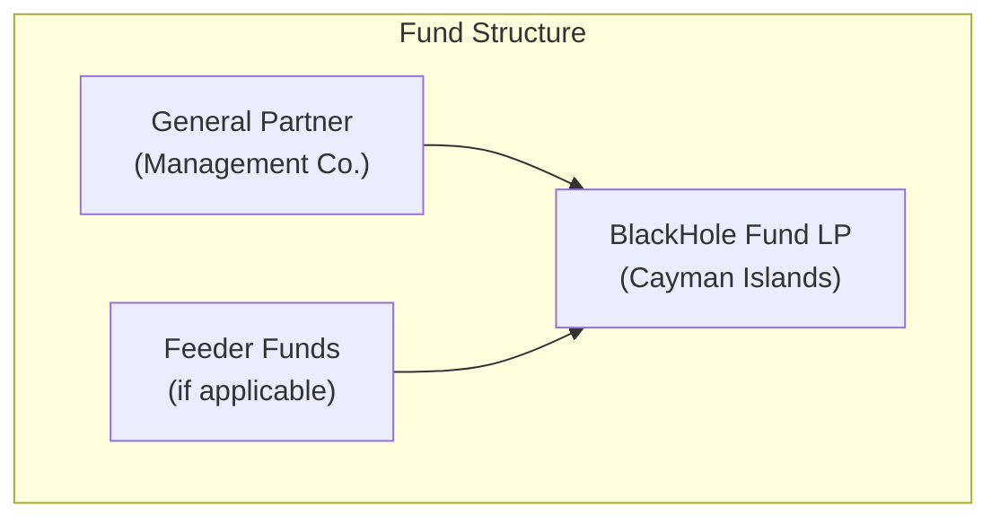
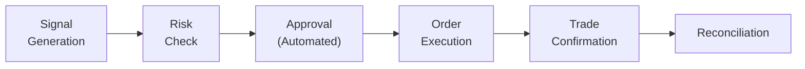
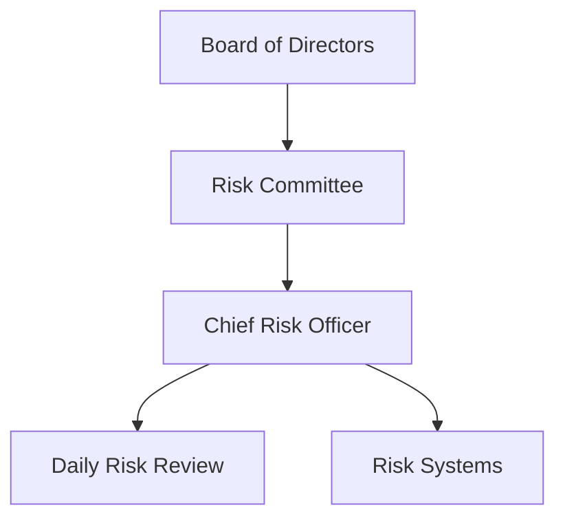

# Operational Due Diligence

## Overview

This document provides information to assist prospective investors in conducting operational due diligence on BlackHole Fund. It addresses common ODD questions across key operational areas.

## Organizational Structure

### Legal Structure

| Entity | Jurisdiction | Purpose |
|--------|--------------|---------|
| Management Company | [Jurisdiction] | Investment manager |
| Fund LP | Cayman Islands | Main fund vehicle |
| GP Entity | [Jurisdiction] | General partner |

### Key Personnel

| Role | Experience | Tenure |
|------|------------|--------|
| Portfolio Manager | 15+ years quant trading | Founding |
| Chief Risk Officer | 12+ years risk management | Founding |
| Head of Technology | 10+ years fintech | Founding |
| CFO/COO | 18+ years fund operations | 3 years |
| Chief Compliance Officer | 10+ years compliance | 2 years |

### Succession Planning

- Deputy PM identified and trained
- Key person insurance in place
- Documentation of all systems and processes
- Cross-training across critical functions

## Service Providers

### Prime Broker

| Attribute | Details |
|-----------|---------|
| Name | [Tier-1 Prime Broker] |
| Relationship Since | [Date] |
| Services | Execution, custody, financing |
| Segregation | Fully segregated client accounts |
| Insurance | SIPC + excess coverage |

### Administrator

| Attribute | Details |
|-----------|---------|
| Name | [Independent Administrator] |
| Relationship Since | [Date] |
| Services | NAV calculation, investor services |
| Frequency | Weekly NAV, monthly statements |
| Independence | No affiliation with manager |

### Auditor

| Attribute | Details |
|-----------|---------|
| Name | [Big-4 Firm] |
| Relationship Since | [Date] |
| Scope | Annual financial audit |
| Opinion History | Unqualified opinions |

### Legal Counsel

| Attribute | Details |
|-----------|---------|
| Fund Counsel | [Law Firm] |
| Regulatory Counsel | [Law Firm] |
| Specialty | Investment fund law |

### Other Service Providers

| Service | Provider |
|---------|----------|
| IT Security | [Security Firm] |
| Compliance Monitoring | [Compliance Firm] |
| Tax Advisor | [Tax Firm] |
| Insurance Broker | [Insurance Firm] |

## Technology & Infrastructure

### System Architecture

| Component | Technology | Redundancy |
|-----------|------------|------------|
| Trading Systems | Proprietary | Dual-region |
| Risk Management | Proprietary | Dual-region |
| Data Infrastructure | AWS | Multi-AZ |
| Connectivity | Multiple ISPs | Failover |

### Disaster Recovery

| Metric | Target | Tested |
|--------|--------|--------|
| RTO (Recovery Time) | < 1 hour | Quarterly |
| RPO (Recovery Point) | < 1 minute | Quarterly |
| DR Site | Manchester (UK) | Active-passive |

### Cybersecurity

| Control | Implementation |
|---------|----------------|
| Access Control | Multi-factor authentication |
| Encryption | TLS 1.3, AES-256 at rest |
| Network Security | Firewalls, IDS/IPS, VPN |
| Monitoring | 24/7 SOC monitoring |
| Testing | Annual penetration testing |
| Training | Quarterly security awareness |

### Business Continuity

| Scenario | Plan |
|----------|------|
| Office unavailable | Remote work capability |
| Key system failure | Automated failover |
| Data loss | Real-time replication |
| Personnel unavailable | Cross-training, documentation |

## Trading Operations

### Order Management

| Step | Automation | Oversight |
|------|------------|-----------|
| Signal Generation | Fully automated | Algorithm monitoring |
| Risk Check | Fully automated | Parameter review |
| Execution | Fully automated | Execution quality review |
| Confirmation | Automated matching | Exception handling |
| Reconciliation | Daily automated | Breaks investigated |

### Trade Reconciliation

| Type | Frequency | Process |
|------|-----------|---------|
| Position | Daily | System vs. broker |
| Cash | Daily | System vs. bank |
| P&L | Daily | System vs. admin |
| NAV | Weekly | Internal vs. admin |

### Error Handling

| Error Type | Detection | Resolution |
|------------|-----------|------------|
| Trade break | Automated alert | Same-day investigation |
| System failure | Automated monitoring | Immediate failover |
| Data issue | Validation checks | Source correction |

## Risk Management

### Risk Governance

### Risk Limits

| Limit | Value | Monitoring |
|-------|-------|------------|
| Daily Loss | 1% NAV | Real-time |
| Weekly Loss | 3% NAV | Daily |
| Position Size | 25% NAV | Pre-trade |
| Gross Exposure | 200% NAV | Real-time |
| VaR (95%) | 1.5% NAV | Daily |

### Independent Risk Oversight

- CRO reports to Board, not PM
- Daily risk reports to management
- Monthly risk reports to Board
- Quarterly risk committee meetings

## Compliance

### Regulatory Status

| Jurisdiction | Registration | Status |
|--------------|--------------|--------|
| [Primary] | [Registration Type] | Active |
| [Secondary] | [Registration Type] | Active |

### Compliance Program

| Component | Description |
|-----------|-------------|
| Policies | Written compliance manual |
| Testing | Annual compliance review |
| Training | Annual compliance training |
| Reporting | Quarterly compliance reports |

### AML/KYC

| Requirement | Process |
|-------------|---------|
| Investor onboarding | Full KYC documentation |
| Ongoing monitoring | Annual refresh |
| Sanctions screening | Daily automated |
| Suspicious activity | SAR procedures |

## Valuation

### NAV Calculation

| Step | Responsibility | Verification |
|------|----------------|--------------|
| Price sourcing | Administrator | Multiple sources |
| Position valuation | Administrator | Independent calc |
| NAV calculation | Administrator | Manager review |
| NAV approval | Manager | Sign-off required |

### Pricing Sources

| Asset Type | Primary Source | Secondary Source |
|------------|----------------|------------------|
| Spot Gold | Bloomberg | Reuters |
| Futures | Exchange | Bloomberg |
| Cash | Bank statements | N/A |

### Fair Value Policy

- Liquid assets: Market prices
- Illiquid assets: N/A (fund holds only liquid instruments)
- Pricing committee: Quarterly review

## Reporting

### Investor Reporting

| Report | Frequency | Content |
|--------|-----------|---------|
| NAV Statement | Weekly | Positions, NAV, returns |
| Monthly Letter | Monthly | Commentary, attribution |
| Quarterly Report | Quarterly | Detailed performance |
| Annual Report | Annual | Audited financials |
| Tax Documents | Annual | K-1 / tax statements |

### Regulatory Reporting

| Report | Jurisdiction | Frequency |
|--------|--------------|-----------|
| Form PF | US (if applicable) | Quarterly |
| AIFMD | EU (if applicable) | Quarterly |
| Local filings | As required | As required |

## Insurance

### Coverage

| Type | Coverage | Carrier |
|------|----------|---------|
| D&O | $[X]M | [Carrier] |
| E&O | $[X]M | [Carrier] |
| Cyber | $[X]M | [Carrier] |
| Crime/Fidelity | $[X]M | [Carrier] |
| Key Person | $[X]M | [Carrier] |

## ODD Checklist

### Documents Available for Review

| Document | Available |
|----------|-----------|
| PPM / Offering Memo | Yes |
| LPA / Fund Documents | Yes |
| Compliance Manual | Yes |
| Business Continuity Plan | Yes |
| Cybersecurity Policy | Yes |
| Trade Reconciliation Samples | Yes |
| Risk Reports (Sample) | Yes |
| Audited Financials | Yes (prior years) |
| Form ADV (if applicable) | Yes |

### On-Site Due Diligence

We welcome on-site visits covering:
- Office tour and infrastructure review
- Meetings with key personnel
- System demonstrations
- Documentation review
- Compliance and risk discussions

### Contact for ODD

For operational due diligence inquiries:
- Investor Relations: [Contact]
- Compliance: [Contact]
- Operations: [Contact]

---

*This document is provided for informational purposes to assist with investor due diligence. Information is current as of the document date and subject to change.*
