# Communication Protocols

## Overview

BlackHole Fund's infrastructure utilizes a combination of communication protocols optimized for different use cases: low-latency trading operations, reliable message delivery, and efficient data streaming.

## Protocol Matrix

| Service | Protocol | Pattern | Latency |
|---------|----------|---------|---------|
| mt5_tick | ZeroMQ (PUB/SUB) | Publish-Subscribe | < 5ms |
| mt5_executor | ZeroMQ (REQ/REP) | Request-Reply | < 5ms |
| bh-risk | gRPC | Unary/Stream | < 15ms |
| bh-guardian | gRPC + ZeroMQ | Hybrid | < 5ms |
| bh-quant-engine | Redis Streams | Consumer Group | < 50ms |
| bh-core | gRPC | Bidirectional | < 10ms |
| bh-market-gateway | FIX + WebSocket | Various | < 20ms |

## Service Communication Diagram

### Synchronous Communication (gRPC)

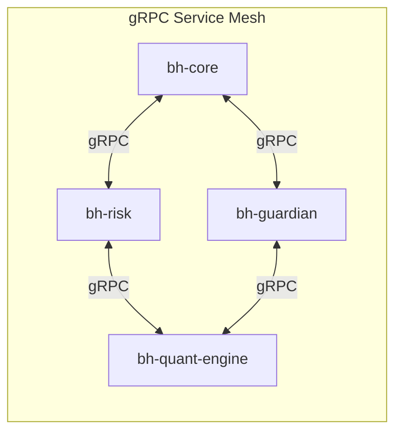

### Asynchronous Communication (ZeroMQ)

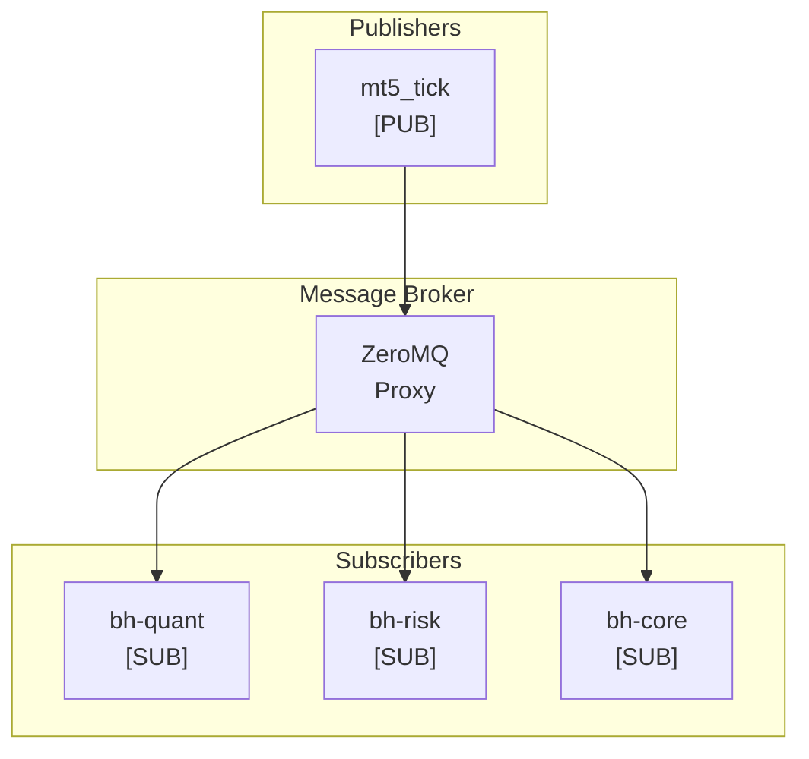

### Event Streaming (Redis Streams)

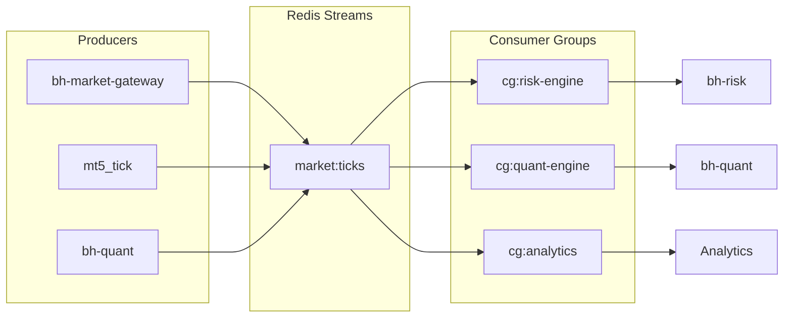

## Protocol Details

### 1. ZeroMQ (High-Performance Messaging)

Used for low-latency communication in the execution path.

#### Tick Data Distribution (PUB/SUB)

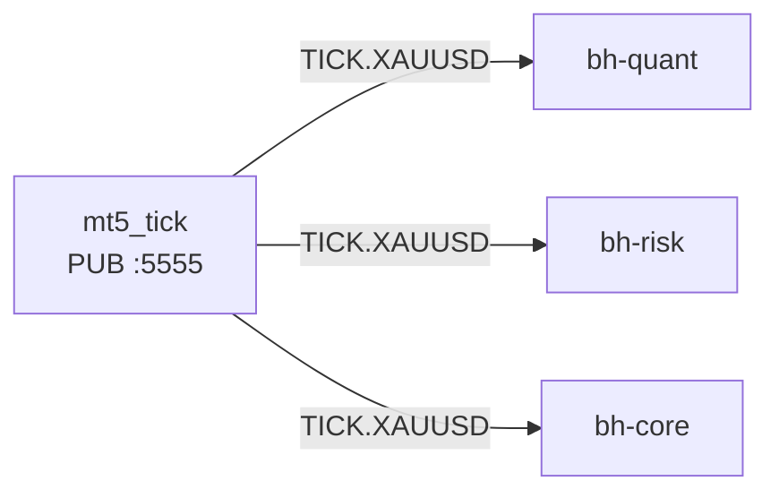

**Message Format:**

| Field | Size | Description |
|-------|------|-------------|
| Header | 8 bytes | MSG_TYPE, SEQ_NUM |
| Symbol | 6 bytes | e.g., XAUUSD |
| Payload | Variable | Bid, Ask, Timestamp, Volume |

**Topic Filtering:**
- `TICK.XAUUSD` - Gold spot ticks
- `TICK.XAUUSD.1M` - 1-minute aggregates
- `TICK.XAUUSD.5M` - 5-minute aggregates

#### Order Execution (REQ/REP)

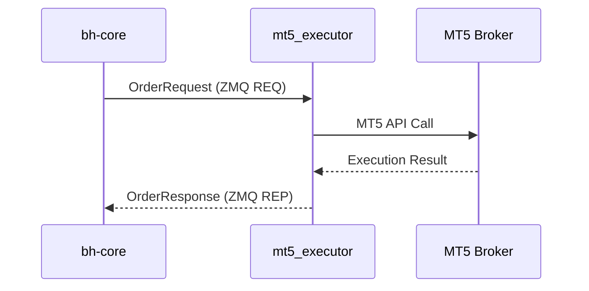

**Request Fields:**

| Field | Type | Description |
|-------|------|-------------|
| request_id | uuid | Unique request identifier |
| action | enum | BUY, SELL, MODIFY, CANCEL |
| symbol | string | Trading symbol (e.g., XAUUSD) |
| volume | double | Position size in lots |
| price | double | Requested price (0 for market) |
| sl | double | Stop loss price |
| tp | double | Take profit price |

**Response Fields:**

| Field | Type | Description |
|-------|------|-------------|
| request_id | uuid | Original request identifier |
| status | enum | SUCCESS, REJECTED, PARTIAL, ERROR |
| order_id | int64 | Broker order identifier |
| filled_price | double | Actual execution price |
| filled_volume | double | Actual filled volume |
| latency_ms | int64 | Execution latency |

### 2. gRPC (Service-to-Service Communication)

Used for reliable, typed communication between core services.

#### Service Interaction

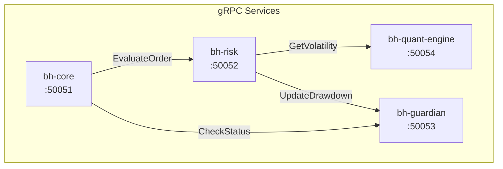

#### Risk Service API

```protobuf
service RiskService {
  rpc EvaluateOrder(OrderRequest) returns (RiskDecision);
  rpc StreamPositions(PositionFilter) returns (stream PositionUpdate);
  rpc GetRiskMetrics(MetricsRequest) returns (RiskMetrics);
  rpc UpdateParameters(RiskParameters) returns (UpdateResponse);
}

message RiskDecision {
  bool approved = 1;
  double adjusted_volume = 2;
  double max_loss = 3;
  string reason = 4;
  RiskLevel risk_level = 5;
}

enum RiskLevel {
  LOW = 0;
  MEDIUM = 1;
  HIGH = 2;
  CRITICAL = 3;
}
```

#### Guardian Service API (Circuit Breaker)

```protobuf
service GuardianService {
  rpc CheckTradingStatus(StatusRequest) returns (TradingStatus);
  rpc SubscribeEvents(EventFilter) returns (stream CircuitEvent);
  rpc SetSystemState(StateCommand) returns (StateResponse);
}

message TradingStatus {
  bool trading_allowed = 1;
  double current_daily_pnl = 2;
  double daily_loss_limit = 3;
  double remaining_capacity = 4;
  SystemState state = 5;
}

enum SystemState {
  ACTIVE = 0;
  REDUCED = 1;    // Reduced position sizes
  CLOSING = 2;    // Closing positions only
  HALTED = 3;     // All trading stopped
}
```

### 3. Redis Streams (Event Streaming)

Used for durable, distributed event streaming with consumer groups.

#### Stream Architecture

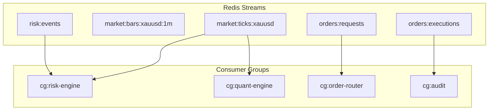

#### Message Schema Example

```json
{
  "stream": "market:ticks:xauusd",
  "id": "1706745600000-0",
  "fields": {
    "timestamp": "1706745600000",
    "bid": "2035.45",
    "ask": "2035.65",
    "bid_volume": "100",
    "ask_volume": "150",
    "spread": "0.20",
    "source": "bloomberg"
  }
}
```

### 4. FIX Protocol (Exchange Connectivity)

Used for connecting to exchanges and market data providers.

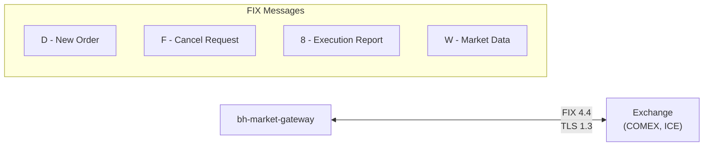

**FIX Configuration:**
- Session: bh-gateway -> Exchange
- HeartBtInt: 30 seconds
- ResetOnLogon: Y

**Supported Messages:**
- D - New Order Single
- F - Order Cancel Request
- G - Order Cancel/Replace
- 8 - Execution Report
- V - Market Data Request
- W - Market Data Snapshot
- X - Market Data Incremental

## Message Serialization

| Format | Use Case | Advantages |
|--------|----------|------------|
| **Protocol Buffers** | gRPC Services | 3-10x smaller than JSON, strong typing |
| **MessagePack** | ZeroMQ Messages | Binary, fast parsing, schema-less |
| **JSON** | REST APIs, Logging | Human readable, debugging |

## Error Handling

### Retry Policies

| Protocol | Retry Count | Backoff | Timeout |
|----------|-------------|---------|---------|
| gRPC | 3 | Exponential | 5s |
| ZeroMQ | 0 | N/A | 100ms |
| Redis | 5 | Linear | 1s |
| FIX | Session-level | N/A | 30s |

### Circuit Breaker Pattern

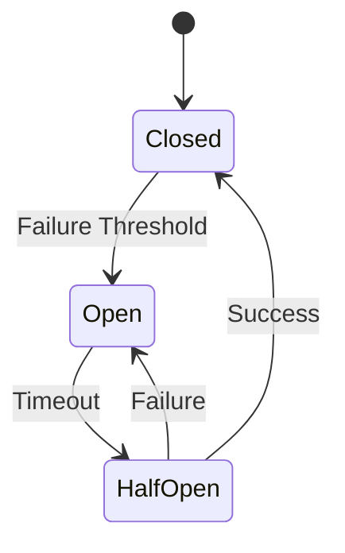

| State | Description | Action |
|-------|-------------|--------|
| **Closed** | Normal operation | Requests pass through |
| **Open** | Failures exceeded | Requests blocked |
| **Half-Open** | Testing recovery | Limited requests |

## Security

### Transport Security

| Connection Type | Encryption | Authentication |
|-----------------|------------|----------------|
| Internal gRPC | mTLS | Service certificates |
| Internal ZeroMQ | CurveZMQ | Public key pairs |
| External FIX | TLS 1.3 | Client certificate |
| Redis | TLS | Password + ACL |

### Message Signing

Critical messages include cryptographic signatures:

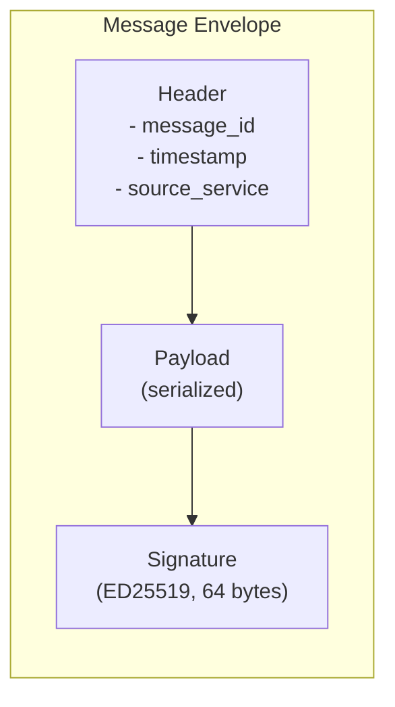

## Monitoring

### Distributed Tracing

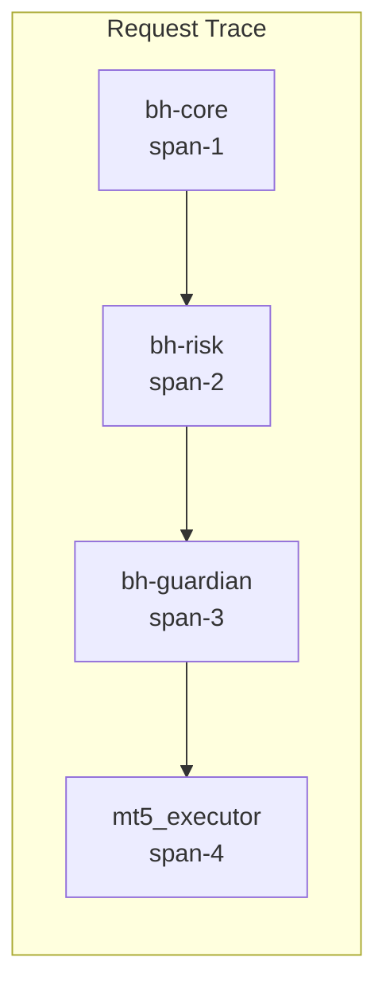

**Trace Headers:**
- `x-trace-id`: Distributed trace identifier
- `x-span-id`: Current span identifier
- `x-parent-span-id`: Parent span identifier
- `x-timestamp-origin`: Origin timestamp (nanoseconds)

### Metrics Collected

| Metric | Description |
|--------|-------------|
| Throughput | Messages per second |
| Latency | p50, p95, p99, p99.9 |
| Error Rate | Failures by type |
| Queue Depth | Backlog size |
