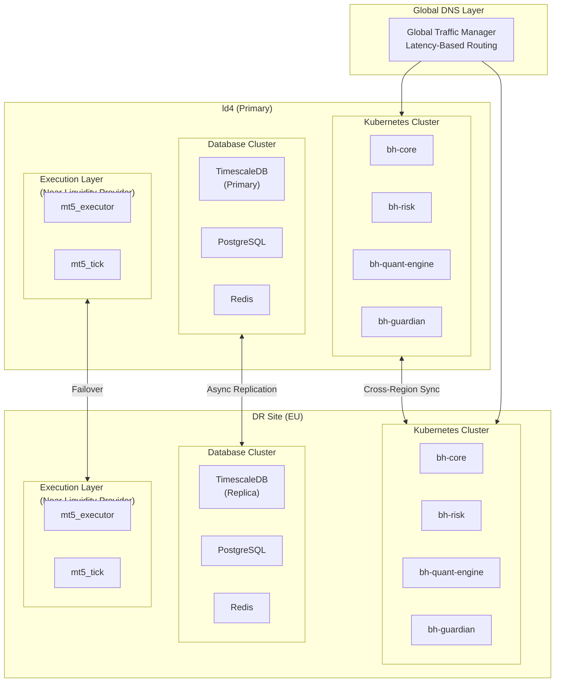
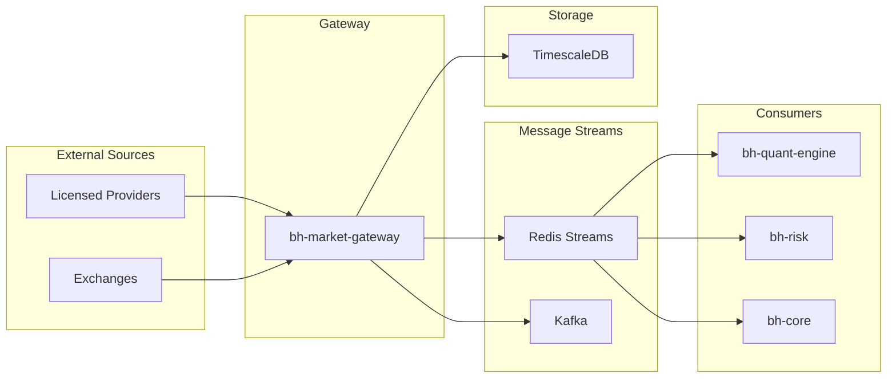
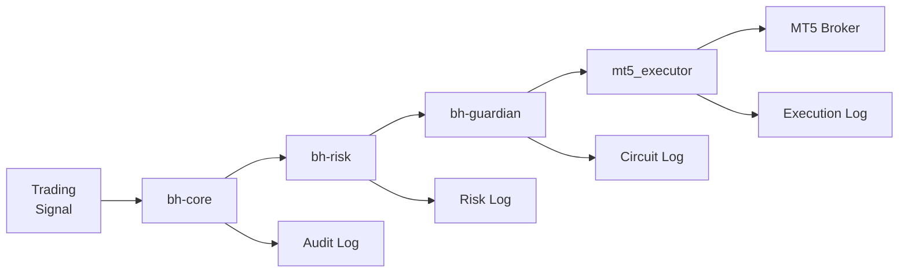
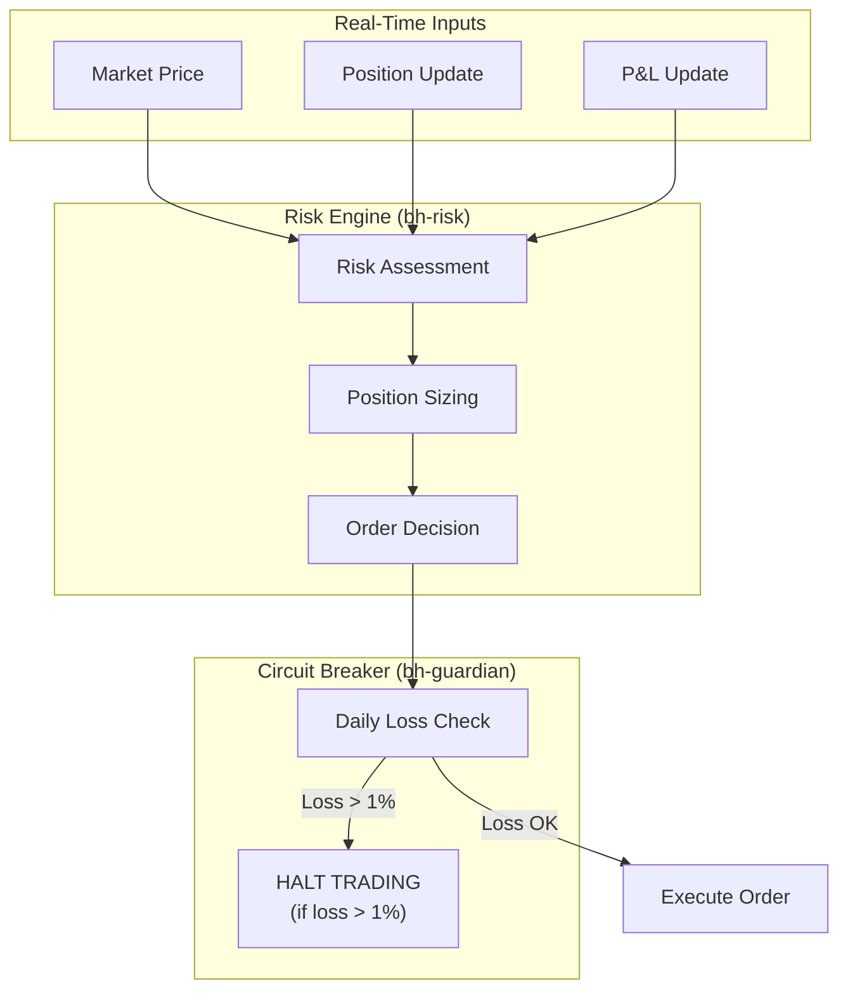
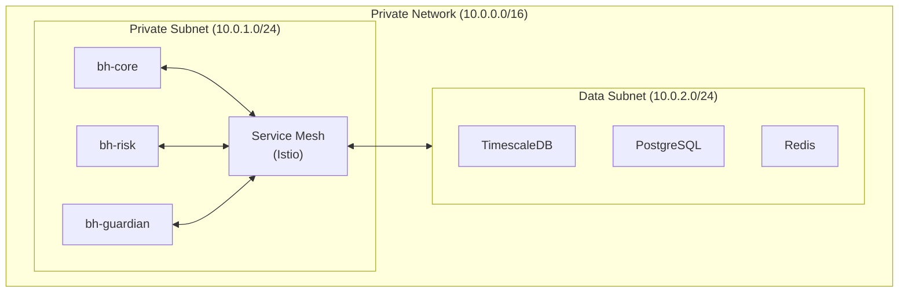
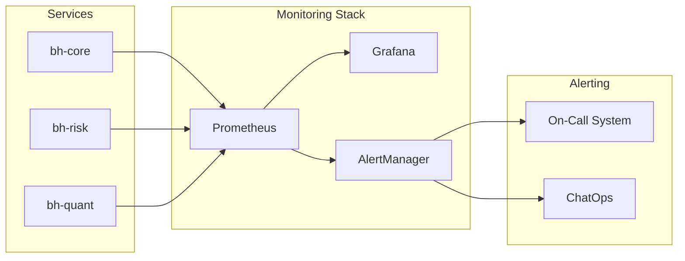
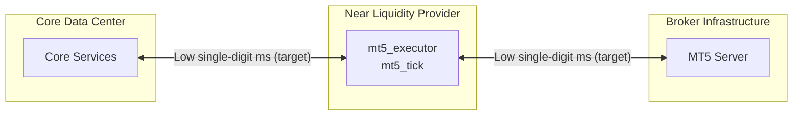

# Architecture Overview

## System Design Philosophy

BlackHole Fund's trading infrastructure follows a **microservices architecture** optimized for:

- **Low Latency**: Single-digit millisecond targets under normal market conditions
- **High Availability**: Availability targets with active monitoring and failover
- **Scalability**: Horizontal scaling for market data processing
- **Resilience**: Multiple layers of failover protection

## Multi-Region Deployment

## Service Topology

### Tier 1: Market Interface Layer
Services that directly interface with external markets and brokers.

| Service | Location | Latency Target |
|---------|----------|----------------|
| mt5_executor | Near LP | Single-digit ms (target) |
| mt5_tick | Near LP | Single-digit ms (target) |
| bh-market-gateway | Core DC | Low-latency target |

### Tier 2: Intelligence Layer
Services that process data and make trading decisions.

| Service | Location | Processing Window |
|---------|----------|-------------------|
| bh-quant-engine | Core DC | 100ms - 5min (model-dependent) |
| bh-risk | Core DC | Low-latency target |
| bh-guardian | Core DC | Low-latency target |

### Tier 3: Orchestration Layer
Services that coordinate system operations.

| Service | Location | Role |
|---------|----------|------|
| bh-core | Core DC | Central coordination |

## Data Flow Architecture

### Market Data Flow

### Order Flow

### Risk Flow

## High Availability Design

### Active-Active Configuration

Both data centers operate in **active-active** mode:

1. **Traffic Distribution**: Global traffic manager with latency-based routing
2. **State Synchronization**: Redis Cluster with cross-region replication
3. **Database**: TimescaleDB with streaming replication
4. **Failover Time**: Targeted sub-minute automatic failover

### Failure Scenarios

| Scenario | Impact | Recovery |
|----------|--------|----------|
| Single service failure | None | Kubernetes auto-restart |
| AZ failure | Minimal | Traffic routed to other AZs |
| Region failure | Temporary | Automatic failover to DR region |
| Broker connection loss | Trading paused | Automatic reconnection |

## Network Architecture

### Internal Communication

### External Connectivity

| Connection | Protocol | Security |
|------------|----------|----------|
| Market Data APIs | REST/WebSocket | mTLS + API Key |
| Exchange Feeds | FIX 4.4 | VPN + mTLS |
| MT5 Broker | MT5 Protocol | Encrypted Channel |
| Cross-Region | Private Interconnect | Encrypted routing + TLS |

## Monitoring & Observability

### Key Metrics Monitored

- **Latency**: Order execution time, tick-to-trade latency
- **Throughput**: Messages per second, orders per second
- **Risk**: Current drawdown, position exposure, VaR
- **System**: CPU, memory, network, disk I/O

## Disaster Recovery

### RPO/RTO Targets

| System | RPO | RTO |
|--------|-----|-----|
| Trading Core | Near-zero (synchronous) | Sub-minute target |
| Market Data | < 1s | < 60s |
| Analytics | < 5min | < 5min |
| Audit Logs | Near-zero | < 1min |

### Backup Strategy

- **Real-time**: Redis replication, PostgreSQL streaming
- **Hourly**: TimescaleDB continuous archiving
- **Daily**: Full database snapshots to S3
- **Weekly**: Cross-region backup verification

## Deployment Strategy

### Execution Layer Deployment

Our execution components (mt5_executor, mt5_tick) are deployed **as close as possible to our liquidity providers** to minimize latency:

This architecture ensures:
- **Minimal network hops** between execution and broker
- **Single-digit ms total execution latency target** from signal to fill (venue dependent)
- **Geographic proximity** to gold market liquidity
