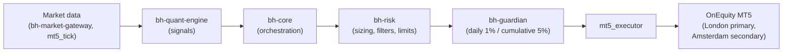
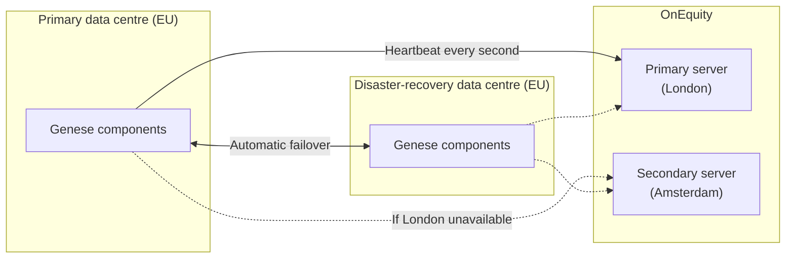

# Architecture Overview

*Genese Capital (formerly BlackHole Capital). Last reviewed September 2026.*

## Summary

Genese Capital runs a proprietary multi-component architecture deployed across **two European data centres** - a primary site and a disaster-recovery site - with **automatic failover**. Core risk controls are enforced by Genese infrastructure; broker protections are secondary safeguards. MT5 acts only as an execution connector to OnEquity.

## Components

| Component | Technology | Function |
|-----------|------------|----------|
| [mt5_executor](../repositories/mt5_executor.md) | C++ | Order execution |
| [mt5_tick](../repositories/mt5_tick.md) | C++ | Tick processing |
| [bh-risk](../repositories/bh-risk.md) | Go | Risk and position sizing |
| [bh-guardian](../repositories/bh-guardian.md) | Rust | Circuit breaker and protection |
| [bh-quant-engine](../repositories/bh-quant-engine.md) | Python | Quantitative analysis and signals |
| [bh-core](../repositories/bh-core.md) | Go | Orchestration |
| [bh-market-gateway](../repositories/bh-market-gateway.md) | Go / Rust | Market data |

## Order Flow

## Redundancy and Failover

| Scenario | Behaviour |
|----------|-----------|
| Primary data centre unavailable | Automatic failover to the disaster-recovery data centre |
| Primary broker server (London) unavailable | Connection moves to the secondary OnEquity server (Amsterdam) |
| Broker disconnection | New orders are suspended; existing positions remain managed; partners are alerted |
| Market-data anomaly | Automatic cross-validation between sources; depending on the anomaly the system discards the tick, freezes execution or pauses trading. A pause requires manual release |
| PAMM divergence | Hourly reconciliation with the PAMM platform; automatic pause and alert on divergence |

## Monitoring and Alerting

| Layer | Mechanism |
|-------|-----------|
| Broker connectivity | Heartbeat every second |
| Market data | Automatic cross-validation between sources |
| Account state | Hourly reconciliation with the PAMM platform |
| Execution | A dedicated trader monitors execution in real time and has an emergency stop |
| Alerts | Partners are alerted through an internal app and dashboard |
| Institutional monitoring | Account monitoring via API rather than investor passwords |

## Emergency Controls

| Control | Who / what | Effect |
|---------|-----------|--------|
| Daily loss limit (1% of NAV, since October 2025) | `bh-guardian`, server-side | Stops order generation and closes open positions; resumes automatically next session |
| Cumulative drawdown limit (5% of NAV) | `bh-guardian`, server-side | Closes all positions; resumes only after partner review and approval |
| Emergency stop | Dedicated trader | Halts execution |
| Full stop | Either partner | Full-stop authority and direct account access |
| Broker margin call (10%) | OnEquity | Independent of Genese infrastructure |

The daily and cumulative limits cannot be manually overridden. See the [Risk Framework](../risk-management/framework.md).

## Access and Security

- Passkey authentication with 2FA on all access
- Servers on an internal network reachable only via VPN
- Credentials rotated quarterly

## Change Management

- Staged deployment - demo, proprietary capital, production. No parameter change goes directly to production
- Lot and risk adjustments are system-generated and require management approval
- See [Production Change History](../PRODUCTION_CHANGE_HISTORY.md)
