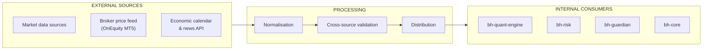

# Market Connectors Overview

*Genese Capital (formerly BlackHole Capital). Last reviewed September 2026.*

## Introduction

This document outlines how market data and event data enter the Genese Capital trading infrastructure through [bh-market-gateway](../repositories/bh-market-gateway.md) and [mt5_tick](../repositories/mt5_tick.md).

The specific data sources used by the decision engine are part of its factor composition, which is proprietary, and are not listed here.

## Data Flow

## Economic Calendar and News

The economic calendar and news are received via API. They drive the **news filter**, which blocks entries around high-impact events.

## Data Quality

Market data is **automatically cross-validated between sources**. Depending on the anomaly, the system:

| Response | Effect |
|----------|--------|
| Discard the tick | The anomalous tick is ignored |
| Freeze execution | No new orders while the anomaly persists |
| Pause trading | Trading stops; **a pause requires manual release** |

## Broker Connectivity

- Heartbeat with the broker every second
- Secondary OnEquity server (Amsterdam) if the primary (London) is unavailable
- On disconnection, new orders are suspended and existing positions remain managed
- Partners are alerted through an internal app and dashboard

## Data Licensing

Market data is used for internal trading operations and risk management only; raw data is not redistributed.
