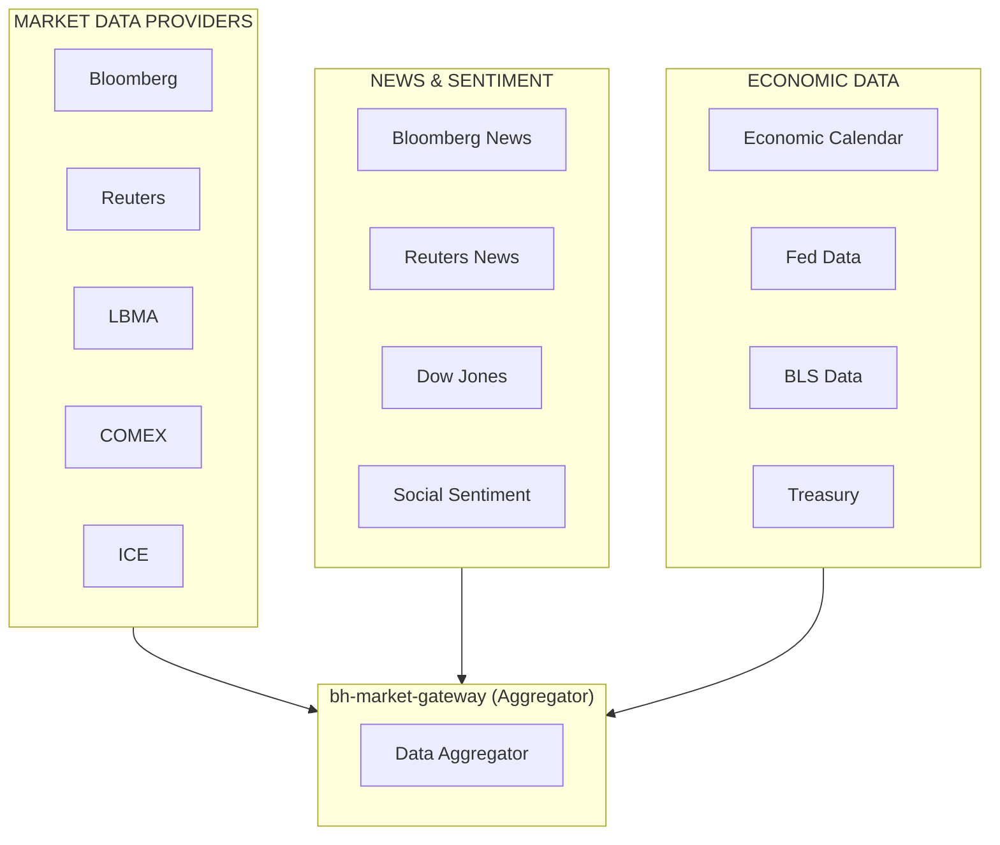
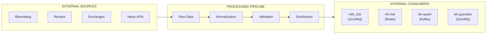
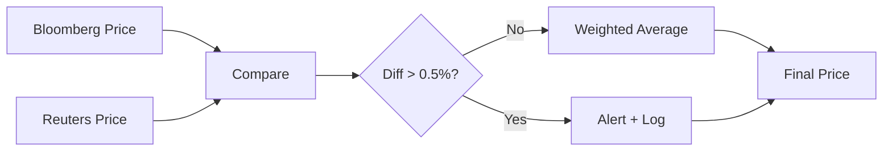
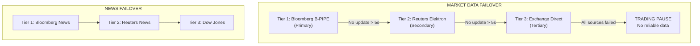

# Market Connectors Overview

## Introduction

BlackHole Fund's market connectivity infrastructure provides access to real-time market data, news feeds, and economic indicators from multiple institutional-grade sources. This document outlines our data provider ecosystem and connectivity architecture.

## Data Provider Ecosystem



## Primary Data Sources

### Bloomberg B-PIPE

**Purpose**: Primary source for real-time and reference data

| Data Type | Coverage | Update Frequency |
|-----------|----------|------------------|
| Spot prices | XAU/USD, XAG/USD | Real-time (< 5ms) |
| Futures | COMEX GC, SI | Real-time |
| FX rates | Major pairs | Real-time |
| Indices | DXY, VIX, SPX | Real-time |
| Reference data | Symbology, corporate actions | Daily |

**Connection Details**:
- Protocol: Bloomberg B-PIPE API
- Redundancy: Dual feed handlers
- Failover: Automatic (< 5s)

### Reuters Elektron

**Purpose**: Backup market data and additional coverage

| Data Type | Coverage | Update Frequency |
|-----------|----------|------------------|
| Spot prices | Precious metals | Real-time |
| FX rates | Extended pairs | Real-time |
| Commodities | Energy, metals | Real-time |
| Fixed income | Rates, yields | Real-time |

**Connection Details**:
- Protocol: Elektron Real-Time (ERT)
- Authentication: OAuth 2.0
- Redundancy: Multi-region endpoints

## Exchange Direct Feeds

### LBMA (London Bullion Market Association)

**Purpose**: Gold spot price reference (London fix)

| Feed | Description | Frequency |
|------|-------------|-----------|
| LBMA Gold Price AM | Morning auction | 10:30 London |
| LBMA Gold Price PM | Afternoon auction | 15:00 London |
| Spot indicative | Continuous quote | Real-time |

### COMEX (CME Group)

**Purpose**: Gold futures and options data

| Product | Contract | Data |
|---------|----------|------|
| GC | Gold Futures | Prices, volume, OI |
| OG | Gold Options | Greeks, IV surface |
| MGC | Micro Gold Futures | Prices, volume |

**Connection**:
- Protocol: FIX 4.4 / CME Market Data
- Location: Near liquidity provider
- Latency: < 5ms

### ICE (Intercontinental Exchange)

**Purpose**: US Dollar Index (DXY) and energy

| Product | Description |
|---------|-------------|
| DX | US Dollar Index Futures |
| CL | WTI Crude Oil |
| BZ | Brent Crude Oil |

### LSE (London Stock Exchange)

**Purpose**: Gold ETFs and mining equities

| Data Type | Examples |
|-----------|----------|
| ETFs | GLD, IAU, SGOL |
| Mining stocks | NEM, GOLD, AEM |
| Indices | FTSE Gold Mines |

### NYSE

**Purpose**: US-listed gold instruments

| Data Type | Examples |
|-----------|----------|
| ETFs | GLD, IAU, GDX, GDXJ |
| Mining ADRs | NEM, GOLD, AEM |

## News & Sentiment Feeds

### Bloomberg News

**Purpose**: Real-time market-moving news

| Category | Topics |
|----------|--------|
| Commodities | Gold, precious metals |
| Central banks | Fed, ECB, BOJ |
| Economic | GDP, inflation, employment |
| Geopolitical | Major events |

**Integration**:
- Real-time streaming
- Natural language processing for sentiment
- Event classification and tagging

### Reuters News

**Purpose**: Backup news source and additional coverage

| Category | Topics |
|----------|--------|
| Markets | All asset classes |
| Economics | Global macro |
| Politics | Policy-relevant events |

### Dow Jones Newswires

**Purpose**: Corporate news and market commentary

### Economic Calendar Integration

**Sources**:
- Bloomberg Economic Calendar
- Investing.com Economic Calendar
- FederalReserve.gov

**Events Monitored**:

| Event | Impact | Typical Gold Response |
|-------|--------|----------------------|
| FOMC Decision | High | High volatility |
| NFP | High | Significant moves |
| CPI/PPI | High | Inflation-driven |
| GDP | Medium | Moderate moves |
| Jobless Claims | Low | Minor impact |
| Fed Speeches | Variable | Depends on content |

## Data Flow Architecture



## API Specifications

### Bloomberg B-PIPE

```yaml
connection:
  type: "b-pipe"
  hosts:
    - "blpapi1.bloomberg.net:8194"
    - "blpapi2.bloomberg.net:8194"
  authentication:
    type: "application"
    name: "BlackHole:Gateway"

subscriptions:
  market_data:
    securities:
      - "XAU Curncy"      # Gold spot
      - "DXY Index"       # Dollar index
      - "GC1 Comdty"      # Gold futures front month
      - "VIX Index"       # Volatility index
    fields:
      - "BID"
      - "ASK"
      - "LAST_PRICE"
      - "VOLUME"
      - "BID_SIZE"
      - "ASK_SIZE"
```

### FIX Protocol (Exchanges)

**Session Configuration:**
- SenderCompID: BLACKHOLE
- TargetCompID: [EXCHANGE]
- HeartBtInt: 30
- ReconnectInterval: 5
- ResetOnLogon: Y

**Message Types:**
- Logon (A)
- Logout (5)
- Heartbeat (0)
- Market Data Request (V)
- Market Data Snapshot (W)
- Market Data Incremental (X)
- Reject (3)

### REST APIs

```yaml
economic_calendar:
  endpoint: "https://api.economicdata.com/v1/calendar"
  authentication:
    type: "api_key"
    header: "X-API-Key"
  rate_limit: 100/minute

  parameters:
    date_from: "today"
    date_to: "today+7d"
    importance: ["high", "medium"]
    countries: ["US", "EU", "GB", "JP", "CN"]

news_api:
  endpoint: "https://api.newsdata.io/v1/news"
  authentication:
    type: "api_key"
  categories:
    - "business"
    - "commodities"
  keywords:
    - "gold"
    - "federal reserve"
    - "inflation"
```

## Data Quality Assurance

### Validation Rules

| Check | Description | Action on Failure |
|-------|-------------|-------------------|
| Price range | Within ±10% of VWAP | Flag, use backup source |
| Timestamp | Not in future, < 5s stale | Flag, use backup |
| Sequence | Monotonic increase | Log gap, request refill |
| Spread | Positive, reasonable | Flag for review |
| Volume | Non-negative | Reject |

### Cross-Source Validation



### Latency Monitoring

| Source | Target Latency | Alert Threshold |
|--------|----------------|-----------------|
| Bloomberg | < 5ms | > 20ms |
| Reuters | < 10ms | > 50ms |
| COMEX FIX | < 5ms | > 20ms |
| News feeds | < 1s | > 5s |

## Failover Strategy



**Failover Criteria:**
- No update for > 5 seconds
- Latency > 100ms sustained
- Price validation failures
- Connection errors

**Note**: News failover is less critical; trading continues with delayed news

## Compliance & Licensing

### Data Licensing

All market data is properly licensed for:
- Internal trading operations
- Risk management
- Regulatory reporting

**Restrictions**:
- No redistribution of raw data
- No display to third parties
- Audit compliance required

### Regulatory Requirements

| Regulation | Requirement | Implementation |
|------------|-------------|----------------|
| MiFID II | Best execution | Multi-source aggregation |
| GDPR | Data privacy | PII handling procedures |
| Market abuse | Surveillance | Order/trade monitoring |

## Monitoring & Alerting

### Health Metrics

```
# Connection status
gateway_connection_status{source="bloomberg|reuters|comex"} # 1=up, 0=down

# Message throughput
gateway_messages_per_second{source="...",type="price|news"}

# Latency
gateway_latency_ms{source="...",quantile="0.5|0.95|0.99"}

# Data quality
gateway_validation_failures{source="...",reason="..."}
gateway_stale_data_count{source="..."}
```

### Alert Rules

| Alert | Condition | Severity |
|-------|-----------|----------|
| Source disconnected | Status = 0 for > 30s | Critical |
| High latency | p99 > 100ms for > 1min | Warning |
| Data gap | No update > 10s | Warning |
| All sources down | All status = 0 | Critical |
