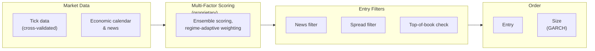

# Quantitative Models

*Genese Capital (formerly BlackHole Capital). Last reviewed September 2026.*

## Overview

Trading decisions are generated by a **multi-factor scoring system with ensemble methods and regime-adaptive weighting**, implemented in [bh-quant-engine](../repositories/bh-quant-engine.md).

**Factor composition, weights and refresh frequencies are proprietary and are not disclosed.** Earlier versions of this document listed indicator categories, weight ranges and update frequencies; that information has been removed.

## Decision Engine

## Approach

- **Instrument:** gold only (XAUUSD).
- **Style:** intraday, multi-factor, regime-adaptive and direction-neutral.
- It is neither a pure mean-reversion nor a trend-following system: entries are split roughly evenly between trading with and against the preceding short-term move.
- There is no carry or arbitrage component - positions are closed intraday and the strategy trades a single instrument at a single venue.

## Entry and Exit

Each position is exited by opening an offsetting position, triggered by a trailing-stop profit target or a fixed stop. Once the offsetting leg is open the pair is market-neutral and the result is locked; the two legs are then netted via Close By. Settlement timing rules are proprietary.

## Position Sizing

A **GARCH volatility model** sets position size: higher volatility reduces lot size, lower volatility allows larger size within limits. Limits scale in lots per million of NAV. Lot adjustments are system-generated and require management approval. See the [Risk Framework](../risk-management/framework.md).

## Research and Model Governance

- Monthly research and recalibration cycle: performance analysis, volatility-regime assessment, parameter evaluation.
- Staged deployment - demo, proprietary capital, production. No parameter change goes directly to production.
- All strategy development is internal; no core logic is outsourced.
