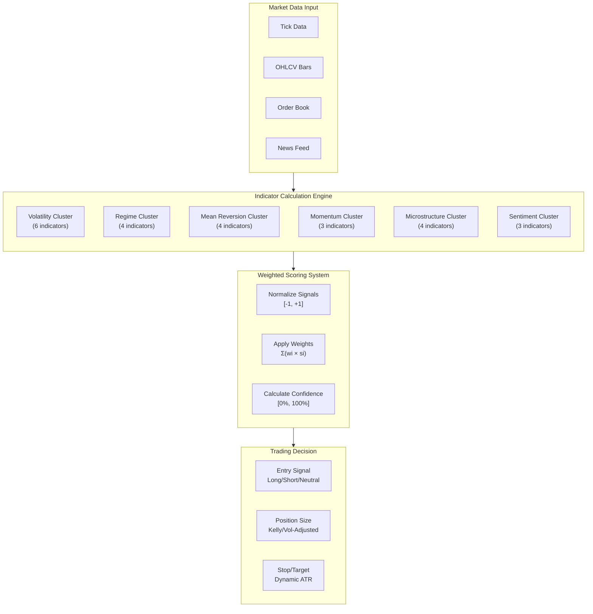
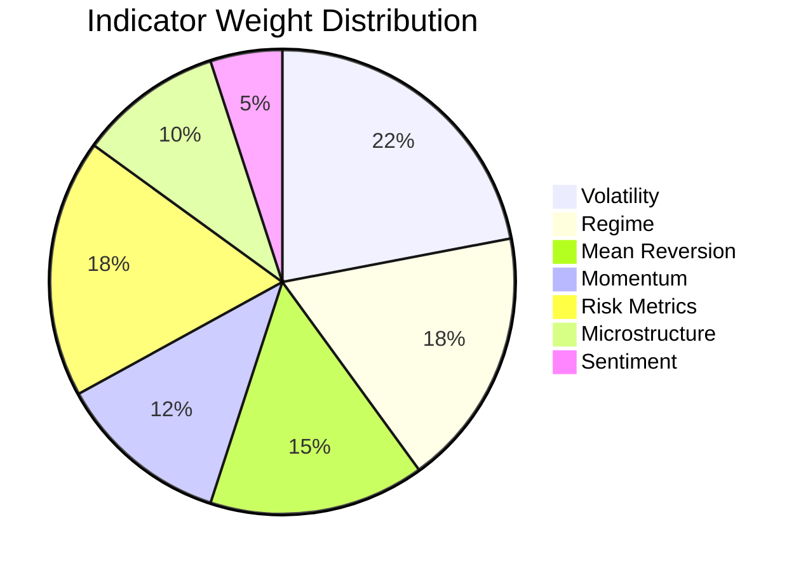
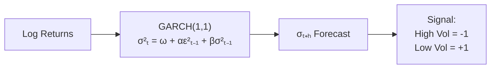
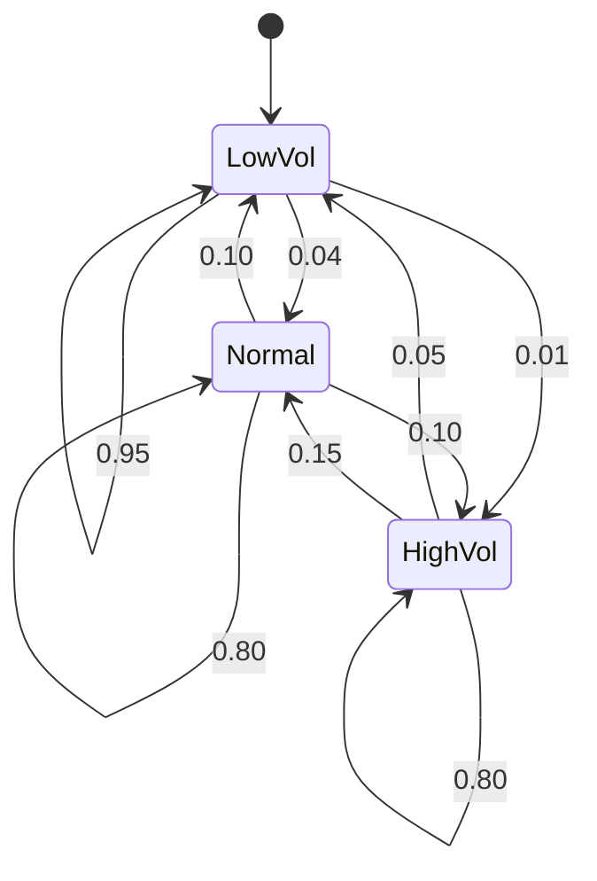
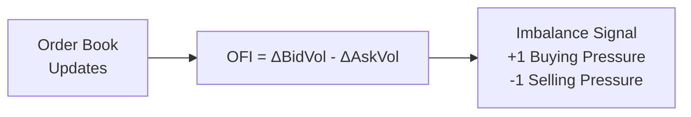
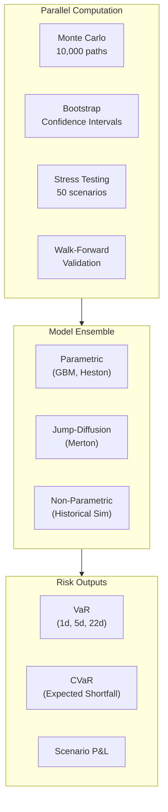
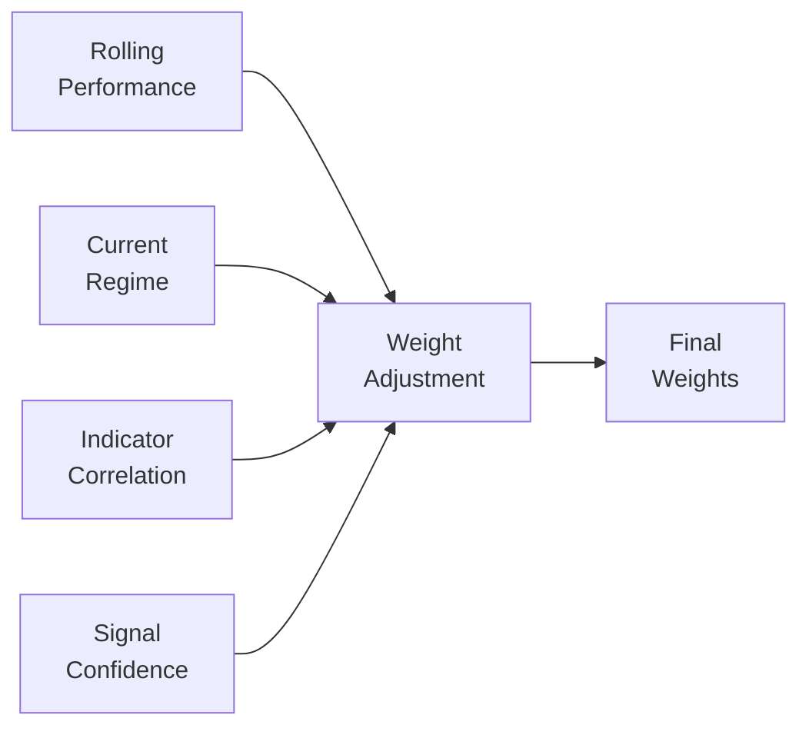

# Quantitative Models

## Overview

BlackHole Fund's quantitative engine includes a library of **24 indicator modules** organized into 7 clusters. **Not all indicators are active simultaneously** - the system dynamically selects 8-12 core indicators based on current market regime, with weights adjusted accordingly.

### Active vs. Available Indicators

| Status | Count | Description |
|--------|-------|-------------|
| **Core (Always Active)** | 6 | Volatility forecast, regime detection, VaR, drawdown |
| **Regime-Dependent** | 6-8 | Selected based on current market conditions |
| **Available (Inactive)** | 10-12 | Research modules, activated when conditions warrant |

This modular approach:
- Reduces overfitting risk from using too many correlated signals
- Allows rapid adaptation to changing market conditions
- Maintains research pipeline for continuous improvement
- Keeps computational overhead manageable

## Decision Engine Architecture



## Indicator Weighting System

Each indicator produces a **normalized signal** in the range `[-1, +1]`:
- **+1**: Strong bullish signal
- **0**: Neutral
- **-1**: Strong bearish signal

The final composite signal is calculated as:

```
Composite Signal = Σ(wi × si × ci) / Σ(wi × ci)

Where:
  wi = Indicator weight (configured per indicator)
  si = Signal value [-1, +1]
  ci = Confidence score [0, 1]
```

### Weight Configuration



| Cluster | Weight Range | Adaptive | Update Frequency |
|---------|--------------|----------|------------------|
| **Volatility** | 18-25% | Yes | 1min - 1hr |
| **Regime** | 15-22% | Yes | 1hr - 4hr |
| **Mean Reversion** | 12-18% | Yes | 5min - 1hr |
| **Momentum** | 10-15% | No | 1min - 15min |
| **Risk Metrics** | 15-20% | Yes | Real-time |
| **Microstructure** | 8-12% | No | Tick-level |
| **Sentiment** | 3-8% | Yes | 15min - Daily |

---

## Volatility Cluster (6 Indicators)

### Indicator V1: GARCH(1,1) Forecast

Standard volatility clustering model.



| Parameter | Value | Description |
|-----------|-------|-------------|
| Weight | 4% | Base volatility measure |
| Lookback | 252 days | Training window |
| Refit | Daily | Re-estimation frequency |
| Horizon | 1, 5, 22 days | Forecast horizons |

### Indicator V2: EGARCH (Leverage Effect)

Captures asymmetric volatility response to negative vs positive shocks.

| Parameter | Value |
|-----------|-------|
| Weight | 4% |
| Lookback | 252 days |
| Asymmetry Detection | γ parameter |

### Indicator V3: FIGARCH (Long Memory)

For persistent volatility regimes with fractional integration.

| Parameter | Value |
|-----------|-------|
| Weight | 3% |
| Memory Parameter | d ∈ (0, 0.5) |
| Use Case | Long-horizon forecasting |

### Indicator V4: Realized Volatility (TSRV)

High-frequency intraday volatility using Two-Scale estimator.

| Parameter | Value |
|-----------|-------|
| Weight | 5% |
| Input Frequency | Tick data |
| Noise Correction | Yes (microstructure) |

### Indicator V5: Range-Based Volatility (Parkinson)

Uses high-low range for volatility estimation.

| Parameter | Value |
|-----------|-------|
| Weight | 3% |
| Formula | σ² = (1/4ln2) × (H-L)² |
| Advantage | Less noisy than close-to-close |

### Indicator V6: Volatility Term Structure

Compares short-term vs long-term volatility expectations.

| Parameter | Value |
|-----------|-------|
| Weight | 3% |
| Short Term | 5-day realized |
| Long Term | 22-day realized |
| Signal | Contango/Backwardation |

---

## Regime Detection Cluster (4 Indicators)

### Indicator R1: Hidden Markov Model (3-State)



| State | Volatility | Position Sizing | Weight |
|-------|------------|-----------------|--------|
| Low Vol | < 10% ann | 1.25x | 5% |
| Normal | 10-20% ann | 1.00x | 5% |
| High Vol | > 20% ann | 0.50x | 5% |

### Indicator R2: Regime-Switching GARCH

Markov-switching GARCH with regime-dependent parameters.

| Parameter | Value |
|-----------|-------|
| Weight | 4% |
| Regimes | 2 (high/low vol) |
| Transition Matrix | Time-varying |

### Indicator R3: Structural Break Detection (CUSUM)

Detects regime changes using cumulative sum tests.

| Parameter | Value |
|-----------|-------|
| Weight | 2% |
| Test | CUSUM, Bai-Perron |
| Sensitivity | Configurable |

### Indicator R4: Volatility Regime Classifier

ML-based regime classification using multiple features.

| Parameter | Value |
|-----------|-------|
| Weight | 4% |
| Features | Vol, skew, kurtosis, autocorr |
| Model | Random Forest |

---

## Mean Reversion Cluster (4 Indicators)

### Indicator M1: Hurst Exponent


| Hurst Value | Signal | Trading Implication |
|-------------|--------|---------------------|
| H < 0.35 | +1 (strong) | Strong mean reversion |
| H 0.35-0.45 | +0.5 | Moderate mean reversion |
| H 0.45-0.55 | 0 | No signal |
| H 0.55-0.65 | -0.5 | Moderate trending |
| H > 0.65 | -1 (strong) | Strong trend following |

### Indicator M2: Ornstein-Uhlenbeck Parameters

Mean-reverting stochastic process estimation.

| Parameter | Value |
|-----------|-------|
| Weight | 4% |
| Estimation | MLE |
| Outputs | θ (speed), μ (mean), σ |

### Indicator M3: Half-Life of Mean Reversion

Time estimate for spread to revert 50% to mean.

| Parameter | Value |
|-----------|-------|
| Weight | 3% |
| Formula | HL = -ln(2)/λ |
| Use | Position holding period |

### Indicator M4: Z-Score (Bollinger)

Standardized deviation from moving average.

| Parameter | Value |
|-----------|-------|
| Weight | 4% |
| Lookback | 20 periods |
| Entry | |Z| > 2 |
| Exit | |Z| < 0.5 |

---

## Momentum Cluster (3 Indicators)

### Indicator Mo1: Spectral Analysis (FFT)

Frequency domain decomposition for cycle detection.

| Parameter | Value |
|-----------|-------|
| Weight | 4% |
| Method | Fast Fourier Transform |
| Output | Dominant frequencies, power |

### Indicator Mo2: Wavelet Decomposition

Multi-resolution time-frequency analysis.

| Parameter | Value |
|-----------|-------|
| Weight | 4% |
| Wavelet | Daubechies (db4) |
| Levels | 4-6 decomposition levels |
| Use | Trend/noise separation |

### Indicator Mo3: Trend Strength Index

Directional movement analysis.

| Parameter | Value |
|-----------|-------|
| Weight | 4% |
| Components | ADX, DI+, DI- |
| Strong Trend | ADX > 25 |

---

## Microstructure Cluster (4 Indicators)

### Indicator Mi1: Order Flow Imbalance (OFI)



| Parameter | Value |
|-----------|-------|
| Weight | 3% |
| Update | Tick-by-tick |
| Smoothing | EMA(20 ticks) |

### Indicator Mi2: Volume-Synchronized PIN (VPIN)

Probability of informed trading.

| Parameter | Value |
|-----------|-------|
| Weight | 3% |
| Bucket Size | Volume-based |
| High VPIN | Risk-off signal |

### Indicator Mi3: Kyle's Lambda

Price impact coefficient estimation.

| Parameter | Value |
|-----------|-------|
| Weight | 2% |
| Formula | ΔP = λ × OrderFlow |
| Use | Liquidity measure |

### Indicator Mi4: Bid-Ask Spread Dynamics

Spread behavior analysis.

| Parameter | Value |
|-----------|-------|
| Weight | 2% |
| Metrics | Mean, volatility, skew |
| Wide Spread | Low liquidity signal |

---

## Risk Metrics Cluster (5 Indicators)

### Indicator Ri1: Rolling VaR (95%)

Historical simulation VaR.

| Parameter | Value |
|-----------|-------|
| Weight | 4% |
| Confidence | 95% |
| Window | 252 days |

### Indicator Ri2: CVaR / Expected Shortfall

Average loss beyond VaR threshold.

| Parameter | Value |
|-----------|-------|
| Weight | 4% |
| Formula | E[Loss | Loss > VaR] |
| Advantage | Tail risk capture |

### Indicator Ri3: Drawdown Monitor

Current and maximum drawdown tracking.

| Parameter | Value |
|-----------|-------|
| Weight | 4% |
| Daily Limit | 1% |
| Weekly Limit | 3% |

### Indicator Ri4: Correlation Tracker

Cross-asset correlation monitoring.

| Parameter | Value |
|-----------|-------|
| Weight | 3% |
| Assets | DXY, VIX, Yields |
| Rolling Window | 60 days |

### Indicator Ri5: Beta to Market

Sensitivity to S&P 500 movements.

| Parameter | Value |
|-----------|-------|
| Weight | 3% |
| Benchmark | S&P 500 |
| Use | Systematic risk measure |

---

## Sentiment Cluster (3 Indicators)

### Indicator S1: News Sentiment Score

NLP-based news analysis.

| Parameter | Value |
|-----------|-------|
| Weight | 2% |
| Sources | Provider A, Provider B |
| Model | FinBERT |
| Lag | 15-minute aggregation |

### Indicator S2: COT Positioning

Commitment of Traders data.

| Parameter | Value |
|-----------|-------|
| Weight | 2% |
| Update | Weekly (Tuesday data, Friday release) |
| Signal | Net commercial positioning |

### Indicator S3: Options Flow Analysis

Put/Call ratio and unusual activity.

| Parameter | Value |
|-----------|-------|
| Weight | 1% |
| Metrics | P/C ratio, IV skew |
| Signal | Hedging demand indicator |

---

## Simulation & Calculation Pipeline



### Monte Carlo Specifications

| Parameter | Value |
|-----------|-------|
| Simulations | 10,000 paths |
| Horizon | 1, 5, 22 days |
| Models | GBM, Heston, Merton Jump |
| Correlation | Cholesky decomposition |
| Distribution | Normal, Student-t (v=5) |

### Stress Test Scenarios

| Scenario | Gold Move | VIX Change | DXY Change | Probability |
|----------|-----------|------------|------------|-------------|
| Flash Crash | -5% | +50% | +2% | 0.1% |
| Fed Hawkish | -3% | +30% | +3% | 2% |
| Geopolitical | +4% | +40% | -1% | 5% |
| Risk-Off | +2% | +25% | +1% | 10% |
| Liquidity Crisis | -8% | +100% | +5% | 0.05% |

---

## Adaptive Weight Adjustment

Weights are dynamically adjusted based on:

1. **Recent Performance**: Indicators with better recent predictive power get higher weights
2. **Market Regime**: Different regimes favor different indicator types
3. **Correlation**: Reduce weights for highly correlated indicators
4. **Confidence Decay**: Lower weights for stale or uncertain signals



### Weight Bounds

All weights are constrained within configured bounds to prevent over-optimization:

| Cluster | Min Weight | Max Weight |
|---------|------------|------------|
| Volatility | 15% | 28% |
| Regime | 12% | 25% |
| Mean Reversion | 10% | 20% |
| Momentum | 8% | 18% |
| Risk | 12% | 22% |
| Microstructure | 5% | 15% |
| Sentiment | 2% | 10% |

---

## Model Validation & Backtesting

| Metric | Target | Current |
|--------|--------|---------|
| VaR Violations (95%) | 5% | 4.8% |
| VaR Violations (99%) | 1% | 1.1% |
| Signal Accuracy | > 52% | 54.3% |
| Sharpe Ratio | > 1.0 | 1.4 |
| Max Drawdown | < 10% | 7.2% |

## References

This quantitative framework draws from established academic and industry research:

- Bollerslev, T. (1986). Generalized Autoregressive Conditional Heteroskedasticity
- Engle, R. F., & Granger, C. W. (1987). Co-integration and Error Correction
- Heston, S. L. (1993). A Closed-Form Solution for Options with Stochastic Volatility
- Mandelbrot, B. B. (1963). The Variation of Certain Speculative Prices
- Merton, R. C. (1976). Option Pricing When Underlying Stock Returns Are Discontinuous
- Easley, D., et al. (2012). Flow Toxicity and Liquidity in a High-Frequency World
