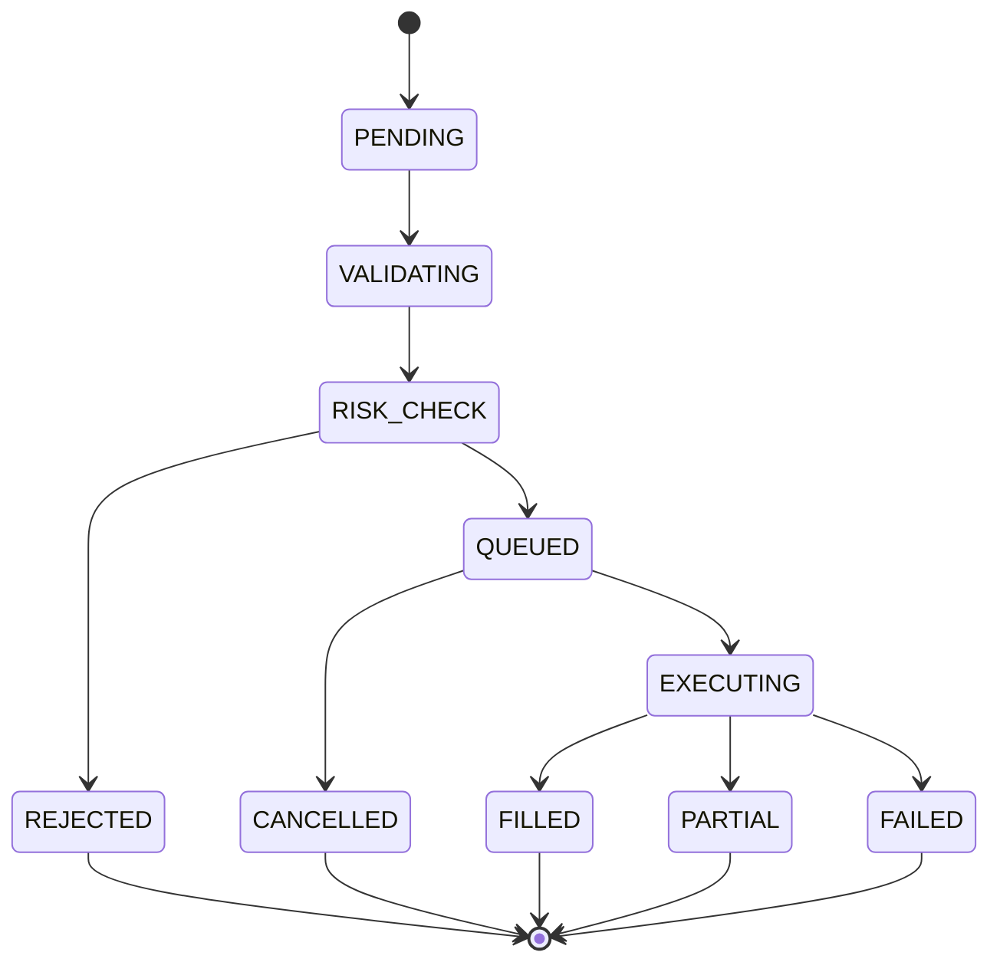
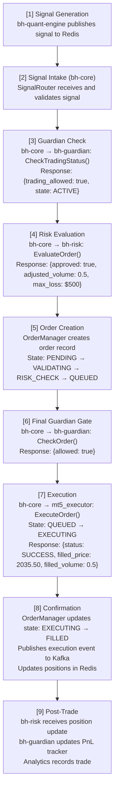
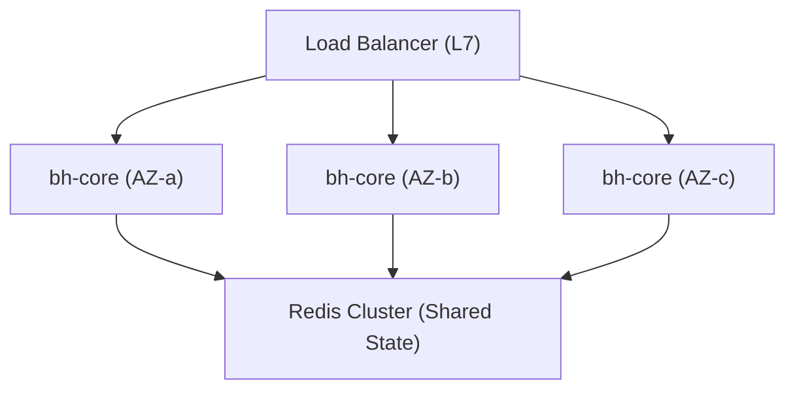

# bh-core

## Overview

**bh-core** is the central orchestration service for BlackHole Fund's trading infrastructure, written in Go. It coordinates all other services, manages the trading workflow, handles service discovery, and provides a unified control plane for the entire system.

## Technical Specifications

| Attribute | Value |
|-----------|-------|
| **Language** | Go 1.22+ |
| **Framework** | gRPC, Gin (HTTP), Consul |
| **Dependencies** | Redis, PostgreSQL, Kafka |
| **Role** | Central orchestrator |

## Architecture

```mermaid
flowchart TB
    subgraph bhCore["bh-core"]
        subgraph api["API Gateway Layer"]
            gRPCServer["gRPC Server (Internal)"]
            RESTAPI["REST API (Admin)"]
            WebSocket["WebSocket (Events)"]
        end

        subgraph services["Core Services"]
            subgraph orderMgr["Order Manager"]
                orderQueue["Order queue"]
                stateMachine["State machine"]
                reconciliation["Reconciliation"]
            end
            subgraph signalRouter["Signal Router"]
                signalIntake["Signal intake"]
                distribution["Distribution"]
                filtering["Filtering"]
            end
            subgraph strategyMgr["Strategy Mgr"]
                strategyReg["Strategy reg"]
                lifecycle["Lifecycle"]
                allocation["Allocation"]
            end
            subgraph serviceMesh["Service Mesh"]
                discovery["Discovery"]
                loadBalance["Load balance"]
                circuitBreak["Circuit break"]
            end
            subgraph configMgr["Config Manager"]
                dynamicConf["Dynamic conf"]
                versioning["Versioning"]
                configDist["Distribution"]
            end
            subgraph healthMon["Health Monitor"]
                serviceHealth["Service health"]
                alerts["Alerts"]
                autoRecovery["Auto-recovery"]
            end
        end

        subgraph integration["Integration Layer"]
            bhRiskClient["bh-risk Client"]
            bhGuardianClient["bh-guardian Client"]
            bhQuantClient["bh-quant Client"]
            mt5ExecutorClient["mt5_executor Client"]
        end

        subgraph persistence["Persistence Layer"]
            PostgreSQL["PostgreSQL (State)"]
            Redis["Redis (Cache)"]
            Kafka["Kafka (Events)"]
            InfluxDB["InfluxDB (Metrics)"]
        end

        api --> services
        services --> integration
        services --> persistence
    end
```



## Core Components

### 1. Order Manager

Central order management with full lifecycle tracking.



### 2. Signal Router

Routes trading signals from strategies to the execution pipeline.

```go
type SignalRouter struct {
    strategies   map[string]*Strategy
    riskClient   RiskServiceClient
    guardClient  GuardianServiceClient
    orderManager *OrderManager
}

func (r *SignalRouter) ProcessSignal(ctx context.Context, signal *Signal) error {
    // 1. Validate signal
    if err := r.validateSignal(signal); err != nil {
        return fmt.Errorf("signal validation failed: %w", err)
    }

    // 2. Check guardian status
    status, err := r.guardClient.CheckTradingStatus(ctx, &StatusRequest{})
    if err != nil || !status.TradingAllowed {
        return ErrTradingNotAllowed
    }

    // 3. Get risk assessment
    decision, err := r.riskClient.EvaluateOrder(ctx, signal.ToOrderRequest())
    if err != nil {
        return fmt.Errorf("risk evaluation failed: %w", err)
    }

    if !decision.Approved {
        return fmt.Errorf("order rejected by risk: %s", decision.Reason)
    }

    // 4. Create order with adjusted size
    order := &Order{
        Signal:   signal,
        Volume:   decision.AdjustedVolume,
        MaxLoss:  decision.MaxLoss,
    }

    // 5. Submit to order manager
    return r.orderManager.Submit(ctx, order)
}
```

### 3. Service Discovery & Health

Manages service registration and health monitoring via Consul.

```
Service Registry:
├── mt5-tick-primary      health: passing   zone: ld4-a
├── mt5-tick-backup       health: passing   zone: ld4-b
├── mt5-executor-primary  health: passing   zone: ld4-a
├── mt5-executor-backup   health: passing   zone: ld4-b
├── bh-risk-1             health: passing   zone: ld4-a
├── bh-risk-2             health: passing   zone: ld4-b
├── bh-guardian-1         health: passing   zone: ld4-a
├── bh-guardian-2         health: passing   zone: ld4-b
├── bh-quant-1            health: passing   zone: ld4-a
└── bh-quant-2            health: passing   zone: ld4-b
```

### 4. Configuration Manager

Dynamic configuration with hot-reload capability.

```yaml
# Managed configuration keys
trading:
  enabled: true
  symbols:
    - XAUUSD
  max_open_orders: 10

risk:
  daily_loss_limit_pct: 1.0
  max_position_size: 10.0
  max_leverage: 20

strategies:
  momentum_gold:
    enabled: true
    allocation_pct: 30
  mean_reversion_gold:
    enabled: true
    allocation_pct: 40
  volatility_breakout:
    enabled: false
    allocation_pct: 30
```

## Trading Workflow



## API Reference

### gRPC Services

```protobuf
service CoreService {
  // Order Management
  rpc SubmitOrder(OrderRequest) returns (OrderResponse);
  rpc CancelOrder(CancelRequest) returns (CancelResponse);
  rpc GetOrder(OrderQuery) returns (Order);
  rpc ListOrders(OrderFilter) returns (stream Order);

  // Strategy Management
  rpc RegisterStrategy(Strategy) returns (RegistrationResponse);
  rpc UpdateStrategy(StrategyUpdate) returns (UpdateResponse);
  rpc GetStrategyStatus(StrategyQuery) returns (StrategyStatus);

  // System Control
  rpc GetSystemStatus(Empty) returns (SystemStatus);
  rpc SetTradingEnabled(TradingControl) returns (ControlResponse);

  // Events
  rpc SubscribeEvents(EventFilter) returns (stream SystemEvent);
}
```

### REST API (Admin)

```
Admin API Endpoints:

GET  /api/v1/status              - System status overview
GET  /api/v1/orders              - List orders with filters
GET  /api/v1/orders/{id}         - Get specific order
POST /api/v1/orders/{id}/cancel  - Cancel order

GET  /api/v1/strategies          - List strategies
PUT  /api/v1/strategies/{id}     - Update strategy config
POST /api/v1/strategies/{id}/enable   - Enable strategy
POST /api/v1/strategies/{id}/disable  - Disable strategy

GET  /api/v1/positions           - Current positions
GET  /api/v1/pnl                 - P&L summary

POST /api/v1/control/halt        - Emergency halt (requires auth)
POST /api/v1/control/resume      - Resume trading (requires auth)

GET  /api/v1/config              - Get current config
PUT  /api/v1/config              - Update config (hot reload)
```

## Configuration

```yaml
# bh-core.yaml
server:
  grpc_port: 50050
  http_port: 8080
  ws_port: 8081
  metrics_port: 9094

services:
  risk:
    address: "bh-risk:50051"
    timeout: 5s
    retry_count: 3

  guardian:
    address: "bh-guardian:50053"
    timeout: 1s
    retry_count: 1  # Low retry for latency

  quant:
    address: "bh-quant-engine:50052"
    timeout: 10s
    retry_count: 3

  executor:
    zmq_endpoint: "tcp://mt5-executor:5556"
    timeout: 2s

discovery:
  consul:
    address: "consul:8500"
    service_name: "bh-core"
    health_check_interval: 10s

trading:
  enabled: true
  symbols: ["XAUUSD"]
  max_pending_orders: 100
  order_timeout: 30s

events:
  kafka:
    brokers: ["kafka:9092"]
    topic_prefix: "blackhole"
    partitions: 3

data:
  postgres:
    dsn: ${POSTGRES_DSN}
    max_connections: 20

  redis:
    address: "redis:6379"
    db: 0

logging:
  level: INFO
  format: json

monitoring:
  tracing:
    enabled: true
    jaeger_endpoint: "http://jaeger:14268/api/traces"
```

## High Availability



- Leader Election: Consul-based distributed lock
- Failover Time: < 5 seconds

### Leader Election

Only one bh-core instance processes orders at a time:

```go
func (c *Core) acquireLeadership(ctx context.Context) error {
    lock, err := c.consul.LockKey("service/bh-core/leader")
    if err != nil {
        return err
    }

    // Attempt to acquire lock
    stopCh := make(chan struct{})
    lockCh, err := lock.Lock(stopCh)
    if err != nil {
        return err
    }

    // We are now the leader
    c.isLeader.Store(true)
    c.startProcessing(ctx)

    // Monitor lock
    go func() {
        <-lockCh
        c.isLeader.Store(false)
        c.stopProcessing()
    }()

    return nil
}
```

## Monitoring

### Key Metrics

```
# Order metrics
bh_core_orders_submitted_total{strategy="...",symbol="..."}
bh_core_orders_filled_total{strategy="...",symbol="..."}
bh_core_orders_rejected_total{reason="..."}
bh_core_order_latency_seconds{stage="validation|risk|execution"}

# Service health
bh_core_service_health{service="risk|guardian|quant|executor"}
bh_core_service_latency_seconds{service="..."}

# System metrics
bh_core_is_leader{instance="..."}
bh_core_pending_orders
bh_core_active_strategies
```

## Operational Procedures

### Emergency Halt

```bash
# Via CLI
bh-core-cli halt --reason "Market volatility" --operator "john.doe"

# Via API
curl -X POST https://bh-core/api/v1/control/halt \
  -H "Authorization: Bearer $TOKEN" \
  -d '{"reason": "Market volatility", "operator": "john.doe"}'
```

### Strategy Deployment

```bash
# Register new strategy
bh-core-cli strategy register \
  --name "new_strategy" \
  --type "signal" \
  --allocation 10

# Enable strategy
bh-core-cli strategy enable --name "new_strategy"

# Monitor strategy
bh-core-cli strategy status --name "new_strategy"
```
