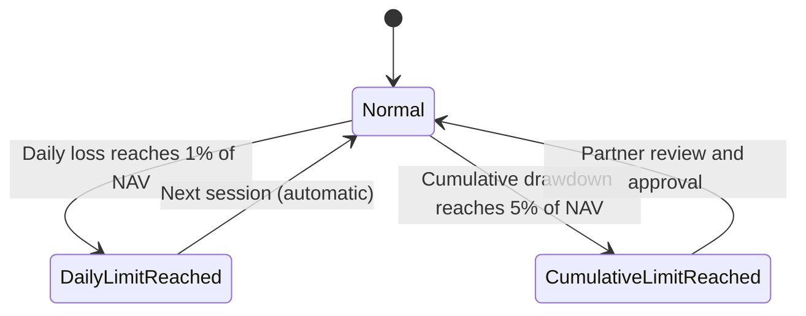
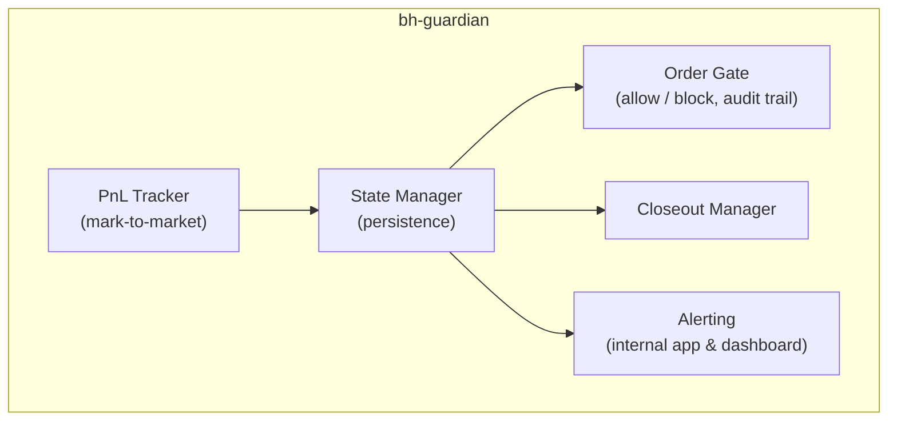
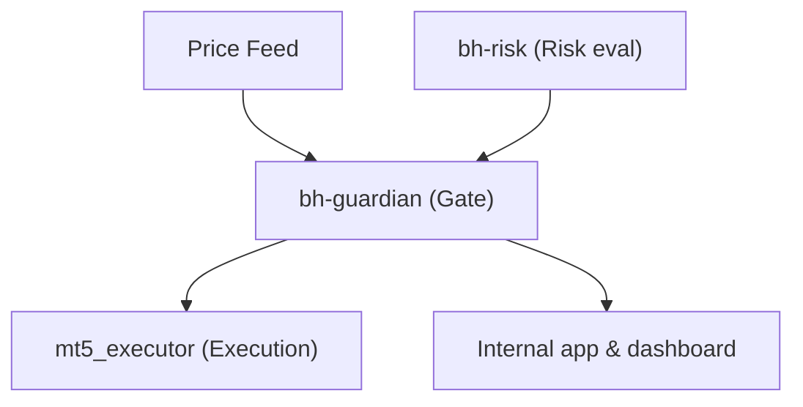

# bh-guardian

## Overview

**bh-guardian** is the circuit breaker and system protection service of the Genese Capital (formerly BlackHole Capital) infrastructure, written in Rust. It enforces the account-level loss limits server-side and sits in front of the execution layer:

- **Daily loss limit: 1% of NAV** (in place since October 2025)
- **Cumulative drawdown limit: 5% of NAV**

These limits are enforced server-side and **cannot be manually overridden**.

## Technical Specifications

| Attribute | Value |
|-----------|-------|
| **Language** | Rust 1.75+ |
| **Async Runtime** | Tokio |
| **Dependencies** | tonic (gRPC), redis-rs, tokio-postgres |
| **Role** | Circuit breaker and protection |

## Protection States

*State names below are descriptive.*

| State | Trigger | Behaviour | Resumption |
|-------|---------|-----------|------------|
| **Normal** | Normal operation | Orders pass to execution after risk checks | - |
| **Daily limit reached** | Daily loss reaches 1% of NAV | Stops order generation and closes open positions | Automatically at the next session |
| **Cumulative limit reached** | Cumulative drawdown reaches 5% of NAV | Closes all positions | Only after partner review and approval |

The 5% cumulative limit has never been reached.

## Core Components

| Component | Function |
|-----------|----------|
| PnL Tracker | Real-time mark-to-market of open positions against the daily and cumulative limits |
| State Manager | Holds and persists the protection state |
| Order Gate | Checkpoint for every order entering the execution path; blocks new orders when a limit has been hit |
| Closeout Manager | Closes open positions when a limit is hit |
| Alerting | Partners are alerted through an internal app and dashboard |

## Human Oversight

- A dedicated trader monitors execution in real time and has an emergency stop.
- Both partners have full-stop authority and direct account access.
- The daily and cumulative limits themselves cannot be manually overridden.

## Integration

## Audit Trail

Every state change and order decision is logged with timestamp, previous and new state, trigger reason and current PnL metrics.
