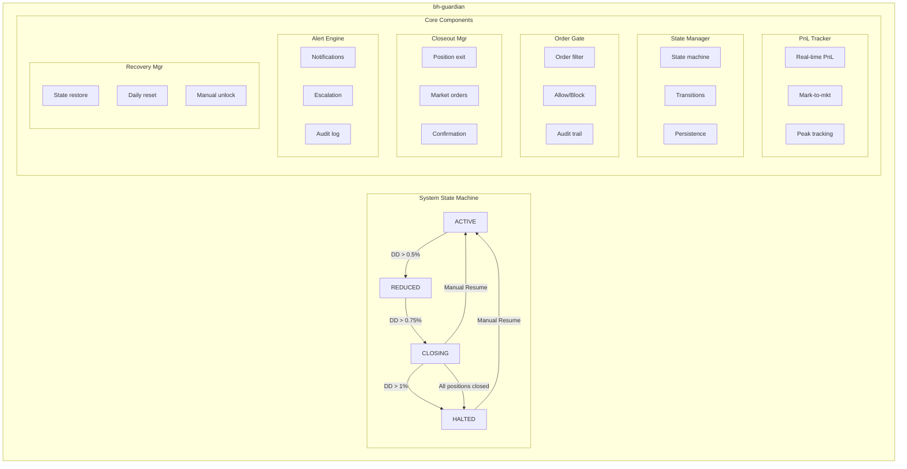
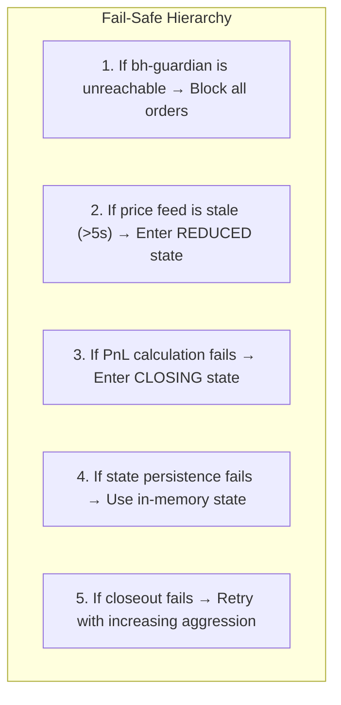
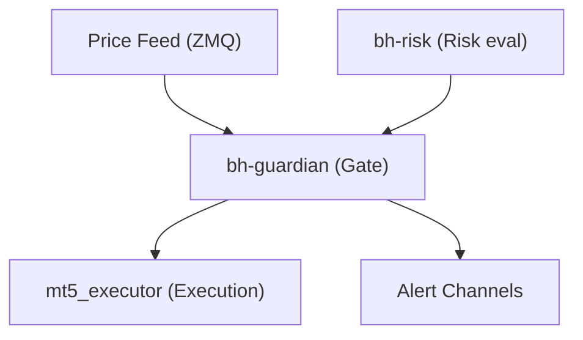

# bh-guardian

## Overview

**bh-guardian** is the circuit breaker and system protection service written in Rust. It enforces the **1% daily loss limit** and acts as the last line of defense before any order reaches the execution layer. When triggered, it immediately halts all trading activity and initiates position closeout procedures.

## Technical Specifications

| Attribute | Value |
|-----------|-------|
| **Language** | Rust 1.75+ |
| **Async Runtime** | Tokio |
| **Dependencies** | tonic (gRPC), redis-rs, tokio-postgres |
| **Target Latency** | < 1ms decision time |

## Architecture



## System States

### State Definitions

| State | Description | Trading Allowed | Actions |
|-------|-------------|-----------------|---------|
| **ACTIVE** | Normal operation | All orders | None |
| **REDUCED** | Warning threshold (0.5%) | Reduced sizes | Alert sent |
| **CLOSING** | Alert threshold (0.75%) | Close only | Reduce exposure |
| **HALTED** | Circuit breaker (1.0%) | None | Close all positions |

### State Transitions

```rust
#[derive(Debug, Clone, Copy, PartialEq)]
pub enum SystemState {
    Active,
    Reduced,
    Closing,
    Halted,
}

impl SystemState {
    pub fn from_drawdown(dd_pct: f64) -> Self {
        match dd_pct {
            d if d >= 1.0 => SystemState::Halted,
            d if d >= 0.75 => SystemState::Closing,
            d if d >= 0.5 => SystemState::Reduced,
            _ => SystemState::Active,
        }
    }

    pub fn is_trading_allowed(&self) -> bool {
        matches!(self, SystemState::Active | SystemState::Reduced)
    }

    pub fn is_new_positions_allowed(&self) -> bool {
        matches!(self, SystemState::Active)
    }

    pub fn position_size_multiplier(&self) -> f64 {
        match self {
            SystemState::Active => 1.0,
            SystemState::Reduced => 0.5,
            SystemState::Closing => 0.0,
            SystemState::Halted => 0.0,
        }
    }
}
```

## Core Components

### 1. PnL Tracker

Real-time profit and loss calculation with mark-to-market pricing.

```rust
pub struct PnLTracker {
    // Starting equity for the day
    day_start_equity: Decimal,

    // Peak equity (for drawdown calculation)
    peak_equity: Decimal,

    // Current positions and prices
    positions: HashMap<String, Position>,
    current_prices: HashMap<String, Price>,

    // Calculated values
    realized_pnl: Decimal,
    unrealized_pnl: Decimal,
}

impl PnLTracker {
    pub fn current_equity(&self) -> Decimal {
        self.day_start_equity + self.realized_pnl + self.unrealized_pnl
    }

    pub fn daily_drawdown_pct(&self) -> f64 {
        let current = self.current_equity();
        let dd = (self.day_start_equity - current) / self.day_start_equity;
        dd.to_f64().unwrap_or(0.0) * 100.0
    }

    pub fn update_price(&mut self, symbol: &str, price: Price) {
        self.current_prices.insert(symbol.to_string(), price);
        self.recalculate_unrealized();
    }
}
```

### 2. Order Gate

The critical checkpoint for all orders entering the execution path.

```rust
pub struct OrderGate {
    state_manager: Arc<StateManager>,
    pnl_tracker: Arc<RwLock<PnLTracker>>,
    audit_logger: Arc<AuditLogger>,
}

impl OrderGate {
    pub async fn check_order(&self, order: &OrderRequest) -> GateDecision {
        let state = self.state_manager.current_state().await;
        let decision = match state {
            SystemState::Halted => GateDecision::Blocked {
                reason: "System halted - daily loss limit reached".to_string(),
            },
            SystemState::Closing => {
                if order.is_close_order() {
                    GateDecision::Allowed
                } else {
                    GateDecision::Blocked {
                        reason: "Only closing orders allowed".to_string(),
                    }
                }
            }
            SystemState::Reduced => GateDecision::AllowedWithAdjustment {
                size_multiplier: 0.5,
            },
            SystemState::Active => GateDecision::Allowed,
        };

        // Audit every decision
        self.audit_logger.log_gate_decision(order, &decision).await;

        decision
    }
}
```

### 3. Closeout Manager

Manages emergency position closeout when circuit breaker triggers.

```rust
pub struct CloseoutManager {
    executor_client: Mt5ExecutorClient,
    position_tracker: Arc<RwLock<PositionTracker>>,
}

impl CloseoutManager {
    pub async fn execute_emergency_closeout(&self) -> CloseoutResult {
        let positions = self.position_tracker.read().await.all_positions();

        let mut results = Vec::new();
        for position in positions {
            let close_order = OrderRequest {
                action: if position.is_long() {
                    OrderAction::Sell
                } else {
                    OrderAction::Buy
                },
                symbol: position.symbol.clone(),
                volume: position.volume,
                order_type: OrderType::Market,
                comment: "EMERGENCY_CLOSEOUT".to_string(),
                ..Default::default()
            };

            let result = self.executor_client.execute(close_order).await;
            results.push(result);
        }

        CloseoutResult {
            positions_closed: results.iter().filter(|r| r.is_ok()).count(),
            total_positions: positions.len(),
            results,
        }
    }
}
```

### 4. Alert Engine

Multi-channel alerting for risk events.

```
Alert Channels:
├── PagerDuty     → On-call team (HALTED state)
├── Slack         → Trading desk (REDUCED, CLOSING)
├── Email         → Risk committee (Daily summary)
└── SMS           → Emergency contacts (HALTED state)

Alert Priority:
├── P1 (Critical) → HALTED state triggered
├── P2 (High)     → CLOSING state triggered
├── P3 (Medium)   → REDUCED state triggered
└── P4 (Low)      → Warning thresholds approached
```

## Configuration

```yaml
# bh-guardian.yaml
server:
  grpc_port: 50053
  metrics_port: 9093

thresholds:
  daily_drawdown:
    warning_pct: 0.5      # ACTIVE → REDUCED
    alert_pct: 0.75       # REDUCED → CLOSING
    halt_pct: 1.0         # CLOSING → HALTED

  position_size_reduction:
    reduced_multiplier: 0.5
    closing_multiplier: 0.0

recovery:
  auto_reset_time: "00:00:00"  # UTC - Reset at day start
  manual_unlock_required: true  # Require manual unlock after HALTED
  cooldown_minutes: 30          # Minimum time in HALTED before unlock

closeout:
  enabled: true
  order_type: "market"
  max_slippage_pct: 1.0
  retry_count: 3
  retry_delay_ms: 500

alerts:
  pagerduty:
    enabled: true
    service_key: ${PAGERDUTY_KEY}
    severity_mapping:
      halted: critical
      closing: high

  slack:
    enabled: true
    webhook_url: ${SLACK_WEBHOOK}
    channel: "#trading-alerts"

  email:
    enabled: true
    smtp_host: "smtp.internal"
    recipients:
      - "risk@blackholefund.com"
      - "trading@blackholefund.com"

data:
  redis:
    host: "redis.internal"
    port: 6379

  price_feed:
    zmq_endpoint: "tcp://mt5-tick:5555"
    symbols: ["XAUUSD"]

logging:
  level: INFO
  audit_file: "/var/log/bh-guardian/audit.log"
```

## API Reference

### CheckTradingStatus

```protobuf
rpc CheckTradingStatus(StatusRequest) returns (TradingStatus);

message TradingStatus {
  bool trading_allowed = 1;
  bool new_positions_allowed = 2;
  double current_daily_pnl = 3;
  double daily_loss_limit = 4;
  double current_drawdown_pct = 5;
  double remaining_risk_budget = 6;
  SystemState state = 7;
  google.protobuf.Timestamp state_changed_at = 8;
}
```

### SubscribeEvents

```protobuf
rpc SubscribeEvents(EventFilter) returns (stream CircuitEvent);

message CircuitEvent {
  EventType type = 1;
  SystemState old_state = 2;
  SystemState new_state = 3;
  double drawdown_pct = 4;
  string reason = 5;
  google.protobuf.Timestamp timestamp = 6;
}

enum EventType {
  STATE_CHANGE = 0;
  THRESHOLD_WARNING = 1;
  CLOSEOUT_STARTED = 2;
  CLOSEOUT_COMPLETED = 3;
  MANUAL_OVERRIDE = 4;
}
```

## Monitoring

### Prometheus Metrics

```
# State metrics
bh_guardian_current_state{state="active|reduced|closing|halted"}
bh_guardian_state_transitions_total{from="...",to="..."}
bh_guardian_time_in_state_seconds{state="..."}

# PnL metrics
bh_guardian_daily_pnl_current
bh_guardian_daily_drawdown_pct
bh_guardian_peak_equity

# Gate metrics
bh_guardian_orders_checked_total
bh_guardian_orders_blocked_total{reason="..."}
bh_guardian_gate_latency_seconds{quantile="0.5|0.95|0.99"}

# Closeout metrics
bh_guardian_closeouts_total
bh_guardian_closeout_positions_total
bh_guardian_closeout_duration_seconds
```

## Safety Guarantees

### Fail-Safe Design



### Audit Trail

Every state change and order decision is logged with:
- Timestamp (nanosecond precision)
- Previous and new state
- Trigger reason
- Current PnL metrics
- Operator (if manual)
- Cryptographic signature

## Integration



## Emergency Procedures

### Manual System Halt

```bash
# Via CLI tool
bh-guardian-cli halt --reason "Manual halt requested" --operator "john.doe"

# Via gRPC
grpcurl -d '{"action": "HALT", "reason": "Emergency", "operator": "john.doe"}' \
  localhost:50053 guardian.GuardianService/SetSystemState
```

### Manual System Resume

Requires:
1. HALTED state for at least `cooldown_minutes`
2. Authorization from risk manager
3. Confirmation of position status

```bash
bh-guardian-cli resume --auth-code ${AUTH_CODE} --operator "risk.manager"
```
