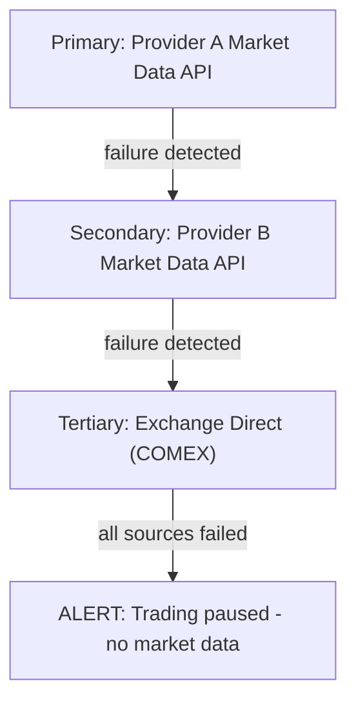

# bh-market-gateway

## Overview

**bh-market-gateway** is the market data connector service that interfaces with external data providers, exchanges, and news feeds. Written in Go with performance-critical components in Rust, it normalizes data from multiple sources into a unified format for consumption by other BlackHole services.

**Note:** Provider names are placeholders (Provider A/Provider B). Replace with contracted vendors and adjust specs/SLAs accordingly.

## Technical Specifications

| Attribute | Value |
|-----------|-------|
| **Language** | Go 1.22+ (Core), Rust (FIX Engine) |
| **Protocols** | FIX 4.4, WebSocket, REST, gRPC |
| **Dependencies** | quickfix, tokio, redis, kafka |
| **Supported Sources** | Provider A, Provider B, Exchange feeds |

## Architecture

```mermaid
flowchart TB
    subgraph gateway["bh-market-gateway"]
        subgraph connectors["Connector Layer"]
            Provider A["Provider A Market Data API"]
            Provider B["Provider B Market Data API"]
            Exchange["Exchange FIX Feeds"]
            NewsAPI["News API"]
        end

        subgraph normalization["Normalization Engine"]
            subgraph priceNorm["Price Normalizer"]
                decimal["Decimal prec"]
                currency["Currency conv"]
                unit["Unit standard"]
            end
            subgraph symbolMap["Symbol Mapper"]
                crossSource["Cross-source"]
                aliasMapping["Alias mapping"]
                validation["Validation"]
            end
            subgraph timeSync["Time Sync"]
                ntp["NTP sync"]
                latencyComp["Latency comp"]
                timestamp["Timestamp"]
            end
        end

        subgraph aggregation["Aggregation & Distribution"]
            subgraph bestPrice["Best Price Aggregator"]
                multiSource["Multi-source"]
                weightedAvg["Weighted avg"]
                arbitrageDet["Arbitrage det"]
            end
            subgraph conflation["Conflation Engine"]
                rateLimiting["Rate limiting"]
                sampling["Sampling"]
                batching["Batching"]
            end
            subgraph fanout["Fan-out Publisher"]
                ZeroMQ["ZeroMQ"]
                RedisStreams["Redis Streams"]
                Kafka["Kafka"]
            end
        end

        connectors --> normalization
        normalization --> aggregation
    end
```

## Data Sources

### 1. Provider A Market Data API

Primary institutional data feed for real-time and reference data.

| Data Type | Update Frequency | Latency |
|-----------|------------------|---------|
| Spot prices | Real-time | Low-latency target |
| Reference data | Daily | N/A |
| Corporate actions | Event-driven | < 1min |
| Economic indicators | Event-driven | < 1s |

### 2. Exchange Direct Feeds

Direct connections to major exchanges for lowest latency.

```
Exchange Connections:
├── LBMA (London)      Gold spot reference
├── COMEX (Chicago)    Gold futures (GC)
├── LSE (London)       Gold ETFs, mining stocks
├── NYSE (New York)    Gold ETFs (GLD, IAU)
└── CME (Chicago)      FX futures
```

### 3. Provider B Market Data API

Backup data feed and additional market coverage.

### 4. News & Events API

```
News Sources:
├── Provider A News     Priority: 1 (fastest)
├── Provider B News       Priority: 2
├── Dow Jones          Priority: 3
└── Economic Calendar  Priority: 1

Event Types Monitored:
├── FOMC decisions
├── NFP releases
├── CPI/PPI data
├── Central bank speeches
├── Geopolitical events
└── Major gold-related news
```

## Connector Implementations

### Provider A Connector

```go
type Provider AConnector struct {
    session    *blpapi.Session
    subscriptions map[string]*Subscription
    normalizer *PriceNormalizer
}

func (c *Provider AConnector) Subscribe(symbols []string) error {
    for _, symbol := range symbols {
        sub := &blpapi.Subscription{
            Security: symbol,
            Fields:   []string{"BID", "ASK", "LAST_PRICE", "VOLUME"},
        }
        c.session.Subscribe(sub)
    }
    return nil
}

func (c *Provider AConnector) handleEvent(event *blpapi.Event) {
    switch event.EventType {
    case blpapi.SUBSCRIPTION_DATA:
        c.processMarketData(event)
    case blpapi.SUBSCRIPTION_STATUS:
        c.handleStatusChange(event)
    }
}
```

### FIX Engine (Rust)

High-performance FIX protocol handler for exchange connectivity.

```rust
pub struct FixEngine {
    sessions: HashMap<String, FixSession>,
    message_store: Arc<MessageStore>,
    router: MessageRouter,
}

impl FixEngine {
    pub async fn connect(&mut self, config: &SessionConfig) -> Result<()> {
        let session = FixSession::new(config)?;
        session.logon().await?;
        self.sessions.insert(config.session_id.clone(), session);
        Ok(())
    }

    pub async fn handle_message(&self, msg: FixMessage) -> Result<()> {
        match msg.msg_type() {
            MsgType::MarketDataSnapshotFullRefresh => {
                self.process_snapshot(msg).await
            }
            MsgType::MarketDataIncrementalRefresh => {
                self.process_incremental(msg).await
            }
            _ => Ok(())
        }
    }
}
```

## Symbol Mapping

Unified symbol mapping across all data sources:

```yaml
# symbol_mapping.yaml
XAUUSD:
  bloomberg: "XAU Curncy"
  reuters: "XAU="
  comex: "GC"
  internal: "XAUUSD"
  description: "Gold Spot USD"
  tick_size: 0.01
  lot_size: 1.0
  currency: "USD"

DXY:
  bloomberg: "DXY Index"
  reuters: ".DXY"
  internal: "DXY"
  description: "US Dollar Index"
```

## Data Normalization

### Price Normalization

```go
type NormalizedPrice struct {
    Symbol      string    `json:"symbol"`
    Bid         float64   `json:"bid"`
    Ask         float64   `json:"ask"`
    Mid         float64   `json:"mid"`
    Spread      float64   `json:"spread"`
    BidSize     float64   `json:"bid_size"`
    AskSize     float64   `json:"ask_size"`
    Timestamp   time.Time `json:"timestamp"`
    Source      string    `json:"source"`
    SourceTime  time.Time `json:"source_time"`
    Latency     int64     `json:"latency_us"`
}

func (n *PriceNormalizer) Normalize(raw *RawPrice) *NormalizedPrice {
    return &NormalizedPrice{
        Symbol:     n.symbolMapper.ToInternal(raw.Symbol, raw.Source),
        Bid:        n.roundPrice(raw.Bid),
        Ask:        n.roundPrice(raw.Ask),
        Mid:        (raw.Bid + raw.Ask) / 2,
        Spread:     raw.Ask - raw.Bid,
        BidSize:    raw.BidSize,
        AskSize:    raw.AskSize,
        Timestamp:  time.Now().UTC(),
        Source:     raw.Source,
        SourceTime: raw.SourceTime,
        Latency:    time.Since(raw.SourceTime).Microseconds(),
    }
}
```

### Best Price Aggregation

```go
type BestPriceAggregator struct {
    prices    map[string]map[string]*NormalizedPrice // symbol -> source -> price
    weights   map[string]float64                      // source weights
    staleTime time.Duration
}

func (a *BestPriceAggregator) GetBestPrice(symbol string) *AggregatedPrice {
    sources := a.prices[symbol]

    var bestBid, bestAsk float64
    var totalWeight float64

    for source, price := range sources {
        if time.Since(price.Timestamp) > a.staleTime {
            continue
        }

        weight := a.weights[source]

        // Best bid is highest, best ask is lowest
        if price.Bid > bestBid {
            bestBid = price.Bid
        }
        if bestAsk == 0 || price.Ask < bestAsk {
            bestAsk = price.Ask
        }

        totalWeight += weight
    }

    return &AggregatedPrice{
        Symbol:   symbol,
        BestBid:  bestBid,
        BestAsk:  bestAsk,
        Sources:  len(sources),
    }
}
```

## Configuration

```yaml
# bh-market-gateway.yaml
server:
  grpc_port: 50054
  metrics_port: 9095

connectors:
  bloomberg:
    enabled: true
    host: "bloomberg-api.internal"
    port: 8194
    app_name: "blackhole_gateway"
    symbols:
      - "XAU Curncy"
      - "DXY Index"
      - "GC1 Comdty"
    reconnect_interval: 5s

  reuters:
    enabled: true
    host: "reuters-elektron.internal"
    port: 14002
    app_id: ${REUTERS_APP_ID}
    symbols:
      - "XAU="

  fix:
    enabled: true
    sessions:
      - id: "COMEX"
        sender_comp_id: "BLACKHOLE"
        target_comp_id: "COMEX"
        host: "fix.cmegroup.com"
        port: 9880
        ssl: true
        heartbeat_interval: 30

  news:
    enabled: true
    bloomberg_news:
      enabled: true
      topics: ["GOLD", "PRECIOUS_METALS", "FED", "RATES"]
    economic_calendar:
      enabled: true
      events: ["FOMC", "NFP", "CPI", "PPI", "GDP"]

normalization:
  decimal_precision: 5
  stale_threshold: 5s
  symbol_mapping_file: "/etc/gateway/symbol_mapping.yaml"

aggregation:
  source_weights:
    bloomberg: 1.0
    reuters: 0.8
    comex: 1.0
  update_interval: 10ms

distribution:
  zeromq:
    enabled: true
    endpoint: "tcp://*:5560"

  redis:
    enabled: true
    host: "redis.internal"
    stream_prefix: "market:"

  kafka:
    enabled: true
    brokers: ["kafka:9092"]
    topic: "market-data"

monitoring:
  latency_buckets: [0.001, 0.005, 0.01, 0.05, 0.1]
```

## Output Streams

### Real-Time Prices (ZeroMQ)

```
Topics:
├── PRICE.XAUUSD           Raw prices from all sources
├── PRICE.XAUUSD.BEST      Aggregated best price
├── PRICE.XAUUSD.BLOOMBERG Single source
└── PRICE.XAUUSD.COMEX     Single source
```

### Redis Streams

```
Streams:
├── market:prices:xauusd     Real-time price updates
├── market:depth:xauusd      Order book depth
├── market:news:gold         News events
└── market:calendar          Economic calendar
```

### Event Schema

```json
{
  "stream": "market:prices:xauusd",
  "event": {
    "type": "price_update",
    "symbol": "XAUUSD",
    "bid": 2035.45,
    "ask": 2035.65,
    "mid": 2035.55,
    "spread": 0.20,
    "timestamp": "2024-01-15T10:30:00.123456Z",
    "source": "bloomberg",
    "source_latency_us": 1234,
    "sequence": 123456789
  }
}
```

## Monitoring

### Prometheus Metrics

```
# Connector metrics
bh_gateway_connected{source="bloomberg|reuters|comex"}
bh_gateway_messages_received_total{source="...",type="price|news|status"}
bh_gateway_latency_seconds{source="...",quantile="0.5|0.95|0.99"}

# Data quality metrics
bh_gateway_stale_prices_total{source="...",symbol="..."}
bh_gateway_gaps_detected_total{source="..."}
bh_gateway_price_variance{symbol="..."}  # Cross-source variance

# Distribution metrics
bh_gateway_published_total{channel="zmq|redis|kafka"}
bh_gateway_publish_latency_seconds{channel="..."}
```

## Failover & Redundancy



Failover Criteria:
- No update for > 5 seconds
- Latency > 100ms sustained
- Price validation failures
- Connection errors

## Security

### API Authentication

```yaml
# Per-source authentication
bloomberg:
  auth_type: "certificate"
  cert_file: "/etc/ssl/bloomberg.pem"
  key_file: "/etc/ssl/bloomberg.key"

reuters:
  auth_type: "oauth2"
  token_url: "https://auth.refinitiv.com/token"
  client_id: ${REUTERS_CLIENT_ID}
  client_secret: ${REUTERS_CLIENT_SECRET}

fix:
  auth_type: "fix_login"
  username: ${FIX_USERNAME}
  password: ${FIX_PASSWORD}
```

### Data Validation

All incoming data is validated before distribution:
- Price sanity checks (within expected range)
- Timestamp validation (not in future, not too stale)
- Sequence number tracking (gap detection)
- Cross-source consistency checks
