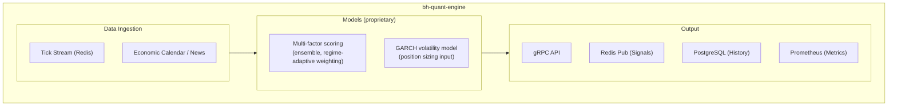
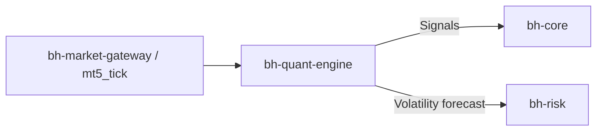

# bh-quant-engine

## Overview

**bh-quant-engine** is the quantitative analysis and signal service of the Genese Capital (formerly BlackHole Capital) infrastructure, written in Python. It hosts the multi-factor scoring system that generates entries and the GARCH volatility model used for position sizing.

**Factor composition, weights, model parameters and refresh frequencies are proprietary and are not documented here.** Earlier versions of this page listed individual models, configuration values and schedules; that content has been removed.

## Technical Specifications

| Attribute | Value |
|-----------|-------|
| **Language** | Python 3.11+ |
| **Framework** | FastAPI, gRPC |
| **Libraries** | NumPy, SciPy, Statsmodels, Arch, Scikit-learn |
| **Role** | Signal generation and volatility forecasting |

## Architecture

## Responsibilities

- Generate entry signals from the proprietary multi-factor scoring system
- Provide volatility forecasts to `bh-risk` for GARCH-based position sizing (higher volatility reduces lot size, lower volatility allows larger size within limits)
- Publish signals to `bh-core` for routing through risk checks and the `bh-guardian` circuit breaker

## Model Governance

- Monthly research and recalibration cycle: performance analysis, volatility-regime assessment, parameter evaluation
- Staged deployment - demo, proprietary capital, production. No parameter change goes directly to production
- All strategy development is internal; no core logic is outsourced

## Integration

