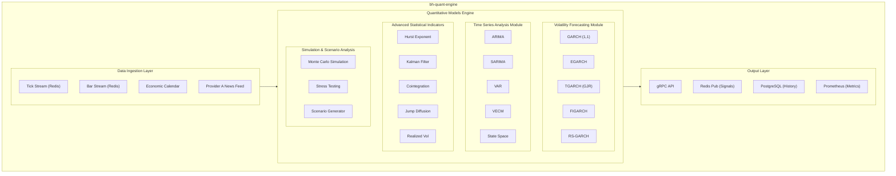

# bh-quant-engine

## Overview

**bh-quant-engine** is the quantitative analysis service written in Python, responsible for advanced statistical modeling, volatility forecasting, and market regime detection. It provides quantitative signals and risk metrics to other services in the BlackHole infrastructure.

## Technical Specifications

| Attribute | Value |
|-----------|-------|
| **Language** | Python 3.11+ |
| **Framework** | FastAPI, gRPC |
| **ML/Stats Libraries** | NumPy, SciPy, Statsmodels, Arch, Scikit-learn |
| **Dependencies** | pandas, numba, redis, asyncpg |
| **Compute Schedule** | Real-time + Batch (configurable) |

## Architecture



## Quantitative Models

### 1. Volatility Forecasting

#### GARCH Family Models

| Model | Use Case | Captures |
|-------|----------|----------|
| **GARCH(1,1)** | Standard volatility | Volatility clustering |
| **EGARCH** | Asymmetric volatility | Leverage effect |
| **TGARCH/GJR-GARCH** | News impact | Asymmetric shocks |
| **FIGARCH** | Long memory | Persistent volatility |
| **RS-GARCH** | Regime changes | Structural breaks |

```python
class GARCHForecaster:
    """
    Multi-model GARCH volatility forecaster with model selection.
    """

    def __init__(self, config: GARCHConfig):
        self.models = {
            'garch': arch_model(y=None, vol='Garch', p=1, q=1),
            'egarch': arch_model(y=None, vol='EGarch', p=1, q=1),
            'gjr': arch_model(y=None, vol='Garch', p=1, o=1, q=1),
            'figarch': arch_model(y=None, vol='FIGARCH', p=1, q=1),
        }
        self.config = config

    def fit_and_forecast(
        self,
        returns: np.ndarray,
        horizon: int = 1
    ) -> VolatilityForecast:
        """
        Fit all models and return ensemble forecast.
        """
        forecasts = {}
        model_scores = {}

        for name, model in self.models.items():
            result = model.fit(returns, disp='off')
            forecast = result.forecast(horizon=horizon)
            forecasts[name] = np.sqrt(forecast.variance.values[-1])
            model_scores[name] = result.aic

        # Weighted ensemble based on AIC
        weights = self._calculate_weights(model_scores)
        ensemble_forecast = sum(
            forecasts[m] * w for m, w in weights.items()
        )

        return VolatilityForecast(
            ensemble=ensemble_forecast,
            individual=forecasts,
            weights=weights,
            horizon=horizon
        )
```

#### Realized Volatility

```python
def realized_volatility(
    prices: np.ndarray,
    frequency: str = '5min'
) -> float:
    """
    Calculate realized volatility from high-frequency data.

    Uses the two-scale estimator to handle microstructure noise.
    """
    log_returns = np.diff(np.log(prices))

    # Subsample for noise reduction
    rv_fast = np.sum(log_returns ** 2)
    rv_slow = np.sum(log_returns[::5] ** 2) * 5

    # Two-scale estimator
    n = len(log_returns)
    rv_adjusted = rv_slow - (n / (5 * n)) * rv_fast

    return np.sqrt(rv_adjusted * 252)  # Annualized
```

### 2. Time Series Models

#### ARIMA/SARIMA

For price level and returns forecasting:

```python
class ARIMAForecaster:
    """
    Auto-ARIMA with seasonal components for gold price forecasting.
    """

    def fit(self, series: pd.Series) -> ARIMAResult:
        # Automatic order selection using AIC
        model = pm.auto_arima(
            series,
            start_p=1, start_q=1,
            max_p=5, max_q=5,
            seasonal=True, m=5,  # Weekly seasonality
            d=None,  # Auto-detect differencing
            trace=False,
            error_action='ignore',
            suppress_warnings=True,
            stepwise=True
        )
        return model
```

#### Vector Autoregression (VAR)

For multi-asset analysis:

```python
class VARModel:
    """
    VAR model for cross-market analysis.

    Analyzes relationships between:
    - Gold (XAU/USD)
    - US Dollar Index (DXY)
    - US Treasury yields
    - S&P 500 VIX
    """

    def granger_causality_matrix(self) -> pd.DataFrame:
        """Test Granger causality between all variable pairs."""
        pass

    def impulse_response(
        self,
        shock_variable: str,
        periods: int = 20
    ) -> IRFResult:
        """Calculate impulse response functions."""
        pass
```

### 3. Advanced Statistical Indicators

#### Hurst Exponent

```python
def hurst_exponent(
    prices: np.ndarray,
    max_lag: int = 100
) -> float:
    """
    Calculate Hurst exponent using R/S analysis.

    Returns:
        H < 0.5: Mean-reverting
        H = 0.5: Random walk
        H > 0.5: Trending
    """
    lags = range(2, max_lag)
    tau = []

    for lag in lags:
        # Calculate standard deviation of lagged differences
        pp = np.subtract(prices[lag:], prices[:-lag])
        tau.append(np.std(pp))

    # Fit power law: tau ~ lag^H
    log_lags = np.log(lags)
    log_tau = np.log(tau)

    # Linear regression to find H
    coeffs = np.polyfit(log_lags, log_tau, 1)
    return coeffs[0]
```

#### Kalman Filter

```python
class KalmanPriceFilter:
    """
    Kalman filter for price estimation and trend extraction.
    """

    def __init__(self):
        self.kf = KalmanFilter(
            transition_matrices=[1],
            observation_matrices=[1],
            initial_state_mean=0,
            initial_state_covariance=1,
            observation_covariance=1,
            transition_covariance=0.01
        )

    def filter(
        self,
        observations: np.ndarray
    ) -> Tuple[np.ndarray, np.ndarray]:
        """
        Filter observations to estimate true price and uncertainty.
        """
        state_means, state_covariances = self.kf.filter(observations)
        return state_means, state_covariances

    def smooth(
        self,
        observations: np.ndarray
    ) -> Tuple[np.ndarray, np.ndarray]:
        """
        Smooth observations using forward-backward pass.
        """
        return self.kf.smooth(observations)
```

#### Cointegration Analysis

```python
def engle_granger_cointegration(
    series1: np.ndarray,
    series2: np.ndarray,
    significance: float = 0.05
) -> CointegrationResult:
    """
    Test for cointegration using Engle-Granger two-step method.
    """
    # Step 1: OLS regression
    model = OLS(series1, add_constant(series2)).fit()
    residuals = model.resid

    # Step 2: ADF test on residuals
    adf_result = adfuller(residuals, regression='c')

    return CointegrationResult(
        is_cointegrated=adf_result[1] < significance,
        adf_statistic=adf_result[0],
        p_value=adf_result[1],
        hedge_ratio=model.params[1],
        half_life=calculate_half_life(residuals)
    )
```

#### Jump-Diffusion Detection

```python
class JumpDetector:
    """
    Detect price jumps using bi-power variation.
    """

    def detect_jumps(
        self,
        returns: np.ndarray,
        threshold: float = 3.0
    ) -> List[JumpEvent]:
        """
        Identify significant price jumps.

        Uses the difference between realized variance and
        bi-power variation to isolate jump component.
        """
        # Realized variance
        rv = np.sum(returns ** 2)

        # Bi-power variation (robust to jumps)
        bv = (np.pi / 2) * np.sum(
            np.abs(returns[1:]) * np.abs(returns[:-1])
        )

        # Jump component
        jump_var = max(rv - bv, 0)

        # Detect individual jumps
        jump_threshold = threshold * np.sqrt(bv / len(returns))
        jumps = np.where(np.abs(returns) > jump_threshold)[0]

        return [
            JumpEvent(
                index=i,
                magnitude=returns[i],
                z_score=returns[i] / np.sqrt(bv / len(returns))
            )
            for i in jumps
        ]
```

### 4. Monte Carlo Simulation

```python
class MonteCarloSimulator:
    """
    Monte Carlo simulation for risk analysis and scenario generation.
    """

    def __init__(self, config: MonteCarloConfig):
        self.n_simulations = config.n_simulations  # 10,000
        self.horizon_days = config.horizon_days
        self.random_state = np.random.RandomState(config.seed)

    def simulate_paths(
        self,
        current_price: float,
        volatility: float,
        drift: float = 0
    ) -> np.ndarray:
        """
        Generate price paths using Geometric Brownian Motion.
        """
        dt = 1 / 252  # Daily steps
        paths = np.zeros((self.n_simulations, self.horizon_days + 1))
        paths[:, 0] = current_price

        for t in range(1, self.horizon_days + 1):
            z = self.random_state.standard_normal(self.n_simulations)
            paths[:, t] = paths[:, t-1] * np.exp(
                (drift - 0.5 * volatility**2) * dt +
                volatility * np.sqrt(dt) * z
            )

        return paths

    def simulate_with_jumps(
        self,
        current_price: float,
        volatility: float,
        jump_intensity: float,
        jump_mean: float,
        jump_std: float
    ) -> np.ndarray:
        """
        Merton jump-diffusion model simulation.
        """
        dt = 1 / 252
        paths = np.zeros((self.n_simulations, self.horizon_days + 1))
        paths[:, 0] = current_price

        for t in range(1, self.horizon_days + 1):
            # Diffusion component
            z = self.random_state.standard_normal(self.n_simulations)
            diffusion = np.exp(
                -0.5 * volatility**2 * dt +
                volatility * np.sqrt(dt) * z
            )

            # Jump component (Poisson process)
            n_jumps = self.random_state.poisson(
                jump_intensity * dt,
                self.n_simulations
            )
            jump_sizes = np.exp(
                jump_mean * n_jumps +
                jump_std * np.sqrt(n_jumps) *
                self.random_state.standard_normal(self.n_simulations)
            )

            paths[:, t] = paths[:, t-1] * diffusion * jump_sizes

        return paths

    def calculate_var(
        self,
        paths: np.ndarray,
        confidence: float = 0.95
    ) -> float:
        """
        Calculate VaR from simulated paths.
        """
        final_returns = (paths[:, -1] / paths[:, 0]) - 1
        return -np.percentile(final_returns, (1 - confidence) * 100)

    def calculate_cvar(
        self,
        paths: np.ndarray,
        confidence: float = 0.95
    ) -> float:
        """
        Calculate CVaR (Expected Shortfall) from simulated paths.
        """
        final_returns = (paths[:, -1] / paths[:, 0]) - 1
        var = self.calculate_var(paths, confidence)
        return -np.mean(final_returns[final_returns <= -var])
```

### 5. Regime Detection

```python
class RegimeDetector:
    """
    Hidden Markov Model for market regime detection.
    """

    def __init__(self, n_regimes: int = 3):
        self.n_regimes = n_regimes
        self.model = GaussianHMM(
            n_components=n_regimes,
            covariance_type='full',
            n_iter=1000
        )

    def fit(self, returns: np.ndarray) -> None:
        """Fit HMM to returns data."""
        self.model.fit(returns.reshape(-1, 1))

    def predict_regime(self, returns: np.ndarray) -> int:
        """Predict current regime."""
        return self.model.predict(returns.reshape(-1, 1))[-1]

    def get_regime_probabilities(
        self,
        returns: np.ndarray
    ) -> np.ndarray:
        """Get probabilities for each regime."""
        return self.model.predict_proba(returns.reshape(-1, 1))[-1]

    def regime_characteristics(self) -> Dict[int, RegimeStats]:
        """
        Get characteristics of each regime.

        Returns mean, volatility, and persistence for each regime.
        """
        return {
            i: RegimeStats(
                mean=self.model.means_[i, 0],
                volatility=np.sqrt(self.model.covars_[i, 0, 0]),
                persistence=self.model.transmat_[i, i]
            )
            for i in range(self.n_regimes)
        }
```

## Configuration

```yaml
# bh-quant-engine.yaml
server:
  grpc_port: 50052
  http_port: 8080
  workers: 4

models:
  garch:
    enabled: true
    variants: ['garch', 'egarch', 'gjr', 'figarch']
    lookback_days: 252
    forecast_horizon: [1, 5, 22]  # 1 day, 1 week, 1 month
    refit_frequency: "1h"

  arima:
    enabled: true
    max_order: [5, 2, 5]
    seasonal_period: 5
    refit_frequency: "4h"

  monte_carlo:
    enabled: true
    n_simulations: 10000
    horizon_days: 22
    include_jumps: true
    run_frequency: "1h"

  regime:
    enabled: true
    n_regimes: 3
    min_observations: 500
    refit_frequency: "1d"

indicators:
  hurst:
    enabled: true
    max_lag: 100
    window_size: 252

  cointegration:
    enabled: true
    pairs:
      - ['XAUUSD', 'DXY']
      - ['XAUUSD', 'SILVER']

  kalman:
    enabled: true
    process_variance: 0.01
    observation_variance: 1.0

data:
  redis:
    host: "redis.internal"
    port: 6379
    tick_stream: "market:ticks:xauusd"
    bar_stream: "market:bars:xauusd:1m"

  timescaledb:
    dsn: ${TIMESCALE_DSN}
    lookback_days: 1000

output:
  redis_publish:
    enabled: true
    channel: "quant:signals"

  postgres:
    enabled: true
    table: "quant_forecasts"

schedule:
  volatility_forecast: "*/5 * * * *"    # Every 5 minutes
  regime_detection: "0 * * * *"          # Every hour
  monte_carlo: "0 */4 * * *"             # Every 4 hours
  model_refit: "0 0 * * *"               # Daily at midnight
```

## API Reference

### GetVolatilityForecast

```protobuf
rpc GetVolatilityForecast(ForecastRequest) returns (VolatilityForecast);

message VolatilityForecast {
  string symbol = 1;
  double current_volatility = 2;
  repeated HorizonForecast forecasts = 3;
  map<string, double> model_weights = 4;
  VolatilityRegime regime = 5;
  google.protobuf.Timestamp generated_at = 6;
}

message HorizonForecast {
  int32 horizon_days = 1;
  double forecast = 2;
  double confidence_lower = 3;
  double confidence_upper = 4;
}
```

### GetRiskMetrics

```protobuf
rpc GetRiskMetrics(RiskMetricsRequest) returns (QuantRiskMetrics);

message QuantRiskMetrics {
  double var_95_1d = 1;
  double var_99_1d = 2;
  double cvar_95_1d = 3;
  double hurst_exponent = 4;
  RegimeInfo current_regime = 5;
  repeated ScenarioResult stress_scenarios = 6;
}
```

## Output Signals

The service publishes quantitative signals to Redis for consumption by other services:

```json
{
  "timestamp": "2024-01-15T10:30:00Z",
  "symbol": "XAUUSD",
  "signals": {
    "volatility_1d": 0.0142,
    "volatility_5d": 0.0158,
    "volatility_22d": 0.0165,
    "regime": "normal",
    "regime_confidence": 0.85,
    "hurst": 0.45,
    "var_95": 0.0185,
    "cvar_95": 0.0234,
    "trend_strength": -0.12,
    "mean_reversion_score": 0.72
  },
  "model_metadata": {
    "garch_aic": 1234.56,
    "regime_log_likelihood": -5678.90
  }
}
```
