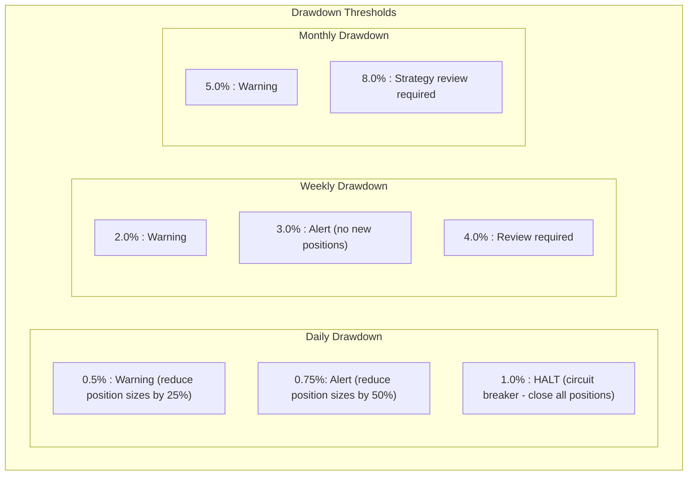
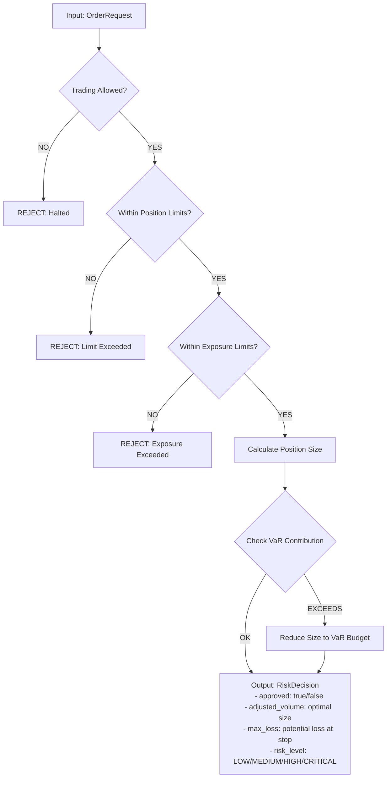
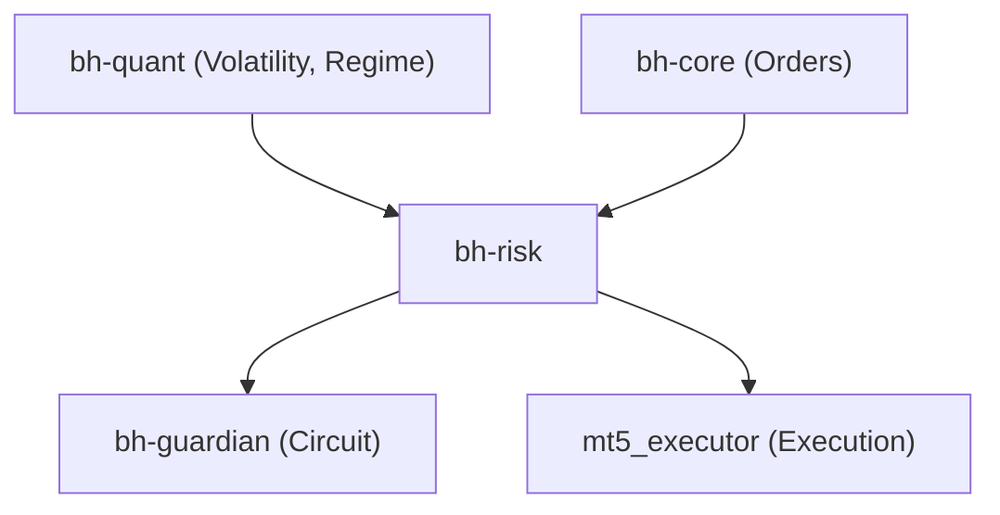

# bh-risk

## Overview

**bh-risk** is the central risk management engine for BlackHole Fund, written in Go. It evaluates every trading decision against configurable risk parameters, manages position sizing, and enforces exposure limits at multiple levels (order, account, portfolio).

## Technical Specifications

| Attribute | Value |
|-----------|-------|
| **Language** | Go 1.22+ |
| **Framework** | gRPC, Redis, PostgreSQL |
| **Dependencies** | gonum, decimal, prometheus |
| **Target Latency** | < 10ms risk evaluation |

## Architecture

```mermaid
flowchart TB
    subgraph bh-risk["bh-risk"]
        subgraph grpc["gRPC Service Layer"]
            EvaluateOrd["EvaluateOrd"]
            StreamPos["StreamPos"]
            GetMetrics["GetMetrics"]
            UpdateParams["UpdateParams"]
        end

        subgraph core["Risk Engine Core"]
            subgraph sizing["Position Sizer"]
                kelly["Kelly"]
                fractional["Fractional"]
                volAdj["Vol Adjusted"]
            end
            subgraph exposure["Exposure Calc"]
                grossNet["Gross/Net"]
                correlation["Correlation"]
                sector["Sector"]
            end
            subgraph var["VaR Engine"]
                historical["Historical"]
                parametric["Parametric"]
                monteCarlo["Monte Carlo"]
            end
            subgraph limits["Limit Checker"]
                orderLimits["Order limits"]
                posLimits["Position lim"]
                acctLimits["Account lim"]
            end
            subgraph drawdown["Drawdown Mgr"]
                dailyDD["Daily DD"]
                weeklyDD["Weekly DD"]
                peakTracking["Peak tracking"]
            end
            subgraph regime["Regime Detector"]
                volRegime["Vol regime"]
                trendRegime["Trend regime"]
                riskOff["Risk-off"]
            end
        end

        subgraph data["Data Layer"]
            Redis["Redis (Cache)"]
            PostgreSQL["PostgreSQL (Persist)"]
            QuantFeed["Quant Feed (Signals)"]
            Market["Market (Prices)"]
        end

        EvaluateOrd --> core
        StreamPos --> core
        GetMetrics --> core
        UpdateParams --> core
        core --> data
    end
```



## Core Components

### 1. Position Sizer

Calculates optimal position sizes based on multiple methodologies.

#### Kelly Criterion (Modified)

```
f* = (p × b - q) / b

Where:
  f* = Fraction of capital to risk
  p  = Win probability
  b  = Win/Loss ratio
  q  = Loss probability (1 - p)

Applied with fractional Kelly (typically 0.25 - 0.5) for reduced variance.
```

#### Volatility-Adjusted Sizing

```
Position Size = (Risk Budget × Account Equity) / (ATR × ATR Multiplier)

Inputs from bh-quant-engine:
  - Current ATR (Average True Range)
  - Volatility regime (low/normal/high/extreme)
  - GARCH forecast
```

### 2. Exposure Calculator

Monitors and limits portfolio exposure across multiple dimensions.

| Exposure Type | Calculation | Default Limit |
|---------------|-------------|---------------|
| Gross Exposure | Σ|position_value| | 200% of NAV |
| Net Exposure | Σposition_value | ±100% of NAV |
| Single Position | position_value / NAV | 25% of NAV |
| Correlation-Adj | Σ(pos × corr_factor) | 150% of NAV |

### 3. VaR Engine

Calculates Value at Risk using multiple methodologies.

#### Historical VaR

```go
// 95% and 99% confidence levels
func (v *VaREngine) HistoricalVaR(returns []float64, confidence float64) float64 {
    sort.Float64s(returns)
    index := int((1 - confidence) * float64(len(returns)))
    return -returns[index]
}
```

#### Parametric VaR

```
VaR = μ - σ × z_α

Where:
  μ   = Expected return (typically 0 for short horizons)
  σ   = Portfolio volatility
  z_α = Z-score for confidence level (1.645 for 95%, 2.326 for 99%)
```

#### Monte Carlo VaR

Integration with bh-quant-engine for scenario-based VaR:
- 10,000 simulations
- Correlated returns using Cholesky decomposition
- Fat-tailed distributions (Student-t)

### 4. CVaR / Expected Shortfall

```
ES_α = E[Loss | Loss > VaR_α]

The average loss in the worst (1-α)% of scenarios.
Provides better tail risk measurement than VaR alone.
```

### 5. Drawdown Manager

Tracks and manages drawdown at multiple time horizons.



### 6. Regime Detector

Integrates with bh-quant-engine to adjust risk parameters based on market regime.

| Regime | Volatility | Position Sizing | Stop Distance |
|--------|------------|-----------------|---------------|
| Low Vol | < 0.8 × avg | 1.25x normal | Tighter |
| Normal | 0.8 - 1.2 × avg | 1.0x normal | Normal |
| High Vol | 1.2 - 2.0 × avg | 0.5x normal | Wider |
| Extreme | > 2.0 × avg | 0.25x normal | Very wide |

## Risk Evaluation Flow



## Configuration

```yaml
# bh-risk.yaml
server:
  grpc_port: 50051
  metrics_port: 9092

limits:
  position:
    max_single_position_pct: 25.0
    max_correlated_exposure_pct: 40.0

  exposure:
    max_gross_exposure_pct: 200.0
    max_net_exposure_pct: 100.0
    max_sector_exposure_pct: 50.0

  drawdown:
    daily_warning_pct: 0.5
    daily_alert_pct: 0.75
    daily_halt_pct: 1.0
    weekly_warning_pct: 2.0
    monthly_warning_pct: 5.0

position_sizing:
  method: "volatility_adjusted"  # kelly, fixed_fraction, volatility_adjusted
  kelly_fraction: 0.25
  fixed_risk_per_trade_pct: 1.0
  atr_multiplier: 2.0

var:
  confidence_levels: [0.95, 0.99]
  lookback_days: 252
  monte_carlo_simulations: 10000

regime:
  enabled: true
  vol_low_threshold: 0.8
  vol_high_threshold: 1.2
  vol_extreme_threshold: 2.0

data:
  redis:
    host: "redis.internal"
    port: 6379
    db: 0

  postgres:
    dsn: ${POSTGRES_DSN}

  quant_service:
    address: "bh-quant-engine:50052"
```

## API Reference

### EvaluateOrder

```protobuf
rpc EvaluateOrder(OrderRequest) returns (RiskDecision);

message OrderRequest {
  string request_id = 1;
  string symbol = 2;
  OrderSide side = 3;        // BUY, SELL
  double requested_volume = 4;
  double entry_price = 5;
  double stop_loss = 6;
  double take_profit = 7;
  string strategy_id = 8;
}

message RiskDecision {
  bool approved = 1;
  double adjusted_volume = 2;
  double max_loss = 3;
  double var_contribution = 4;
  RiskLevel risk_level = 5;
  string reason = 6;
  map<string, double> metrics = 7;
}
```

### GetRiskMetrics

```protobuf
rpc GetRiskMetrics(MetricsRequest) returns (RiskMetrics);

message RiskMetrics {
  double current_nav = 1;
  double gross_exposure = 2;
  double net_exposure = 3;
  double var_95 = 4;
  double var_99 = 5;
  double cvar_95 = 6;
  double daily_pnl = 7;
  double daily_drawdown = 8;
  double peak_nav = 9;
  VolatilityRegime current_regime = 10;
  repeated PositionRisk positions = 11;
}
```

## Monitoring

### Key Metrics

```
# Risk metrics
bh_risk_var_95{portfolio="main"}
bh_risk_var_99{portfolio="main"}
bh_risk_cvar_95{portfolio="main"}
bh_risk_drawdown_daily{portfolio="main"}
bh_risk_gross_exposure_pct{portfolio="main"}
bh_risk_net_exposure_pct{portfolio="main"}

# Decision metrics
bh_risk_evaluations_total{decision="approved|rejected"}
bh_risk_evaluation_latency_seconds{quantile="0.5|0.95|0.99"}
bh_risk_volume_adjusted_total

# Regime metrics
bh_risk_current_regime{regime="low|normal|high|extreme"}
```

## Integration Points


