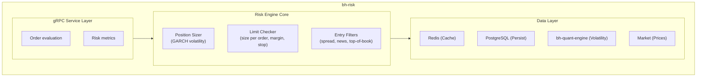
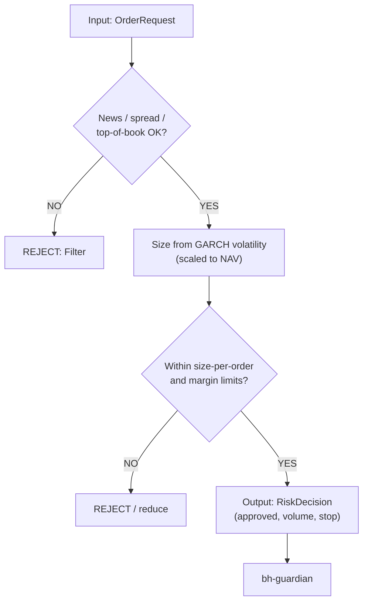
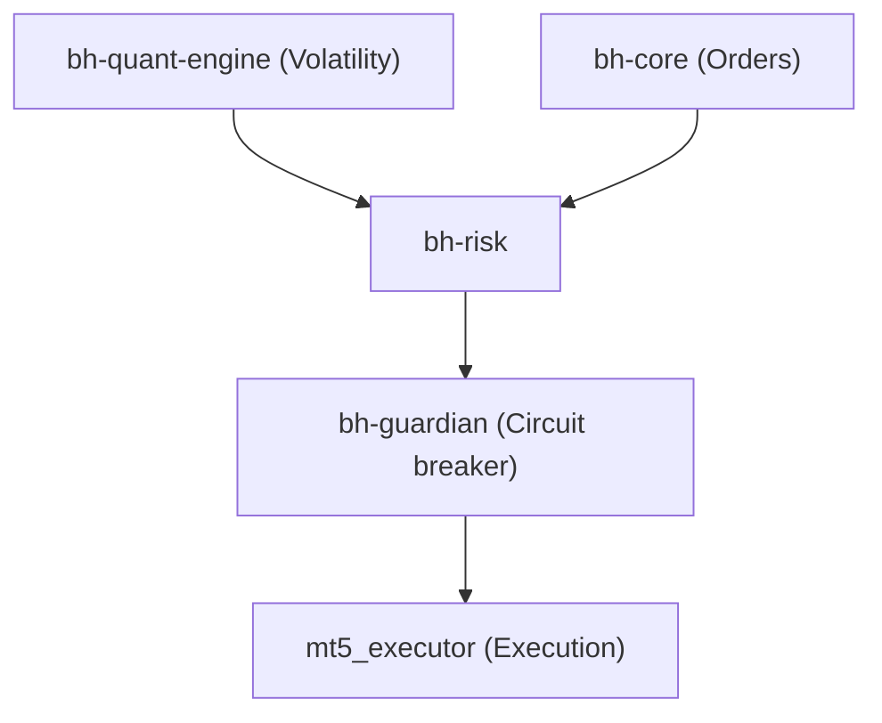

# bh-risk

## Overview

**bh-risk** is the risk and position-sizing engine of the Genese Capital (formerly BlackHole Capital) infrastructure, written in Go. It evaluates every order before it reaches the `bh-guardian` circuit breaker and the execution layer.

## Technical Specifications

| Attribute | Value |
|-----------|-------|
| **Language** | Go 1.22+ |
| **Framework** | gRPC, Redis, PostgreSQL |
| **Role** | Risk and position sizing |

## Responsibilities

| Area | Rule |
|------|------|
| Position sizing | GARCH volatility model: higher volatility reduces lot size, lower volatility allows larger size within limits |
| Size per order | Approx. 7.5 lots maximum on a NAV of approx. 4.2 million; limits scale in lots per million of NAV |
| Per-position stop | 25.00 move in the gold price (2,500 per lot) |
| Margin | Internal limit of 10% of NAV |
| Spread filter | No new entries above a defined spread threshold; protective closure if spreads widen abruptly after entry |
| News filter | Blocks entries around high-impact economic events (calendar and news via API) |
| Liquidity | Size checked against liquidity-provider top-of-book depth before entry |
| Lot adjustments | System-generated; require management approval |

The daily (1% of NAV, since October 2025) and cumulative (5% of NAV) loss limits are enforced by [bh-guardian](bh-guardian.md).

## Architecture

## Risk Evaluation Flow

## Integration Points

