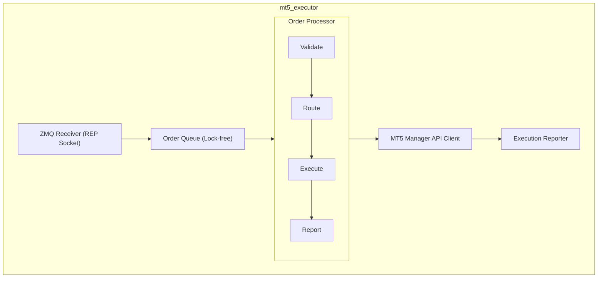
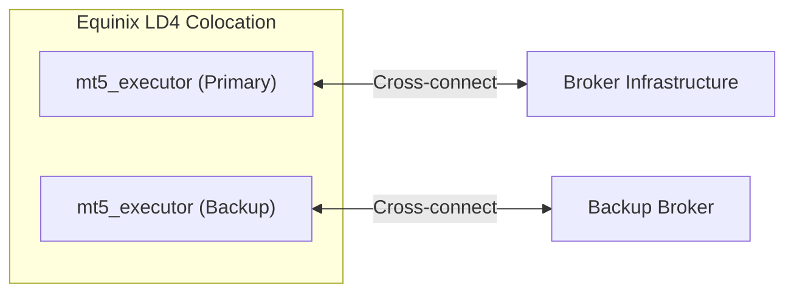

# mt5_executor

## Overview

**mt5_executor** is a high-performance order execution engine written in C++ that interfaces directly with MetaTrader 5 brokers. It is responsible for receiving validated orders from the risk management layer and executing them with minimal latency.

## Technical Specifications

| Attribute | Value |
|-----------|-------|
| **Language** | C++ 20 |
| **Build System** | CMake 3.25+ |
| **Compiler** | GCC 13+ / Clang 17+ |
| **Dependencies** | ZeroMQ, Boost, MT5 API SDK |
| **Target Latency** | < 5ms order submission |

## Architecture



## Core Components

### 1. Order Receiver

Receives orders via ZeroMQ REQ/REP pattern for guaranteed delivery.

```cpp
// Simplified interface
class OrderReceiver {
public:
    void start(const std::string& endpoint);
    void stop();

private:
    void processMessage(const OrderRequest& request);
    void sendResponse(const ExecutionReport& report);
};
```

### 2. Order Queue

Lock-free SPSC (Single Producer Single Consumer) queue for minimal contention.

- **Capacity**: 10,000 orders
- **Memory**: Pre-allocated ring buffer
- **Latency**: < 100ns enqueue/dequeue

### 3. Order Processor

Validates and processes orders through the execution pipeline.

**Validation Checks:**
- Symbol validity
- Volume within limits
- Price sanity checks
- Account permissions
- Duplicate detection

### 4. MT5 Manager API Client

Direct interface to MetaTrader 5 Manager API for order execution.

**Supported Operations:**
- Market orders (instant execution)
- Pending orders (limit, stop)
- Order modification
- Order cancellation
- Position queries

## Order Flow

```
1. [Receive]     ─► ZMQ REP socket receives OrderRequest
2. [Deserialize] ─► MessagePack deserialization
3. [Validate]    ─► Basic validation (symbol, volume, etc.)
4. [Queue]       ─► Push to lock-free queue
5. [Process]     ─► Worker thread picks up order
6. [Execute]     ─► MT5 Manager API call
7. [Report]      ─► Build ExecutionReport
8. [Respond]     ─► Send response via ZMQ
9. [Log]         ─► Async logging to file/stream
```

## Configuration

```yaml
# mt5_executor.yaml
server:
  zmq_endpoint: "tcp://*:5556"
  worker_threads: 2
  max_queue_size: 10000

mt5:
  server: "broker.example.com:443"
  login: ${MT5_LOGIN}
  password: ${MT5_PASSWORD}
  timeout_ms: 5000
  retry_count: 3

execution:
  max_slippage_points: 5
  partial_fill_allowed: true
  market_order_timeout_ms: 1000

logging:
  level: INFO
  file: "/var/log/mt5_executor/executor.log"
  rotation_size_mb: 100

monitoring:
  prometheus_port: 9090
  health_check_port: 8080
```

## Performance Characteristics

| Metric | Target | Typical |
|--------|--------|---------|
| Order submission latency | < 5ms | 2-4ms |
| Throughput | > 10,000 orders/sec | 15,000 orders/sec |
| Memory footprint | < 256MB | 128MB |
| CPU usage (idle) | < 5% | 2% |

## Error Handling

### Retry Logic

```
Retriable Errors:
├── Network timeout        → Retry with exponential backoff
├── Broker busy           → Retry after 100ms
└── Requote               → Retry with new price

Non-Retriable Errors:
├── Invalid symbol        → Reject immediately
├── Insufficient margin   → Reject with error code
├── Market closed         → Reject with error code
└── Account disabled      → Reject and alert
```

### Circuit Breaker

Connection-level circuit breaker to prevent cascading failures:

- **Threshold**: 5 consecutive failures
- **Open duration**: 30 seconds
- **Half-open**: Test with single order

## Monitoring

### Prometheus Metrics

```
# Order execution metrics
mt5_executor_orders_total{status="success|rejected|error"}
mt5_executor_latency_seconds{quantile="0.5|0.95|0.99"}
mt5_executor_queue_depth

# Connection metrics
mt5_executor_broker_connected{broker="primary|backup"}
mt5_executor_reconnection_total

# System metrics
mt5_executor_memory_bytes
mt5_executor_cpu_seconds_total
```

### Health Endpoints

- `GET /health` - Basic health check
- `GET /ready` - Readiness probe (broker connected)
- `GET /metrics` - Prometheus metrics

## Deployment

### Hardware Requirements

| Resource | Minimum | Recommended |
|----------|---------|-------------|
| CPU | 2 cores | 4 cores (dedicated) |
| RAM | 512MB | 2GB |
| Network | 1 Gbps | 10 Gbps |
| Storage | SSD (for logs) | NVMe |

### Colocation Deployment

mt5_executor is deployed in colocation facilities (Equinix LD4/LD5) for minimal latency to broker infrastructure:



## Security

- Binary runs with minimal privileges (non-root)
- Credentials loaded from environment/secrets manager
- All network communication encrypted
- Audit logging for all order operations
