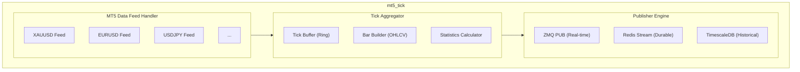
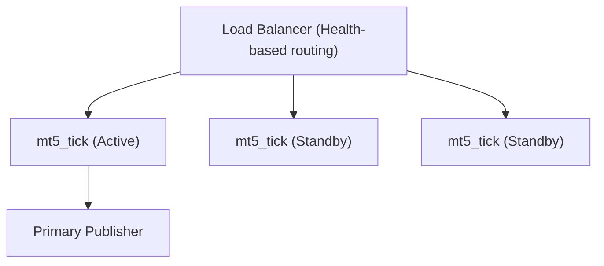

# mt5_tick

## Overview

**mt5_tick** is a high-frequency market data processor written in C++ that captures real-time tick data from MetaTrader 5 and distributes it to consuming services. It serves as the primary market data source for the entire trading infrastructure.

## Technical Specifications

| Attribute | Value |
|-----------|-------|
| **Language** | C++ 20 |
| **Build System** | CMake 3.25+ |
| **Compiler** | GCC 13+ / Clang 17+ |
| **Dependencies** | ZeroMQ, Boost, MT5 API SDK, HdrHistogram |
| **Target Latency** | Sub-millisecond tick distribution (target) |

## Architecture



## Core Components

### 1. MT5 Data Feed Handler

Manages connections to MT5 servers and processes incoming tick data.

**Capabilities:**
- Multiple symbol subscription
- Automatic reconnection
- Tick sequence validation
- Gap detection and reporting

### 2. Tick Aggregator

Processes raw ticks into various formats for downstream consumers.

**Output Formats:**
- Raw ticks (bid, ask, volume, timestamp)
- Time bars (1s, 1m, 5m, 15m, 1h, 4h, 1d)
- Volume bars
- Tick statistics (VWAP, spread analytics)

### 3. Publisher Engine

Distributes processed data through multiple channels.

| Channel | Protocol | Use Case |
|---------|----------|----------|
| ZeroMQ PUB | TCP | Real-time subscribers |
| Redis Streams | RESP3 | Durable event streaming |
| TimescaleDB | PostgreSQL | Historical storage |

## Data Structures

### Tick Message Format

```cpp
struct TickData {
    uint64_t sequence;      // Monotonic sequence number
    uint64_t timestamp_ns;  // Nanosecond timestamp
    char symbol[8];         // Trading symbol
    double bid;             // Best bid price
    double ask;             // Best ask price
    double bid_volume;      // Bid volume
    double ask_volume;      // Ask volume
    uint8_t flags;          // Tick flags (trade, bid, ask)
};
// Size: 56 bytes (cache-line aligned)
```

### Bar Message Format

```cpp
struct BarData {
    uint64_t timestamp;     // Bar open timestamp
    char symbol[8];         // Trading symbol
    uint32_t timeframe;     // Timeframe in seconds
    double open;            // Open price
    double high;            // High price
    double low;             // Low price
    double close;           // Close price
    double volume;          // Total volume
    uint32_t tick_count;    // Number of ticks
    double vwap;            // Volume-weighted average price
};
```

## Topic Structure

```
ZeroMQ Topics:
├── TICK.XAUUSD              # Raw XAUUSD ticks
├── TICK.XAUUSD.STATS        # Tick statistics
├── BAR.XAUUSD.1M            # 1-minute bars
├── BAR.XAUUSD.5M            # 5-minute bars
├── BAR.XAUUSD.15M           # 15-minute bars
├── BAR.XAUUSD.1H            # 1-hour bars
├── BAR.XAUUSD.4H            # 4-hour bars
└── BAR.XAUUSD.1D            # Daily bars

Redis Streams:
├── market:ticks:xauusd      # Tick stream
├── market:bars:xauusd:1m    # 1-minute bar stream
└── market:stats:xauusd      # Statistics stream
```

## Configuration

```yaml
# mt5_tick.yaml
mt5:
  servers:
    - host: "broker-primary.example.com"
      port: 443
      priority: 1
    - host: "broker-backup.example.com"
      port: 443
      priority: 2
  login: ${MT5_LOGIN}
  password: ${MT5_PASSWORD}
  symbols:
    - XAUUSD
  reconnect_interval_ms: 1000

aggregator:
  tick_buffer_size: 100000
  bar_timeframes: [1, 60, 300, 900, 3600, 14400, 86400]
  statistics_window_ticks: 1000

publishers:
  zeromq:
    enabled: true
    endpoint: "tcp://*:5555"
    hwm: 100000

  redis:
    enabled: true
    host: "redis.internal"
    port: 6379
    stream_max_len: 1000000

  timescaledb:
    enabled: true
    connection_string: ${TIMESCALE_DSN}
    batch_size: 1000
    flush_interval_ms: 100

logging:
  level: INFO
  file: "/var/log/mt5_tick/tick.log"

monitoring:
  prometheus_port: 9091
  latency_histogram_buckets: [0.00001, 0.0001, 0.001, 0.01]
```

## Performance Characteristics

| Metric | Target | Notes |
|--------|--------|-------|
| Tick processing latency | Sub-millisecond | Environment dependent |
| Distribution latency | Sub-millisecond | Environment dependent |
| Throughput | 100,000+ ticks/sec | Benchmark target |
| Memory footprint | < 512MB | Typical profile varies by workload |

## Data Quality

### Tick Validation

```
Validation Rules:
├── Sequence continuity    → Alert on gaps
├── Timestamp monotonicity → Reject out-of-order
├── Price sanity          → Reject if |change| > 5%
├── Spread validity       → Reject if spread < 0
└── Volume validity       → Reject if volume < 0
```

### Gap Handling

When gaps are detected:
1. Log gap event with sequence range
2. Request gap fill from backup source
3. Mark affected bars as potentially incomplete
4. Notify downstream consumers

## Monitoring

### Prometheus Metrics

```
# Tick processing metrics
mt5_tick_received_total{symbol="XAUUSD"}
mt5_tick_published_total{channel="zmq|redis|timescale"}
mt5_tick_latency_seconds{quantile="0.5|0.95|0.99"}

# Data quality metrics
mt5_tick_gaps_total{symbol="XAUUSD"}
mt5_tick_invalid_total{reason="sequence|timestamp|price"}

# Connection metrics
mt5_tick_connected{server="primary|backup"}
mt5_tick_reconnection_total

# Bar metrics
mt5_tick_bars_completed_total{symbol="XAUUSD",timeframe="1m|5m|1h"}
```

### Alerting Rules

```yaml
# Example Prometheus alerting rules
groups:
  - name: mt5_tick_alerts
    rules:
      - alert: TickLatencyHigh
        expr: mt5_tick_latency_seconds{quantile="0.99"} > 0.001
        for: 1m
        labels:
          severity: warning

      - alert: TickGapDetected
        expr: increase(mt5_tick_gaps_total[5m]) > 0
        labels:
          severity: critical

      - alert: MT5Disconnected
        expr: mt5_tick_connected == 0
        for: 30s
        labels:
          severity: critical
```

## Deployment

### System Requirements

| Resource | Minimum | Recommended |
|----------|---------|-------------|
| CPU | 2 cores | 4 cores (dedicated, isolated) |
| RAM | 1GB | 4GB |
| Network | 1 Gbps | 10 Gbps |
| Storage | 10GB SSD | 100GB NVMe |

### CPU Affinity

For optimal latency, mt5_tick should run with dedicated CPU cores:

```bash
# Example: Pin to cores 2-3
taskset -c 2,3 ./mt5_tick --config /etc/mt5_tick/config.yaml
```

### Kernel Tuning

```bash
# Recommended sysctl settings
net.core.rmem_max = 134217728
net.core.wmem_max = 134217728
net.core.netdev_max_backlog = 300000
net.ipv4.tcp_rmem = 4096 87380 134217728
net.ipv4.tcp_wmem = 4096 65536 134217728
```

## High Availability



- Active instance publishes to ZMQ
- Standby instances ready for instant failover
- Shared Redis/TimescaleDB for data consistency
