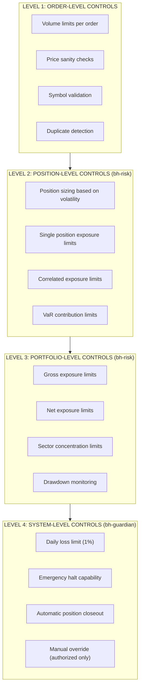
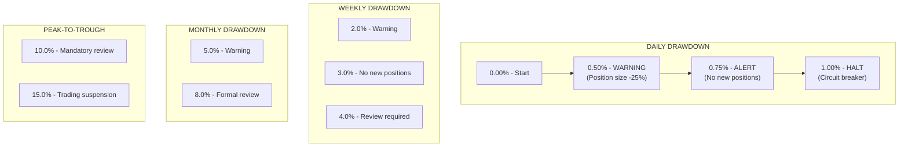
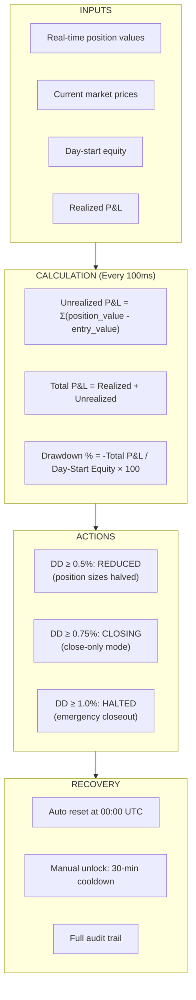
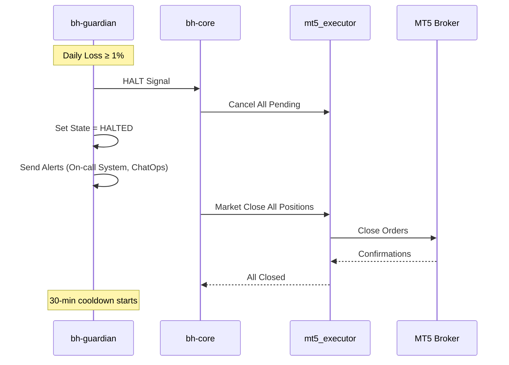
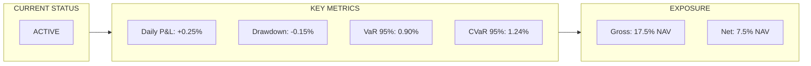

# Risk Management Framework

## Overview

BlackHole Fund employs a comprehensive, multi-layered risk management framework designed to protect capital while enabling systematic trading in the gold market. Our approach combines quantitative risk metrics with hard operational limits.

## Risk Philosophy

### Core Principles

1. **Capital Preservation First** - The primary objective is protecting capital. Returns are secondary to survival.

2. **Multiple Independent Safeguards** - No single point of failure. Risk controls operate at multiple levels with independent systems.

3. **Hard Limits Are Absolute** - Circuit breakers cannot be overridden during market hours. Period.

4. **Adapt to Regime** - Risk parameters dynamically adjust based on market conditions.

5. **Transparency and Auditability** - Every risk decision is logged and auditable.

## Risk Control Hierarchy



## Quantitative Risk Metrics

### Value at Risk (VaR)

Daily VaR calculations at multiple confidence levels:

| Confidence | Interpretation | Limit |
|------------|----------------|-------|
| 95% VaR | 1 in 20 days exceeded | 1.5% of NAV |
| 99% VaR | 1 in 100 days exceeded | 2.5% of NAV |
| 99.9% VaR | 1 in 1000 days exceeded | 4.0% of NAV |

**Calculation Methods**:
- Historical simulation (252-day rolling window)
- Parametric (assuming Student-t distribution)
- Monte Carlo (10,000 simulations)

**Final VaR**: Conservative estimate using maximum of all methods

### Expected Shortfall (CVaR)

Average loss in tail scenarios:

| Metric | Target | Hard Limit |
|--------|--------|------------|
| CVaR 95% | < 1.8% | 2.5% |
| CVaR 99% | < 3.0% | 4.0% |

CVaR is used for:
- Capital allocation
- Position sizing optimization
- Regulatory reporting (FRTB compliance)

### Drawdown Limits



## Position Sizing

### Volatility-Adjusted Sizing

Position size is inversely proportional to current volatility:

```
Position Size = (Risk Budget × Account Equity) / (ATR × ATR Multiplier)
```

**Parameters**:
- Risk Budget: 1% of equity per trade (max)
- ATR Period: 14-day Average True Range
- ATR Multiplier: 2.0 (adjustable by regime)

### Kelly Criterion (Modified)

Optimal sizing based on edge and win rate:

```
f* = (p × b - q) / b
```

Where:
- p = Win probability
- q = Loss probability (1-p)
- b = Win/Loss ratio

**Implementation**: Fractional Kelly (0.25x) for variance reduction

### Regime-Based Adjustments

| Volatility Regime | Size Multiplier | Max Position |
|-------------------|-----------------|--------------|
| Low (< 10% ann) | 1.25x | 30% of NAV |
| Normal (10-20%) | 1.00x | 25% of NAV |
| High (20-35%) | 0.50x | 15% of NAV |
| Extreme (> 35%) | 0.25x | 10% of NAV |

## Exposure Limits

### Single Position Limits

| Limit Type | Threshold | Action |
|------------|-----------|--------|
| Notional value | 25% NAV | Reject new orders |
| Margin utilization | 50% | Warning |
| Margin utilization | 70% | Reduce exposure |
| Margin utilization | 80% | Close positions |

### Portfolio Exposure

| Exposure Type | Limit | Calculation |
|---------------|-------|-------------|
| Gross Exposure | 200% NAV | Σ|position| / NAV |
| Net Exposure | ±100% NAV | Σposition / NAV |
| Correlation-Adjusted | 150% NAV | Risk-weighted sum |

## Stress Testing

### Standard Scenarios

| Scenario | Description | Expected Impact |
|----------|-------------|-----------------|
| Gold -5% | Flash crash | -1.25% to -2.5% |
| Gold +5% | Sharp rally | Variable |
| VIX +50% | Volatility spike | Widen stops |
| DXY +3% | Dollar strength | -0.5% to -1.5% |
| Liquidity shock | Spread widening | -0.3% slippage |

### Tail Risk Scenarios

| Scenario | Gold | VIX | Probability | Max Loss |
|----------|------|-----|-------------|----------|
| 2008-style crisis | -15% | +200% | 0.1% | -4% (limited) |
| Flash crash | -10% | +100% | 0.5% | -2.5% (circuit) |
| Geopolitical event | +8% | +80% | 1% | Gains likely |

### Stress Test Frequency

- Daily: Standard scenarios
- Weekly: Extended historical scenarios
- Monthly: Comprehensive tail risk analysis
- Quarterly: Full system stress test

## Circuit Breaker System

### bh-guardian Operation

The circuit breaker (bh-guardian) operates independently of all other systems:



### Emergency Closeout Procedure



Timeline:
- **T+0s**: All pending orders cancelled, state set to HALTED
- **T+0s**: Alert sent to all channels
- **T+1s**: Begin market order closeout
- **T+5s**: Verify all positions closed
- **T+10s**: Final P&L reconciliation
- **T+30min**: Earliest possible manual unlock

## Operational Risk Controls

### System Redundancy

| Component | Primary | Backup | Failover Time |
|-----------|---------|--------|---------------|
| Execution | mt5_executor (Primary) | mt5_executor (DR) | Target < 5s |
| Risk Engine | bh-risk (Primary) | bh-risk (Backup) | Target < 10s |
| Circuit Breaker | bh-guardian (Primary) | bh-guardian (Backup) | Target < 5s |
| Market Data | Provider A | Provider B | Target < 5s |

### Fail-Safe Defaults

If any critical system becomes unavailable:

| System Unavailable | Default Behavior |
|--------------------|------------------|
| bh-risk | Reject all new orders |
| bh-guardian | Reject all new orders |
| mt5_tick | Pause trading |
| bh-quant-engine | Use last known signals |
| Database | Continue with cached data |

## Monitoring & Reporting

### Real-Time Dashboard



### Reporting Schedule

| Report | Frequency | Recipients |
|--------|-----------|------------|
| Real-time dashboard | Continuous | Trading desk |
| Daily risk summary | EOD | Risk committee |
| Weekly risk review | Weekly | Management |
| Monthly risk report | Monthly | Investors (summary) |
| Stress test results | Monthly | Risk committee |

## Governance

### Risk Committee

- **Chair**: Chief Risk Officer
- **Members**: CIO, Head of Trading, Head of Technology
- **Meeting Frequency**: Weekly (or as needed)
- **Authority**: Can modify risk parameters, suspend trading

### Parameter Changes

All risk parameter changes require:
1. Written proposal with justification
2. Risk committee approval
3. Backtesting/simulation results
4. Implementation during non-trading hours
5. Full audit trail

### Audit Trail

Every risk decision is logged with:
- Timestamp (nanosecond precision)
- Input parameters
- Calculation results
- Final decision
- System state
- Operator (if manual)
