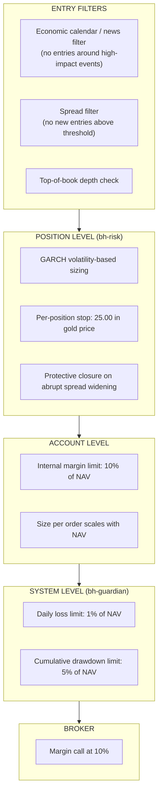
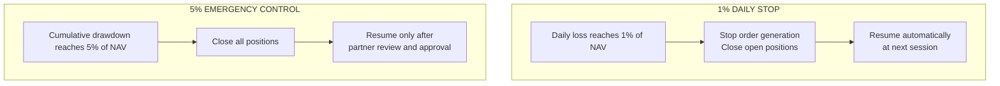

# Risk Management Framework

*Genese Capital (formerly BlackHole Capital). Last reviewed September 2026.*

## Overview

Genese Capital's risk framework combines per-position stops, account-level loss limits enforced server-side, volatility-based position sizing and entry filters. Core risk controls are enforced by Genese infrastructure; broker protections are secondary safeguards. MT5 acts only as an execution connector.

## Limits

| Control | Limit | Action |
|---------|-------|--------|
| Loss per position | 25.00 move in the gold price (2,500 per lot) | Position closed; subject to spread widening |
| Daily loss | 1% of NAV (in place since October 2025) | Stops order generation and closes open positions; resumes automatically next session |
| Cumulative drawdown | 5% of NAV | Closes all positions; resumes only after partner review and approval |
| Margin | 10% of NAV | Internal limit |
| Size per order | Approx. 7.5 lots on 4.2m NAV | Scales with NAV (lots per million of NAV) |
| Broker | Margin call at 10% | Independent of Genese infrastructure |

- Daily and cumulative limits are enforced server-side by `bh-guardian` and **cannot be manually overridden**.
- The 1% daily limit was added in October 2025, alongside the existing 5% cumulative limit.
- The 5% cumulative control has never been triggered.

One lot equals 100 ounces; a 1.00 move in the gold price equals 100 per lot.

## Risk Control Hierarchy

## Position Structure

- Each position is exited by opening an **offsetting position**, triggered by a trailing-stop profit target or a fixed stop.
- Once the offsetting leg is open the pair is market-neutral and the result is locked; the two legs are then netted via **Close By**.
- Directional exposure is limited to the interval before the offsetting leg opens.
- The account holds **up to 8 simultaneous positions, organised in pairs**. Net exposure is lower than gross exposure because the legs offset. Full margin is charged on both legs.
- Positions are closed intraday and are not intended to be held overnight.

## Position Sizing

Position size is set by a **GARCH volatility model**: higher volatility reduces lot size, lower volatility allows larger size within limits. Limits scale in lots per million of NAV. Lot adjustments are system-generated and require management approval.

## Entry Filters

- **News:** economic calendar and news via API, blocking entries around high-impact events.
- **Spreads:** measured continuously; no new entries above a defined threshold, and protective closure if spreads widen abruptly after entry.
- **Trading window:** execution concentrated in the New York session; no trading at weekends or when the market is closed.

## 1% Daily Stop vs 5% Emergency Control

Both controls are enforced server-side by [bh-guardian](../repositories/bh-guardian.md) and **cannot be manually overridden**.

| | 1% daily stop | 5% emergency control |
|---|---|---|
| **In place since** | October 2025 | Before October 2025 (the 1% daily limit was added to it) |
| **Trigger** | Daily loss reaches 1% of NAV | Cumulative drawdown reaches 5% of NAV |
| **Open positions** | Stops order generation and closes open positions | Closes all positions |
| **Restart** | Automatic at the next session | Only after partner review and approval |
| **Manual override** | Not possible | Not possible |
| **History** | - | Never triggered |

## Broker-Side Stops and Emergency Controls

| Control | Owner | Description |
|---------|-------|-------------|
| Broker margin call at 10% | OnEquity | Independent secondary safeguard, outside Genese infrastructure |
| Emergency stop | Dedicated trader | Monitors execution in real time and can halt it |
| Full stop | Either partner | Full-stop authority and direct account access |
| Broker disconnection | Genese infrastructure | Heartbeat every second; on disconnection new orders are suspended and existing positions remain managed; secondary OnEquity server (Amsterdam) if the primary (London) is unavailable; partners alerted through an internal app and dashboard |

## Worst-Case Scenario

The worst realistic scenario combines a gold volatility spike, a liquidity gap and slippage at the same time.

The per-position stop triggers after a gold move of about 0.45%. The residual risk is a **price gap**: if price jumps through the stop without execution, the loss can exceed the daily and cumulative limits, which act on new orders and open positions but cannot prevent a gap. Because directional exposure is short and there is no weekend or closed-market trading, the probability of such a gap coinciding with an open position is low but not zero.

Containment: per-position, daily and cumulative limits; broker margin call; spread filter; news filter; no weekend trading; data-centre failover.

Genese does not run a formal stress-testing programme. Scenario calculations from the account history and exposure statistics are included in the *Due Diligence Reference*, available on request.

## Operational Risk Controls

| Area | Behaviour |
|------|-----------|
| Broker connection | Heartbeat every second; secondary OnEquity server (Amsterdam) if the primary (London) is unavailable. On disconnection new orders are suspended and existing positions remain managed |
| Market data | Automatic cross-validation between sources. Depending on the anomaly, the system discards the tick, freezes execution or pauses trading; a pause requires manual release |
| PAMM reconciliation | Hourly, with automatic pause and alert on divergence |
| Data centres | Primary and disaster-recovery sites in Europe with automatic failover |
| Alerting | Partners are alerted through an internal app and dashboard |

## Governance

- Weekly governance meeting between the partners.
- Monthly research and recalibration cycle: performance analysis, volatility-regime assessment, parameter evaluation.
- Staged deployment - demo, proprietary capital, production. No parameter change goes directly to production.
- Lot and risk adjustments are system-generated and require management approval.
